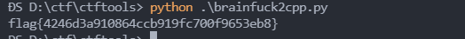

# bf_code

## 0x00 题面

```
,>>++ +++++ +++[< +++++ +++++ >-]<+ +[<-> -]<[+ -],>> +++++ +++++
[<+++ +++++ ++>-] <++++ ++++[ <->-] <[+-] ,>>++ +++++ ++[<+ +++++
++++> -]<++ +++++ [<->- ]<[+- ],>>+ +++++ ++++[ <++++ +++++ +>-]<
+++[< ->-]< [+-], >>+++ +++++ ++++[ <++++ +++++ +>-]< +++[< ->-]<
[+-], >>+++ ++[<+ +++++ ++++> -]<++ [<->- ]<[+- ],>>+ ++++[ <++++
+++++ +>-]< [<->- ]<[+- ],>>+ ++++[ <++++ +++++ +>-]< ++[<- >-]<[
+-],> >++++ +[<++ +++++ +++>- ]<+++ +[<-> -]<[+ -],>> +++++ +++++
[<+++ +++++ ++>-] <[<-> -]<[+ -],>> +++++ [<+++ +++++ ++>-] <+[<-
>-]<[ +-],> >++++ +++++ [<+++ +++++ ++>-] <++++ +++[< ->-]< [+-],
>>+++ ++[<+ +++++ ++++> -]<++ +++++ [<->- ]<[+- ],>>+ +++[< +++++
+++++ >-]<+ +++++ +++[< ->-]< [+-], >>+++ +[<++ +++++ +++>- ]<+++
+++++ [<->- ]<[+- ],>>+ ++++[ <++++ +++++ +>-]< +++++ +[<-> -]<[+
-],>> +++++ [<+++ +++++ ++>-] <++++ [<->- ]<[+- ],>>+ ++++[ <++++
+++++ +>-]< ++[<- >-]<[ +-],> >++++ +++++ [<+++ +++++ ++>-] <++++
+++++ [<->- ]<[+- ],>>+ +++++ +++[< +++++ +++++ >-]<+ +++++ +++[<
->-]< [+-], >>+++ +++++ +[<++ +++++ +++>- ]<+++ +++++ [<->- ]<[+-
],>>+ ++++[ <++++ +++++ +>-]< +++++ ++[<- >-]<[ +-],> >++++ [<+++
+++++ ++>-] <++++ +++++ [<->- ]<[+- ],>>+ ++++[ <++++ +++++ +>-]<
+++++ ++[<- >-]<[ +-],> >++++ +++++ +[<++ +++++ +++>- ]<++[ <->-]
<[+-] ,>>++ +++++ ++[<+ +++++ ++++> -]<++ +++++ ++[<- >-]<[ +-],>
>++++ +[<++ +++++ +++>- ]<+++ ++[<- >-]<[ +-],> >++++ [<+++ +++++
++>-] <++++ ++++[ <->-] <[+-] ,>>++ ++[<+ +++++ ++++> -]<++ +++++
+[<-> -]<[+ -],>> +++++ +++++ [<+++ +++++ ++>-] <++[< ->-]< [+-],
>>+++ ++[<+ +++++ ++++> -]<++ +++++ [<->- ]<[+- ],>>+ ++++[ <++++
+++++ +>-]< ++++[ <->-] <[+-] ,>>++ +++[< +++++ +++++ >-]<+ ++[<-
>-]<[ +-],> >++++ +[<++ +++++ +++>- ]<+[< ->-]< [+-], >>+++ +++++
++[<+ +++++ ++++> -]<+[ <->-] <[+-] ,>>++ +++++ ++[<+ +++++ ++++>
-]<++ +++++ +[<-> -]<[+ -],>> +++++ [<+++ +++++ ++>-] <++++ ++[<-
>-]<[ +-],> >++++ +++++ +++[< +++++ +++++ >-]<+ ++++[ <->-] <[+-]
>>>>> +++++ +++++ +[<++ +++++ +++>- ]<+.> >>>>+ +++++ ++++[ <++++
+++++ +>-]< +++++ ++.
```

## 0x01 思路

从题面来看, 这种编码只有`,.<>[]+-`构成, 并且题目名称为 bf_code, 因此可以联想到, 这是`brainfuck`语言.
但是我们使用在线网站[https://www.splitbrain.org/services/ook](https://www.splitbrain.org/services/ook)执行时, 发现网站直接崩溃了, 于是我们手动分析一波. 由于直接分析过于晦涩, 我们先将`brainfuck`翻译成 C++
`brainfuck`语言的语法如下:

| 字符 | 含义                                                          | 翻译成 C          |
| ---- | ------------------------------------------------------------- | ----------------- |
| >    | 指针加一                                                      | `++ptr; `         |
| <    | 指针减一                                                      | `--ptr; `         |
| +    | 指针指向的字节的值加一                                        | `++(*ptr);`       |
| -    | 指针指向的字节的值减一                                        | `--(*ptr);`       |
| .    | 输出指针指向的单元内容(ASII 码)                               | `putchar(*ptr);`  |
| ,    | 输入内容到指针指向的单元(ASCII 码)                            | `*ptr=gerchar();` |
| \[   | 如果指针指向的单元值为零，向后跳转到对应的]指令的次一指令处   | `while(*ptr){`    |
| ]    | 如果指针指向的单元值不为零，向前跳转到对应的[指令的次一指令处 | `}`               |

因此可以构造翻译脚本:

```python
def translate(c):
    tab = {}
    tab['>'] = 'p++'
    tab['<'] = 'p--'
    tab['+'] = '*p = *p + 1'
    tab['-'] = '*p = *p - 1'
    tab['.'] = 'cout<<char(*p)'
    tab[','] = '*p=getchar()'
    tab['['] = 'while(*p){'
    tab[']'] = '}'
    ans = ''
    for i in c:
        ans += (tab.get(i, " ") + '\n')
    return ans

f = open('./info.txt')
s = f.read()
print(translate(s))
```

翻译后的代码如下[output.cpp](D:\ctf\ctftools\output.cpp)

通过代码审计, 可知程序会等待我们输入字符, 并与 flag 进行比较, 如果我们的输入与 flag 不相同, 则会死循环.

值得注意的是, 程序在执行过程便会存在 flag, 因此我们可以直接从代码里提取 flag. 为了方便审阅, 我们将判断输入是否与 flag 相等的代码进行删除:

```python
    f = open('./info.txt')
    s = f.read()
    s = s.replace(' ','').replace('\n','')
    s = s.replace('[<->-]<[+-]', '')
```

处理过后的代码如下[output-1.cpp](D:\ctf\ctftools\output-1.cpp), 使用脚本提取 flag

```python
def translate(c):
    tab = {}
    tab['>'] = 'p++'
    tab['<'] = 'p--'
    tab['+'] = '*p = *p + 1'
    tab['-'] = '*p = *p - 1'
    tab['.'] = 'cout<<char(*p)'
    tab[','] = '*p=getchar()'
    tab['['] = 'while(*p){'
    tab[']'] = '}'
    ans = ''
    for i in c:
        ans += (tab.get(i, " ") + '\n')
    return ans

def getflag(s):
    idx = 0
    flag = ""
    s = s.split('\n')
    i = 0
    while True:
        if 'p++' in s[i] and 'p++' in s[i+1]:
            i += 2
            loop = 0
            while 'while' not in s[i]:
                loop += 1
                i += 1
        elif '}' in s[i] and 'p--' in s[i+1]:
            i += 2
            cnt = 0
            while i < len(s) and 'getchar' not in s[i] and 'p++' not in s[i]:
                cnt += 1
                i += 1
            flag += chr(loop*10+cnt)
        else:
            i += 1
        if i >= len(s):
            break
    return flag


if __name__=="__main__":
    filename = "./info.txt"
    f = open(filename)
    s = f.read()
    s = s.replace(' ','').replace('\n','')
    s = s.replace('[<->-]<[+-]', '')
    ans = translate(s)
    f.close()
    print(getflag(ans))
```


