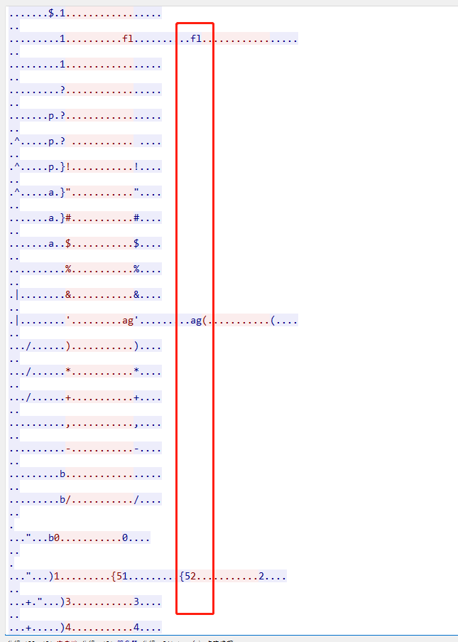

# modbus

## 0x00 题面

这是一道流量题, [题目链接](D:\ctf\mise\xyfx_c0f123874d571056d686f627e74fbc82\modbus.pcapng)

## 0x01 思路

看到题目名称, 怀疑大概率与`modbus`协议有关, 于是过滤出`modbus`协议查看:

发现有 flag, 拼接后得到 flag:
flag{5101446957}
