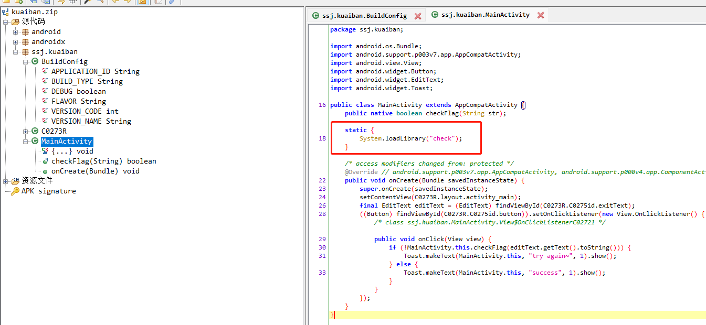
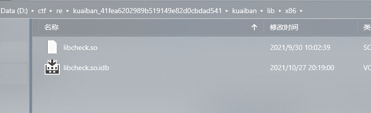
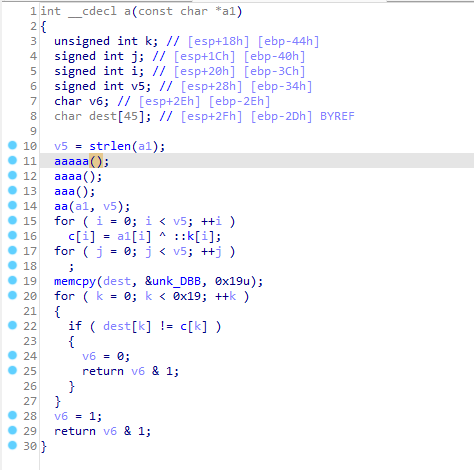
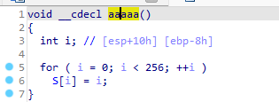
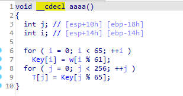
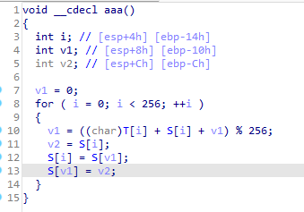
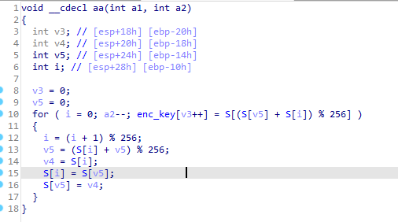
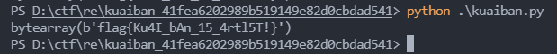

# 快板

## 0x00 题面

这是一道安卓题, 但是需要调用了外部程序, 真正的逻辑在.so 文件里, [题目链接](file:///D:/ctf/pwn/easy_vm_ac77fc3065048854ccc391daccecf7a9/kuaiban.zip)

## 0x01 思路

拿到 APK 之后, 使用`jadx`进行反编译查看:
发现判断 flag 的函数在.so 文件中



将 apk 文件后缀改为 zip, 并解压, 找到.so 文件


使用 IDA Pro 打开, 核心函数如下:


该函数的作用的是使用 4 个函数生成生成一个数组, 再用此数组与我们输入逐位异或, 并与程序内置的密文进行比较, 如果一致则通过检查. 安装经验, 内置的密文即为 flag 通过程序加密后的密文.
跟进`aaaaa()`, `aaaa()`, `aaa()`, `aa()`:

- `aaaaa()`

  

- `aaaa()`

  

- `aaa()`

  

- `aa()`

  

我们发现这其实就是 RC4 加密, 这是一个对称加密算法, 而且具有同态性, 意味着我们只需将密文作为输入, 即可获得明文.
我们使用 python 将反编译的代码进行实现:

```python
char_table = "ABCDEFGHIJKLMNOPQRSTUVWXYZabcdefghijklmnopqrstuvwxyz0123456789"
flag_len = 25
enc_flag = [0xAA, 0x4B, 0x70, 0x73, 0x24, 0x81, 0x71, 0xC9, 0x85, 0x69, 0x6C, 0x9A, 0xDD, 0x5A, 0x4D, 0xEC, 0x4C, 0x53, 0x23, 0xF8, 0xEC, 0x87, 0x54, 0xF1, 0x36]

# aaaaa()
S = [i for i in range(0,256)]
# aaaa()
Key = [char_table[i%61] for i in range(65)]
T = [Key[j%65] for j in range(256)]

# aaa()
v1 = 0
for i in range(256):
    v1 = (ord(T[i])+S[i]+v1) % 256
    tmp = S[i]
    S[i] = S[v1]
    S[v1] = tmp

# aa()
v3 = 0
v5 = 0
idx = 0
enc_key = [0 for i in range(153)]

l = 25
while l:
    idx = (idx+1)%256
    v5 = (S[idx] + v5) % 256
    tmp = S[idx]
    S[idx] = S[v5]
    S[v5] = tmp
    l -= 1
    enc_key[v3] = S[(S[v5] + S[idx]) % 256]
    v3 += 1

# decrypt
c = [0 for i in range(25)]
for i in range(flag_len):
    c[i] = (enc_flag[i]) ^ (enc_key[i])

ans = ""
for i in c:
    ans += hex(i)[2:]

print(bytearray.fromhex(ans))
```

运行后得到 flag:


```
enc_flag[i] = flag[i] ^ enc_key[i];
enc_key[i] ^ enc_flag[i] = enc_key[i] ^ flag[i] ^ enc_key[i]
```
