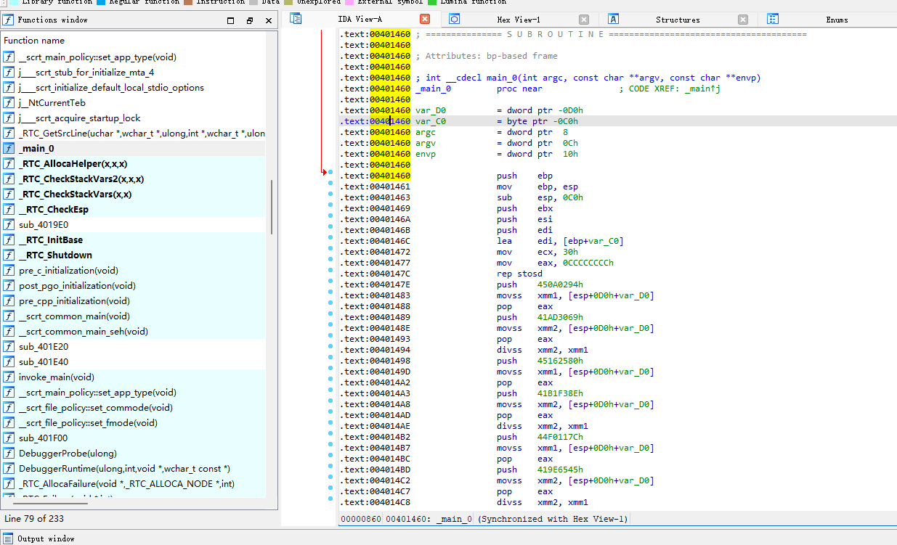
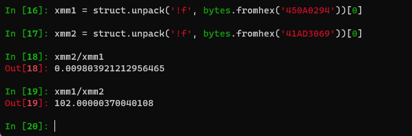
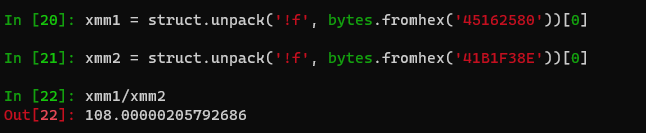
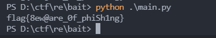

# 钓鱼邮件

## 0x00 题面

题目给了一个.exe 文件, [D:\ctf\re\bait\bait.exe](D:\ctf\re\bait)

## 0x01 思路

首先使用 IDA Pro 反编译该文件, 通过查找发现入口函数`_main_0`



发现不能使用 F5 查看伪代码, 于是只能看汇编代码. 发现整个程序都在做除法操作, 我们来看看除法的结果是什么


我们发现 xmm1/xmm2 的结果约等于 102, 恰好是`f`的 ascii 码,
再看下一组除法:


这一组中, 恰好等于 xmm1/xmm2 约等于 108, 恰好是`l`的 ascii 码, 因此我们有理由怀疑, 将全部除法都做完, 我们就能得到 flag, 于是编写脚本如下:

```python
import struct

xmm1 = ['450a0294','45162580','44f0117c','44b5b89b','450926a0','4493387c','44a4ac60','44984d00','4361ef01','4501767a','446d88fa','446489d8','44f089e6','43711b39','44366fd6','4396b48f','44b7478f','4502d4b0','45078666','4451edba','44ba6006','445a57a2','44a4eddc','449b33ee','44d5c14c']
xmm2 = ['41ad3069','41b1f38e','419e6545','4161d404','418eb9e3','41a8408e','4150b1e6','4123d1bf','4061ef01','41aad666','41055a5f','4110d102','41a20c0f','40a0bcd1','40e4f0bc','404b0e39','4151765b','41a105c5','41a53620','4121df67','4165627e','418e9745','413feae4','4140df9b','415ae29c']

for i,j in zip(xmm1, xmm2):
    i = struct.unpack('!f', bytes.fromhex(i))[0]
    j = struct.unpack('!f', bytes.fromhex(j))[0]
    print(chr(round(i/j)), end='')
```


