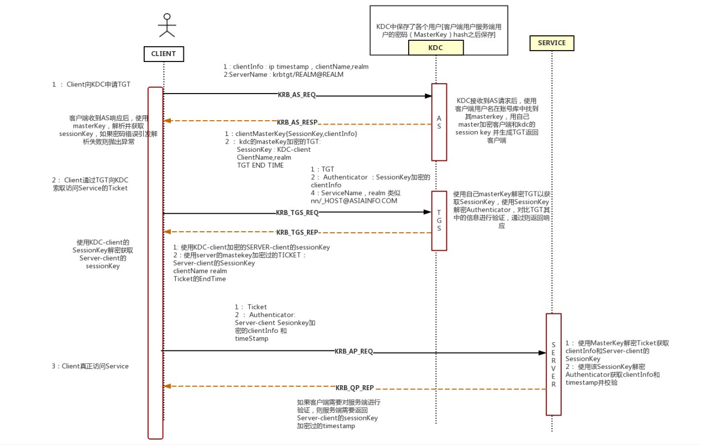

# 域相关

## 1. 基础概念

### 1.1 活动目录(AD)

活动目录存储网络中所有的资源对象快捷方式, 例如用户/组/计算机/打印机/共享资源  
AD 本质是一个数据库, 成为活动目录数据库  
存放有 AD 库的主机是域控

### 1.2 Windows hash

[文档地址](file:///D:/KnowledgeDocument/2021%E7%BD%91%E4%BF%A1%E5%AE%89%E8%B5%9B%E5%9F%B9%E8%AE%AD_%E5%A2%A8%E6%94%BB%E5%B9%B3%E5%8F%B0%E5%85%A8%E9%83%A8_PDF/pdf2/%E5%86%85%E7%BD%91%E6%B8%97%E9%80%8F/3.2%E3%80%81Windows%E4%B9%8BNTLM%E8%AE%A4%E8%AF%81-20200626%E3%80%90%E9%80%9A%E8%BF%87%E3%80%91.pdf)

### 1.3 Kerberos 认证

- KDC: 可信任的第三方机构, 一般装在 DC 中
  _ AS: 认证服务器, KDC 的一部分, 它用于回复用户初始的认证请求，当用户没有被认证时，他必须输入密码用于 KDC 对用户的认证。
  _ **TGS**: Ticket Granting Server, KDC 的 TGS 组件用于为拥有可用的 TGT 的客户端分发**服务票据**，它可以确保请求一个应用服务器上的资源的身份的真伪. TGS 使用服务(service)hash 进行加密。用于 KDC 向用户和 Service 分发 SessionKey。

  > 作为对认证请求的响应，AS 分发一个特殊的 ticket，被称为 Ticket Granting Ticket，简称为 TGT
  > **TGT**使用**krbtgt/REALM＠REALM**这个 principal 的密钥来加密, 如果用户的确具有他们所声称的身份, 它们就可以使用 TGT 来获取其它服务的 ticket，而不是重新输入密码。

- KRBTGT 账户: 它是在创建域时系统自动创建的一个账号，可以暂时理解为他就是一个无法登陆的账号，在发放票据时会使用到它的密码 HASH 值
- realm: 认证管理域, 在同一个认证管理域中, 认证服务才有权认证用户
- Ticket: 票据, 客户端提供给应用服务器用于表明自己真实身份的东西, 加密 ticket 使用的密钥是 AS 和提供服务的服务器之间的秘密，因此即使请求 ticket 的客户端也不能知道或更改它的内容
- Principal:

  > 一个 Principal 就是一个名字，这个名字用于引用认证服务数据库中的一个条目。一个 Principal 和一个特定 realm 的用户、主机、或者服务相关联。Kerberos5 中的一个 principal 有以下的形式：
  > component1/component2/.../componentN@REALM

- 会话密钥 Session Key

  > 就像我们所看到的一样，用户和服务和 KDC**共享一个秘密**。对于用户来说，这个秘密就是从密码推导出来的密钥，对于服务来说，就是密钥(由管理员指定)。这些密钥被称为长期密钥(long term)，因为在工会话程改变时，它们是不变的。但是，用户和服务间也有必要共享秘密，至少当用户和服务之间存在工作会话的时候：这个密钥在 KDC 分发 ticket 时候生成，称为 Session Key。分发给服务的 session key 被 KDC 封装在 ticket 中(应用服务器拥有 long term key，因此可以从 ticket 中解码出 session key)，分发给用户的 session key 被使用用户的长期密钥加密封装。

- **Kerberos 协议框架**



#### 1.3.1 认证流程

---

- **Client AS:**

1. KRB_AS_REQ(请求)：

   > Client 输入认证密码, 发起认证. 此时 Client 向 KDC 的 AS 发送使用 Client Hash 加密的时间戳, 以及`ClientInfo`, 其中包含: ip, 时间戳, Client Name, Realm

2. KRB_AS_REP(应答)
   > AS 收到 Client 的请求后, 根据 Client 发送的用户名查找该 Client 是否在白名单中, 然后根据用户名从数据库中提取对应的`NTLM Hash`, 记作`ClientHash`, 接着生成一个随机数 session key-as, 记作`SessionKeyAS`, 然后使用`ClientHash`对`SessionKeyAS`进行加密， 得到`EncSessionKeyAS`. 然后 AS 使用 krbtgt 的`NTLM Hash`对`ClientInfo`和`SessionKeyAS`进行加密, 得到`TGT`. 最后 AS 向 client 返回`EncSessionKeyAS`和`TGT`

AS 在此阶段进行的验证: AS 收到 Client 的请求后, 使用数据库记录的`ClientHash`对请求中的加密时间戳进行解密, 如果成功解密则通过验证, 并返回`EncSessionKeyAS`和`TGT`

```
Client request with:
ClientInfo, plaintext
TimeStamp encrypted by ClientHash

KDC responses with:
session key-as encrypted by ClientHash
ClientInfo and session key-as, encrypted by krbtgt Hash, called TGT
```

---

- **Client TGS**

3. KRB_TGS_REQ(请求)：

   > Client 接收到了`EncSessionKeyAS`和`TGT`之后，先用**自身**的`NTLM Hash`解密`EncSessioneKeyAS`得到 session key-as. 由于`TGT` 是由 KDC 中 kebtgt 的`NTLM Hash`加密，所以 Client 无法解密。这时 Client 再用 session key-as 加密自身信息`ClientInfo_A`，然后再和`TGT`一起发送给 KDC 中的 TGS（TicketGranting Server）票据授权服务器, 换取能够访问 Server 的票据.
   > 在这一步中, `ClientInfo_A`中还会携带`SPN`去声明用户要使用何种服务。

4. KRB_TGS_REP(应答)：
   > TGS 收到 Client 发送过来的`TGT`和 session key-as 加密的`ClientInfo_A`之后，首先会检查自身是否存在 Client 所请求的服务。如果服务存在，则用**krbtgt**的`NTLM Hash`**解密** `TGT`, 获取**session key-as**。再使用**session key-as**解密被加密的`ClientInfo_A`, 并与`TGT`当中的`ClientInfo`进行对比验证. 验证成功后`TGS`生成 session key-tgs, 并向 Client 返回以下两个东西:
   > (1) 使用 session key-as 加密 session key-tgs, 记作`EncSessionKeyTGS`
   > (2) 使用 Client 要访问的 Server 的`NTLM Hash`加密 session key-tgs 得到 Client-To-Server Ticket, 记作`ST`

```
Client requests with:
ClientInfo_A encrypted by session key-as
TGT

TGS responses with:
session key-tgs encrypted by session key-as
session key-tgs encrypted by Server Hash, called ST
```

---

- **Client Server**

5. KRB_AP_REQ(请求)：

   > Client 收到`EncSessionKeyTGS`后, 使用`SessionKeyAS`解密得到**session key-tgs**, 再使用**session key-tgs**加密包含时间戳在内的`ClientInfo`, 得到`Authticator3`. 并向 Server 发送`Authticator3`和`ST`

6. KRB_AP_REP(应答)：
   > Server 使用自身的`NTLM Hash`解密`ST`, 得到**session key-tgs**, 再用**session key-tgs**解密`Authticator3`, 如果成功得到时间戳, 则认证完成.

```
client requests with:
ClientInfo with time stamp encrypted by session key-tgs
ST
```

## 2. 域内信息收集

### 2.1 域内用户和管理员信息

- `net view /domain` 查看域名
- `net group "domain computers"` 查看域内所有机器
- `net user /domain` 查看域内所有用户
- `net group /domain` 查看域内所有组
- `net group "domain admins" /domain` 获取域管理员列表
- `net group "enterprise admins" /domain` 获取企业管理员列表
- `net localgroup administrators /domain` 获取域内置 administrators 组用户
- `net group "domain controller" /domain` 获取域控制器列表
- `net user someuser /domain` 获取指定域用户 someuser 的信息
- `net accounts /domain` 获取域密码策略设置, 密码长短, 错误锁定等信息
- `nltest /domain_trusts` 获取域信任信息

## 3. 委派

见`5. 横向移动`
