# Exchange Proxylogon CVE-2021–26855 SSRF 漏洞分析与利用

## 漏洞调试

还是使用[https://github.com/jeningogo/exchange-ssrf-rce/](https://github.com/jeningogo/exchange-ssrf-rce/)的 exp 进行调试分析。
运行 exp，设置代理抓包后，发现 exp 的第一个数据包是请求 rpc 获取 NTLM 认证，以此获取域名和主机名。

第二个数据包才是利用 ssrf 访问`autodiscover.xml`, 泄露 LegacyDN 信息，并获取 sid。其数据包如下：
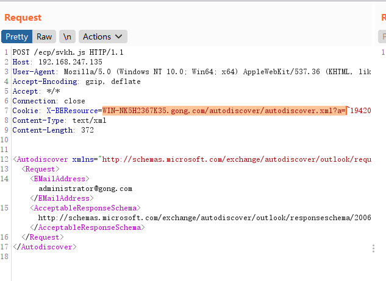

漏洞点位于`C:\Program Files\Microsoft\ExchangeServer\V15\FrontEnd\HttpProxy\bin` 目录下的`Microsoft.Exchange.FrontEndHttpProxy.dll`。使用 dnspy 反编译。
定位到`Microsoft.Exchange.HttpProxy`的`BEResourceRequestHandler`类, 漏洞的入口点就在这个类中. 为了实例化这个类, 我们需要对服务器发起特定的请求.
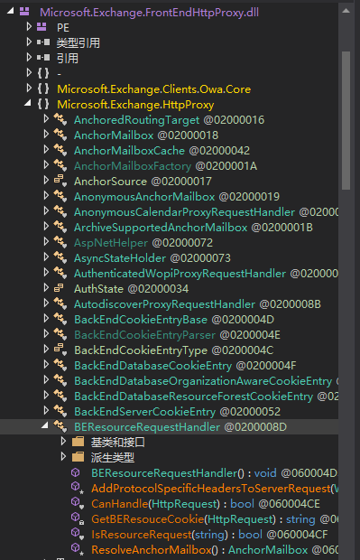

查看`BEResourceRequestHandler`的引用, 可以发现该类在以下两处被实例化了
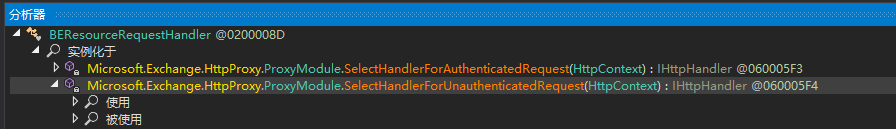

这里由于我们并没有进行身份认证, 所以会使用`SelectHandlerForUnauthenticatedRequest`方法

### 0x00 为什么 exp 的路径是/ecp/<random_str>.js

观察 exp 中的漏洞路径`/ecp/svkh.js`, 这是为了过以下两个检查以便实例化`BEResourceRequestHandler`
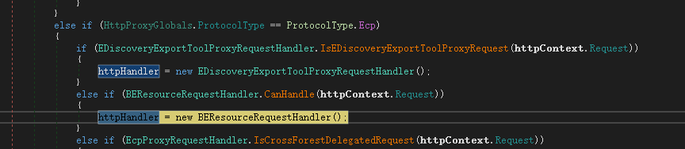

即:

1. `HttpProxyGlobals.ProtocolType`为 ecp 类型, 即用户对 Exchange 后台管理中心(`https://xxxx/ecp`)发起请求时, 就会进入这个 if 分支
2. `BEResourceRequestHandler.CanHandle(httpContext.Request)`为`true`, 我们对其跟进:
   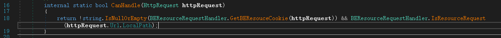
   这个函数进行了两个子判定, 分别跟进查看

```c#
string.IsNullOrEmpty(BEResourceRequestHandler.GetBEResouceCookie(httpRequest));
BEResourceRequestHandler.IsResourceRequest(httpRequest.Url.LocalPath);
```

2.1. 第一个判定用于判定 cookie 中的`X-BEResource`字段是否为空, 所以在 exp 中我们必须在 cookie 中指定`X-BEResource`, 通过这个值, 我们可以控制一些东西最终导致 ssrf
跟进`BEResourceRequestHandler.GetBEResouceCookie`, 取出了 cookie 中的`Constants.BEResource`
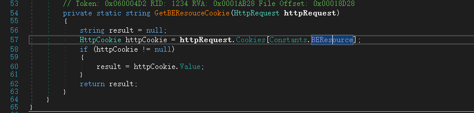
Constants 主要定义了一些常量, `Constants.BEResource`如下:
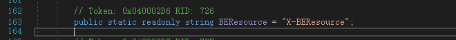

2.2. 第二个判定用于判断请求的路径后缀是否为指定后缀, exp 的`xxx.js`正是处指定的后缀表之中:
跟进`RequestPathParser.IsResourceRequest`:


通过这两个 check 后, 便可以实例化`BEResourceRequestHandler`类, 从而在后续的调用中触发漏洞.

### 0x01 跟踪 exp 在服务器中的流程

首先我们通过 dnspy 在`BEResourceRequestHandler`类中打两个断点, 随后附加调试调用了`MSExchangeECPAppPool`的进程
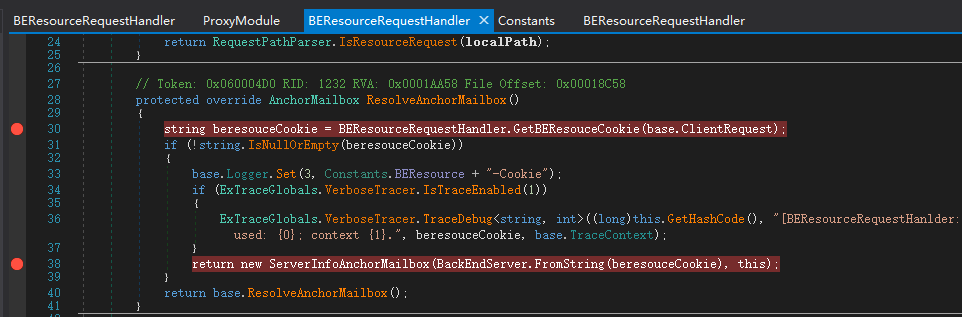

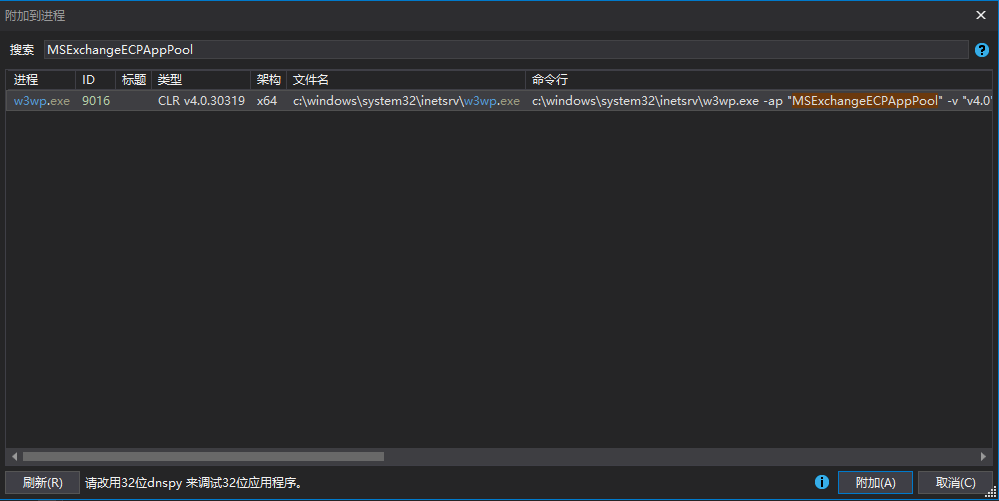

打下断点的这个方法的作用, 主要是将 exp 中 cookie 里的`X-BEResource`字段交给`BackEndServer`处理.
随后通过 burp 发包, 触发断点后进行单步调试, 在`BackEndServer`中, `FromString`方法将`X-BEResource`以`~`切分, 并用分割结果实例化了`BackEndServer`并返回:

1. 跟进`BackEndServer.FromString`查看
   
   这里的`array[0], array[1]`在`BackEndServer`的构造函数中最终被赋值为:

```
BackEndServer.Fqdn = array[0]
BackEndServer.Version = array[1]
```

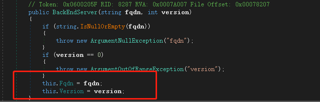
而`version`就是`array[1]`, 需要留意的是`BackEndServer.Version`在后续过程中至关重要.

从`BackEndServer`返回的实例, 作为参数进入了`ServerInfoAnchorMailbox`的构造函数中, 并返回这个新的实例. 返回后发现程序处于`ProxyRequestHandler.InternalBeginCalculateTargetBackEnd`中, 跟进查看.

2. 跟进`ProxyRequestHandler.InternalBeginCalculateTargetBackEnd`查看:
   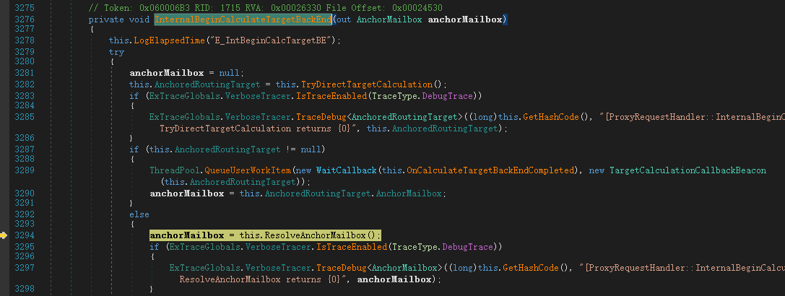

这一段又臭又长的东西我们并不关心, 继续步进, 主要关心`Fqdn`和`Version`变量的位置, 最终发现在`ProxyRequestHandler.BeginProxyRequest`类中的`GetTargetBackEndServerUrl`中用到了两个变量.

3. <span id="jump">跟进`GetTargetBackEndServerUrl`</span>, 发现`BackEndServer`中`Fqdn`和`Version`的值赋给了 Uri: `result`并最终返回到`BeginProxyRequest`方法中. 在这里我们已经控制了 Host 的值, 这个值最终会转换为 URI, 并且由服务端根据这个 URI 发起一个`HttpWebRequest`. **注意到第 2965 行, 会判断`Version`是否小于一个常量, 这个判断结果将会影响`this.ProxyToDownLevel`的值.**

`ProxyRequestHandler.GetTargetBackEndServerUrl`:
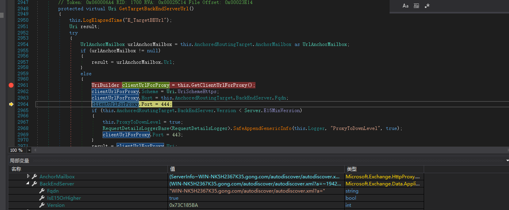
↓
↓`result`作为返回值, 最后返回到`BeginProxyRequest`中的`uri`变量中
↓ 注意到`uri`是已经被我们控制了的

返回到了`ProxyRequestHandler.BeginProxyRequest`中
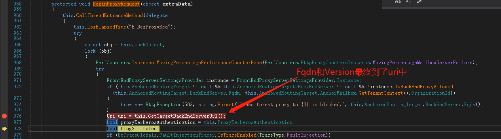

最后`uri`会作为参数进入到`ProxyRequestHandler.CreateServerRequest`方法中, 在这个方法里程序会使用`HttpWebRequest`并根据`uri`向后端服务器发起 request 请求:

4. 跟进`ProxyRequestHandler.CreateServerRequest`
   `ProxyRequestHandler.BeginProxyRequest`, 第 1026 行发生了方法调用:
   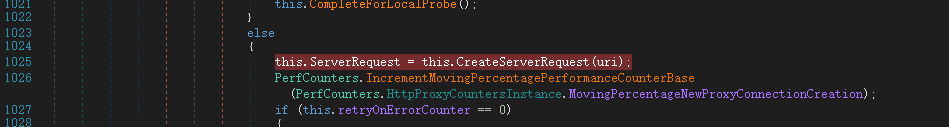

`ProxyRequestHandler.CreateServerRequest`:
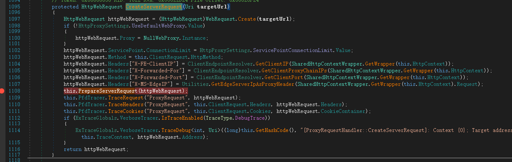

基本上到了这里就可导致 ssrf 了, 因为我们已经让服务器发送了一个`HTTPWebRequest`请求, 而这个请求的地址我们通过一开始的 cookie 中的`X-BEResource`字段已经控制了. 即:

```
WIN-NK5H2367K35.gong.com/autodiscover/autodiscover.xml
```

但是这个 exp 中的`X-BEResource`并不一样, 原始的`X-BEResource`是这样的

```
X-BEResource=WIN-NK5H2367K35.gong.com/autodiscover/autodiscover.xml?a=~1942062522;
```

可以看到控制访问的地址与 exp 中的`BEResource`字段想比, 前者少了波浪号`~`后的一串数字`1942062522`. 这个数字即上文中提到的`Version`, 它的作为是为了通过一个 check.

### 0x02 为什么要控制 Version

还记得我们[前面](#jump)说的通过`Version`控制了`this.ProxyToDownLevel`吗, 这个`this.ProxyToDownLevel`是个布尔类型, 会控制以下一些检查:

1. 我们注意到`ProxyRequestHandler.CreateServerRequest`的第 1108 行, 即上图中打下断点的那行, 程序在这里执行了`PrepareServerRequest`方法, 跟进查看如下.
   `ProxyRequestHandler.PrepareServerRequest`:
   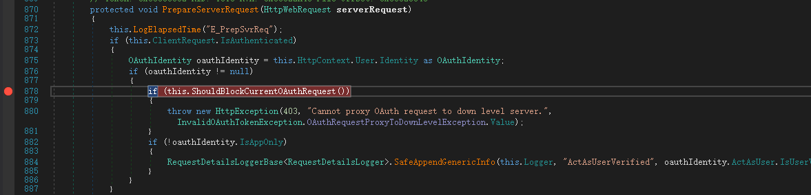
   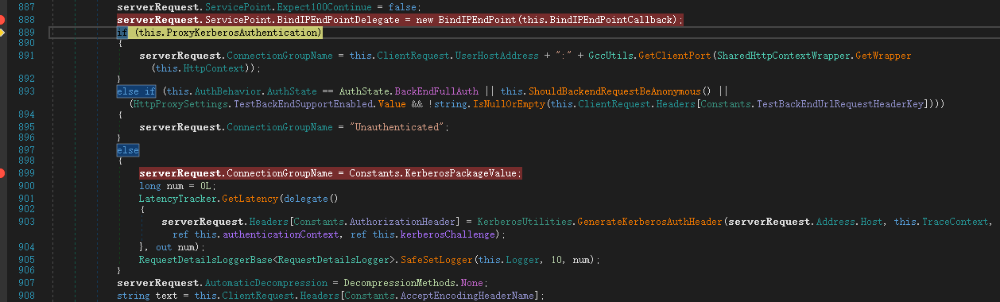

这个方法的作用主要是对`ServerRequest`做一些预先的检查, 注意到 878 行会对`this.ShouldBlockCurrentOAuthRequest()`进行判断, 如果通过判断就是抛出 403, 我们跟进查看这个函数:
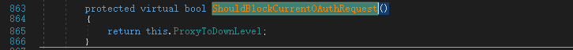
发现其返回的是`this.ProxyToDownLevel`, 这正是我们[上文](#jump)提到的, 使用`Version`可以影响到一个属性, 如果我们的通过`X-BEResource`传入的`Version`小于`Server.E15MinVersion`, 那么`this.ProxyToDownLevel`就会被设置为 true, 这样一来程序就会抛出 403, 拒绝我们的访问:

`ProxyRequestHandler.GetTargetBackEndServerUrl`:
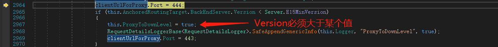

`Server.E15MinVersion`
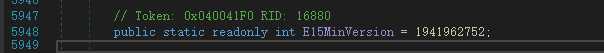

通过这个 check 后, 我们便等于触发了 ssrf, 利用服务器为我们发起一次 http 请求, 最终获取到了`autodiscover.xml`用户配置文件.
